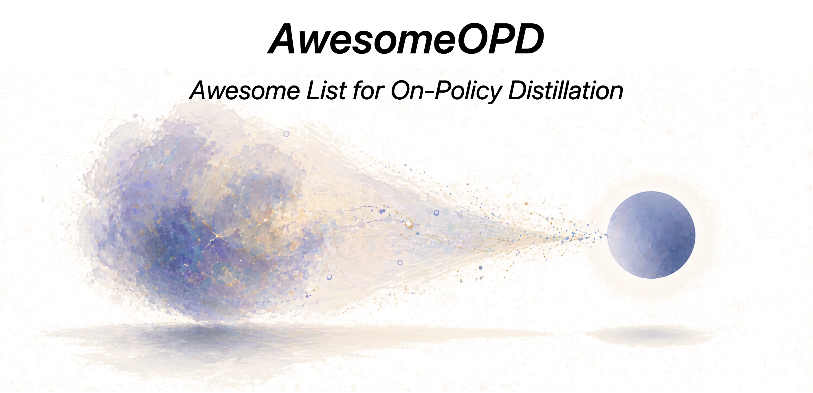

  

 

 

 

# When LLMs Distill On-Policy

**AwesomeOPD** is an awesome list summarising **open-source repositories and papers** for training LLMs (and VLMs / agents / draft models) with **On-Policy Distillation (OPD)** and **On-Policy Self-Distillation (OPSD)**:
 - 🎯 **OPD = C1 + C2.** `C1`: student samples its own trajectories `y ~ π_student(·|x)` during training. `C2`: teacher provides per-token / sequence supervision on those student samples. Methods that only partially satisfy are flagged in **📝 Strictness notes** per section.
 - 🪞 **OPSD** = special case where teacher *is the same model*, conditioned on privileged context (verified trace / answer / "be concise" prefix / longer context) or an earlier checkpoint.
 - 🚀 Each entry is annotated along four design axes — **teacher source** (external · same model with privileged context · earlier checkpoint · multi-teacher · discriminator), **supervision signal** (logits / top-k / sequence reward / verbal score / discriminator / verifier / feature), **rollout consumption** (all / selected / truncated / replaced / as PG samples), and **pipeline slot** (cold-start / mid / RL-replacement / inside-RL / inter-stage / compression / continual-anchor).
 - ⚠️ Built by reading paper PDFs, project pages, and source code with LLM coding agents; manually reviewed but errors possible. PRs welcome.
 - 📌 If you find this repository helpful for your research, please cite it via the **"Cite this repository"** button in the right sidebar of the GitHub page.
 - 📅 Last updated: 2026-07-23

Taxonomy:
 - **📚 Surveys, Foundations & Position Papers** — meta-references and seed papers (GKD, MiniLLM, Thinking Machines blog, Tencent / THUNLP surveys)
 - **🔬 White-Box** — logit-based OPD on student rollouts with an external teacher
 - **🎭 Black-Box** — discriminator / verbal / preference, no teacher logits
 - **♻️ OPSD** — privileged-context self-distillation (same model, different conditioning)
 - **🔁 Iterative Self-Bootstrapping** — same model as previous-checkpoint teacher
 - **🤝 OPD-RL Hybrids** — inside-RL OPD: KL-as-reward, RL+OPD fusion
 - **🧠 Reasoning / 🖼️ Multimodal / 🤖 Agent & Embodied** — by application; cuts across all teacher-source categories
 - **⚡ Speculative-Decoding Distillation** — drafter distillation; "student" is a draft model
 - **🛠️ Frameworks & Toolkits** — what to actually run
 - **🏭 Industrial / Production Reports** — what the labs ship

Shorthand: **FKL** = forward KL · **RKL** = reverse KL · **JSD** = Jensen–Shannon · **Skew-KL** / **AKL** = skewed / adaptive KL · `📄 paper-only` = no public code yet.

## Updates

📢 click to expand

- **2026-07-23 (c)** — **independent re-audit of all 191 entries added in (a) and (b).** Every entry was re-read against its PDF by a second reviewer with no access to the first pass's reasoning; **189/191 verdicts were reproduced (98.9%)**.
  - *Removed as out of scope* (2): **CollectionLoRA** ([2605.25378](https://arxiv.org/abs/2605.25378)) — single-step LoRA image editing, no sequence model; **FA-OPD** ([2605.27095](https://arxiv.org/abs/2605.27095)) — MLP policy on Gym/D4RL continuous control, no language or generative-sequence component. The flow-matching entries that *are* retained (DiffusionOPD, D-OPSD, OPSD-V, dOPSD, AnyFlow, WMSD, π-Flow, Qwen-Image-2.0-RL) generate a supervised *trajectory*; these two do not.
  - *Corrected*: a transcription error in **Multi-Rollout OPD** (AIME25 mean@8 41.21 → **25.41**); a misattributed ablation in **OPSD Compresses RLVR** (−26.8% → −29.22% at −1.03 pp); conflated settings in **ADWIN**; a worst-case-only figure in **GeoSD**; teacher count in **MAD-OPD**; a loose "doubles" in **Tool-Call Boundary Drift**.
  - *Metadata*: an unverifiable venue tag on **Revisiting OPD**; four wrong or over-specific Org cells (**HPD** listed a GitHub username; **Draft-OPD** listed an affiliation absent from the paper; **CoPD** "JD Explore" → JD.COM; **EffOPD** "Tencent Hunyuan" → Tencent); ten Date cells normalised to the arXiv-ID month; **ShortOPD** refiled from White-Box to OPSD (its teacher is its own pre-compression checkpoint, not an external model); two new acronym collisions documented (**PBSD** ×2, **COPD**/**CoPD**); all badge counts recomputed.
  - *Checked and confirmed correct*: the eight cross-listed arXiv IDs are the intended cross-section duplicates; `HJSang/OPSD_OnPolicyDistillation` genuinely hosts three separate papers (PACED, TIP, Sparse-to-Dense); no dead repo links.
- **2026-07-23 (b)** — **backfill sweep of 2026-04-25 → 2026-06-20: 152 papers read in full, 120 added, 32 rejected.** This period predates the previous update and had never been covered, so the list was missing roughly half the field's output during its busiest months. Highlights: *Decoupling KL and Trajectories* (the cleanest formal taxonomy of SFT/DAgger/offline-RL/OPD), Apple's *Unmasking OPD*, three independent parameter-geometry studies, the prefix-truncation family (Prune-OPD, ESR, ADWIN, Truncated OPD), cross-tokenizer OPD (SimCT, Tokenizer Barrier), Meta's logit-free *OmniOPD*, and two production reports with genuine MOPD (Kwai Keye-VL-2.0, Nemotron 3 Ultra). New acronym-collision and contested-finding notes added to the relevant strictness sections. Backfill entries carry their mechanism summary inline in the table rather than a separate technical-details row.
- **2026-07-23 (a)** — **large sweep (~60 entries), every paper PDF read and every repo link checked.**
  - *Surveys*: Formula-Driven Survey, NAIL, When Does Online IL Help, Demystifying OPD
  - *White-Box*: IW-OPD, DEAR, ReNIO, PG-OPD, SEAD, DOPD, MOPD (Xiaomi), Blockwise Drift Gating, Direct-OPD, OPD², TOP-D, COPD, ShortOPD, TOPD
  - *OPSD*: CaOPD, Vision-OPD, D-OPSD, PW-OPSD, OPSD Predictive Law, SDSD Diversity, PHF, Visual-OPSD, Denser ≠ Better, Purified OPSD, DemoPSD, Rethinking OPSD, GeoSD, AD-OPSD, dOPSD, PromptSD; BIRD → Iterative Self-Bootstrapping
  - *OPD-RL*: OPID, ATOD, PASS, CRAFT, UCOB, DRIFT, RG-OPD, CPO, Distilled RL, CriPO, H²SD, CADENCE
  - *Multimodal*: DiffusionOPD, V-Zero, H-OPD, OPSD-V, Med-OPD, OPD-IAD
  - *Agent*: KbSD, Two-Phase Distillation, SEED, ReOPD, UI-MOPD, TurnOPD, FA-SD Failure, Tool-Call Boundary Drift, ROAD-VLA
  - *SpecDec*: TIGER, AdaFlash · *Frameworks*: Spider, AsyncOPD, EasyOPD
  - *Industrial*: Solar Open 2, KAT-Coder-V2.5, OvisOCR2, Mach-Mind-4-Flash, Agents-A1, Qwen-Image-2.0-RL, Audex
  - *Maintenance*: TCOD upgraded to its released repo (COLM 2026); Draft-OPD relinked to the canonical `Simplified-Reasoning` org; venue tags added to HPD (ICML 2026) and Revisiting OPD (COLM 2026); all badge counts recomputed (several were stale)
  - *Verified and excluded*: TREK, REGEN, A Few Teacher Steps, Prefix-GRPO, HyperDFlash, SOPD-SocialNav, DataFlex-RL — each fails C1 or C2 on a full read; rationale in the relevant section's strictness notes
- **2026-06-23** — add FiRe-OPD (White-Box; hard trajectory filtering + soft token reweighting)
- **2026-06-19** — add d-OPSD, RLCSD, SSOPD (OPSD); TGPO, OPD+ (OPD-RL); Flow-OPD, Decomposed-OPD/VGS (Multimodal); ROPD (Black-Box); BRTS, OPRD (White-Box); Draft-OPD (SpecDec); SDAR (Agent); *The Many Faces of OPD* (Surveys)
- **2026-06-13** — add TRD (White-Box; trajectory-level refinement) + Li Jiang's OPD reflection blog
- **2026-06-08** — add EMPO² (OPSD; cross-listed into Agent)
- **2026-06-07** — add SPOT
- **2026-05-18** — add COPSD, MSD
- **2026-05-15** — add TCOD, Healthcare AI GYM, HyperEyes (and cross-list Skill-SD into Agent)
- **2026-05-14** — add CORD
- **2026-05-13** — add Uni-OPD; add HY-MT, Baichuan-M3, KAT-Coder-V2, HY-Embodied, Qwen3.5-Omni
- **2026-05-11** — add Skill-SD
- **2026-04-30** — add π-Play
- **2026-04-29** — add SD-Zero, *Why Does Self-Distillation (Sometimes) Degrade Reasoning?*
- **2026-04-28** — initial release; add NPO, VLA-OPD, KDFlow, HPD, DeepSeek-V4

---

## 📚 Surveys, Foundations & Position Papers

| Resource | 🌟 Stars | Date | Org | Paper / Link | Title / Notes |
| :----: | :----: | :----: |  :----: | :----: | :---- |
| [GKD](https://arxiv.org/abs/2306.13649) |  | 2023.06 | Google DeepMind (Agarwal et al.) | [arXiv 2306.13649](https://arxiv.org/abs/2306.13649) — implemented in [TRL `GKDTrainer`](https://github.com/huggingface/trl/blob/main/trl/experimental/gkd/gkd_trainer.py) | **GKD: On-Policy Distillation of Language Models — Learning from Self-Generated Mistakes** (Seminal · ICLR 2024) |
| [Blog](https://thinkingmachines.ai/blog/on-policy-distillation/) |  | 2025.10 | Thinking Machines Lab (Kevin Lu et al.) | [Blog](https://thinkingmachines.ai/blog/on-policy-distillation/) · [tinker-cookbook](https://github.com/thinking-machines-lab/tinker-cookbook) | **Thinking Machines Lab — On-Policy Distillation (blog)** |
| [tinker-cookbook](https://github.com/thinking-machines-lab/tinker-cookbook) |  | 2025.10 | Thinking Machines Lab | — | Reference impl. of the OPD recipe on the Tinker SDK |
| [revisiting_opd](https://github.com/hhh675597/revisiting_opd) |  | 2026.03 | CASIA (Fu et al.) | [arXiv 2603.25562](https://arxiv.org/abs/2603.25562) | Revisiting OPD: Failure Modes & Simple Fixes |
| [Tencent OPD Survey](https://arxiv.org/abs/2604.00626) |  | 2026.04 | Tencent (Mingyang Song & Mao Zheng) | [arXiv 2604.00626](https://arxiv.org/abs/2604.00626) | **A Survey of On-Policy Distillation for LLMs** |
| [OPD](https://github.com/thunlp/OPD) |  | 2026.04 | Tsinghua THUNLP | [arXiv 2604.13016](https://arxiv.org/abs/2604.13016) | **Rethinking On-Policy Distillation: Phenomenology, Mechanism & Recipe** |
| [Lightning OPD](https://arxiv.org/abs/2604.13010) |  | 2026.04 | Wu, Han, Cai | [arXiv 2604.13010](https://arxiv.org/abs/2604.13010) | **Lightning OPD: Efficient Post-Training with Offline OPD** |
| [OPSD Survey](https://arxiv.org/abs/2605.18141) |  | 2026.05 | Academic | [arXiv 2605.18141](https://arxiv.org/abs/2605.18141) | **A Brief Overview: On-Policy Self-Distillation in LLMs** |
| [Many Faces of OPD](https://arxiv.org/abs/2605.11182) |  | 2026.05 | UIUC (Ge Liu's ULab) | [arXiv 2605.11182](https://arxiv.org/abs/2605.11182) | **The Many Faces of On-Policy Distillation: Pitfalls, Mechanisms, and Fixes** — diagnoses when OPD/OPSD succeed or fail (distribution mismatch, optimization instability, PI-free policy limits) & proposes fixes; companion to Revisiting OPD & THUNLP Rethinking |
| [Blog](https://louieworth.github.io/blog/opd_reflection/) |  | 2026.06 | Li Jiang | [Blog](https://louieworth.github.io/blog/opd_reflection/) · [arXiv 2606.08432](https://arxiv.org/abs/2606.08432) | **On-Policy Distillation: Promise, Pitfalls, and Prospects** — reflection on OPD's promise, three failure mechanisms (local teacher noise, coverage decay, myopic gradients) & prospects; companion to TRD |
| [Formula-Driven Survey](https://arxiv.org/abs/2606.22793) |  | 2026.06 | Tsinghua (Bowen Zhang) | [arXiv 2606.22793](https://arxiv.org/abs/2606.22793) | **A Formula-Driven Survey and Research Agenda for OPD** — organises OPD as a *feedback-to-update path* rather than by KL direction; seven formula-derived variables + an explicit evidence-tier table (E0 papers → E3 own hypotheses) |
| [NAIL](https://github.com/plau666/NAIL) |  | 2026.06 | Columbia (Sriraman, Liu, Hsu, Block) | [arXiv 2606.30923](https://arxiv.org/abs/2606.30923) | **Behavior Cloning is Not All You Need: The Optimality of OPD for Noisy Expert Feedback** — proves offline BC needs samples *exponential* in horizon under a noisy expert (and that this is necessary for **any** offline IL), while OPD is polynomial; proposes **NAIL** |
| [Online IL Realizability](https://arxiv.org/abs/2606.30445) |  | 2026.06 | Tsinghua / CMU / Berkeley / Harvard | [arXiv 2606.30445](https://arxiv.org/abs/2606.30445) | **When Does Online Imitation Learning Help in LLM Post-Training?** — challenges the error-accumulation story: under **realizability** OPD buys nothing over SFT; **non-realizability** is the real source of online gains |
| [Demystifying OPD](https://arxiv.org/abs/2607.13399) |  | 2026.07 | CUHK / Tencent AI Lab | [arXiv 2607.13399](https://arxiv.org/abs/2607.13399) | **Demystifying OPD: Roles, Pathologies, and Regulations** — OPD as *exploration catalyst*, not ceiling-raiser; diagnoses Student–Teacher Mismatch (the strongest teacher can be the worst) + Length Exploitation, and fixes both with clipping / log-compression |
| [Unmasking OPD](https://arxiv.org/abs/2605.10889) |  | 2026.05 | Apple | [arXiv 2605.10889](https://arxiv.org/abs/2605.10889) | **Unmasking OPD: Where It Helps, Where It Hurts, and Why** — training-free diagnostic that derives an *ideal* per-token gradient from empirical success probabilities and scores GKD / MiniLLM / Dr.GRPO objectives by cosine alignment to it. Finds guidance is far better aligned on **incorrect** rollouts than correct ones |
| [Decoupling KL & Trajectories](https://arxiv.org/abs/2605.16826) |  | 2026.05 | EIT Ningbo / HK PolyU / HKUST / SJTU | [arXiv 2605.16826](https://arxiv.org/abs/2605.16826) | **A Unified Perspective for SFT, DAgger, Offline RL, and OPD** — decomposes distillation along *prefix source* × *KL direction*, showing the four cells are exactly SFT / on-policy SFT / offline-RL distillation / OPD, and proves student-prefix + reverse KL equals a dense-reward REINFORCE objective |
| [States, Not Tokens](https://arxiv.org/abs/2605.22731) |  | 2026.05 | Independent (Dong Nie) | [arXiv 2605.22731](https://arxiv.org/abs/2605.22731) | **Post-Training is About States, Not Tokens** — recasts SFT/RL/OPD along *state source* × *signal source*; shows continuation-OPD from a deliberately **degraded** teacher still lifts the student past that teacher on all three axes |
| [Geometry of OPD](https://arxiv.org/abs/2606.07082) |  | 2026.06 | HKUST / Brown / ZJU / HK PolyU / USTC / BUPT | [arXiv 2606.07082](https://arxiv.org/abs/2606.07082) | **On the Geometry of On-Policy Distillation** — locates OPD between SFT and RLVR in parameter space (update sparsity 51.6% vs 8.1% / 77.2%) and identifies early **subspace locking** into a persistent low-rank update channel |
| [Dense Supervision, Sparse Updates](https://github.com/SydCS/OPD-Param-Analysis) |  | 2026.06 | Nanjing Univ. / Amap Alibaba | [arXiv 2606.13657](https://arxiv.org/abs/2606.13657) | **On the Sparsity and Geometry of OPD** — OPD updates are tiny (0.036–0.142% relative Frobenius norm) and 67–90% coordinate-sparse, concentrated in FFN; **training only the discovered sparse mask nearly recovers full OPD** |
| [Rock Tokens](https://github.com/YuxuanJiang1/Rock-Token) |  | 2026.05 | UMBC / Case Western / ASU / VU Amsterdam | [arXiv 2605.09253](https://arxiv.org/abs/2605.09253) | **Cornerstones or Stumbling Blocks? Deciphering the Rock Tokens in OPD** — tokens keeping high KL after saturation are mostly structural scaffolding whose gradients Adam neutralizes, and are causally near-irrelevant to accuracy |
| [OPSD Compresses RLVR](https://arxiv.org/abs/2605.06188) |  | 2026.05 | Yonsei | [arXiv 2605.06188](https://arxiv.org/abs/2605.06188) | **OPSD Compresses What RLVR Teaches** — separating correct-only from incorrect-only rollouts shows OPSD mainly *compresses* already-correct traces (−29.22% length at −1.03 pp accuracy, Qwen3-8B) rather than repairing failures; proposes it as a post-RL compaction stage |
| [Extrapolation Cliff](https://arxiv.org/abs/2605.08737) |  | 2026.05 | NTU Singapore | [arXiv 2605.08737](https://arxiv.org/abs/2605.08737) | **The Extrapolation Cliff in OPD of Near-Deterministic Structured Outputs** — derives a closed-form clip-safety threshold λ\* beyond which reward-extrapolated OPD collapses output validity; the quantitative bound on G-OPD/ExOPD-style λ>1 |

📋 Click to view technical details

| Resource | Loss / Divergence | Data | Teacher Access | Granularity | Notes |
| :----: | :----: | :----: | :----: | :----: | :---- |
| GKD (Agarwal) | Generalised JSD (FKL/RKL configurable) | Mixed (`λ` interpolates teacher↔student) | White-box | Token | The seminal paper that named OPD; introduced student-self-rollout supervision. |
| Thinking Machines blog | Reverse KL (student‖teacher) | Student rollouts | White-box | Token | "Swap KL ref model for stronger teacher" recipe; one-line addition to RL trainer. Replicates Qwen3 result at ~1/10 RL cost. |
| Revisiting OPD | Truncated reverse KL + top-p sampling + special-token masking | Student | White-box | Token (filtered) | Diagnoses 3 failure modes: imbalanced one-token signal, unreliable prefix guidance, tokenizer mismatch. |
| Tencent OPD Survey | (survey) | (survey) | (survey) | (survey) | Catalogues 50+ methods; useful as a reference index. |
| THUNLP Rethinking OPD | Reverse KL with progressive top-K alignment | Student | White-box | Token | Identifies two success conditions: compatible thinking patterns + genuinely new teacher capability. Recipe = **off-policy cold-start + teacher-aligned prompt selection**. |
| Lightning OPD | Cached teacher log-probs over SFT rollouts (offline OPD) | Student (cached) | White-box | Token | Introduces "teacher consistency" — same teacher must be used for SFT and OPD or else gradient bias. Eliminates the live teacher server. |
| OPSD Survey|(survey) | (survey) | (survey) | (survey) | Categorize eight designs; useful as a reference index. |
| Many Faces of OPD | Reverse KL (FKL/RKL comparison) | Student (self-sampled trajectories) | White-box / self | Token | **Diagnostic study** (not a training method). Identifies three failure mechanisms — distribution mismatch, optimization instability, and a PI-free policy limit specific to OPSD — and proposes stop-gradient objectives + stabilized training as fixes. Covers both OPD and OPSD. |
| Formula-Driven Survey | (survey) | (survey) | (survey) | (survey) | Refuses the "KL direction × teacher access" taxonomy; models OPD as feedback→update with seven variables: state distribution, feedback source, comparison support Ω_t (sampled-token / top-k / full-vocab), temporal credit A_t, gate-or-weight w_t, vocabulary routing, update route (direct-loss vs policy-gradient score-function). Carves out OPD-hybrids and OPD-adjacent (RLVR, teacher-forced KD, SFT) as out of scope. Proposes two unimplemented designs (GAE-OPD, CR-OPD), self-labelled as E3 hypotheses. |
| NAIL (Behavior Cloning Is Not All You Need) | Forward-KL and reverse-KL variants, on a rollout distribution *distinct* from the scored policy | Student | White-box | Token | **Theory + method.** Noisy-expert model π*_η = (1−η)π* + η·ν. Offline BC needs n ≳ (1−η)^{−(H+2)}log\|Π\|/ε — exponential in horizon and *necessary for any offline IL algorithm*, unlike the horizon-free clean-expert result; the OPD variant is polynomial in H. Key design claim: the loss must distinguish the **rollout** distribution (greedy) from the **scored** policy (temp 1) — which standard OPD does not. NAIL ≈ BC/OPD at low noise, far better at high noise (GSM8K + modular addition). |
| When Does Online IL Help | Reverse KL + entropy under the student (analysis only) | Student | White-box / self | Sequence (contextual bandit, H=1) | **Position/theory paper.** Under *realizability* (student class can represent the expert) SFT on expert samples fully matches expert performance and OPD adds neither accuracy nor speed — replicated on Countdown, GSM8K (Llama-3.2-3B) and DeepScaleR (R1-Distill-Qwen-1.5B). Under *misspecification*, discrepancy-based (TV/Hellinger) bounds go vacuous, and an information-theoretic lower bound with coverage coefficient C^e_∞ applies even at H=1. Notes strong-to-weak OPD lives in the non-realizable regime — which is why it works. |
| Demystifying OPD | Reverse KL as policy gradient, per-token Δℓ_t = log π_T − log π_θ, PPO-clipped | Student | White-box | Token | **Analysis + method.** (1) OPD steers the student toward correct paths without expanding the capability ceiling (pass@1024 converges to the base model's); prompt diversity beats per-prompt rollout depth. (2) *Student–Teacher Mismatch*: Qwen3-4B-GRPO, the strongest teacher, is the worst teacher (student stuck ~2% AIME25); an Informativeness metric I = E[Δℓ̄\|r=1] − E[Δℓ̄\|r=0] predicts this in advance. (3) *Length Exploitation*: token-mean advantage lets the student wash out negative advantage by padding or truncate early on a favourable prefix. Fixes = Hard Clipping + Soft Log-Scale Compression, zero extra compute. Regulated OPD with a 1.7B/4B teacher beats prior OPD from a 30B teacher (AIME24 45.2 vs Uni-OPD 35.2 / G-OPD 37.3). |

📝 <b>Strictness notes</b> (against the strict OPD definition <code>C1: student samples its own trajectories during training</code> + <code>C2: teacher provides supervision on those samples</code>)

- **Lightning OPD** — ⚠️ partially satisfies C1: teacher log-probs are pre-computed *once* over SFT rollouts and reused during training; student doesn't actively sample during the OPD step. Authors call this "offline OPD" explicitly. Listed in OPD because the data is past-student-generated rollouts, not teacher-generated.

---

## 🔬 OPD with Larger External Teachers — White-Box

White-box methods use **teacher logits / log-probabilities** to supervise the student on **student-generated rollouts**. Each entry below has been verified to (a) train on student rollouts and (b) operate at the token level.

Methods that turned out to be RL-style on verification have been moved to [OPD-RL Hybrids](#-opd-rl-hybrids); off-policy / pure-loss-function / pretraining-side methods are excluded from this list.

| Resource | 🌟 Stars | Date | Org | Paper Link | Title / Notes |
| :----: | :----: | :----: |  :----: | :----: | :---- |
| [LMOps `/minillm`](https://github.com/microsoft/LMOps/tree/main/minillm) |  | 2023.06 | Microsoft / Tsinghua | [arXiv 2306.08543](https://arxiv.org/abs/2306.08543) | MiniLLM (ICLR 2024) |
| [distillm](https://github.com/jongwooko/distillm) |  | 2024.02 | KAIST / Microsoft | [arXiv 2402.03898](https://arxiv.org/abs/2402.03898) | DistiLLM (ICML 2024) |
| [google-research `/speculative_kd`](https://github.com/google-research/google-research/tree/master/speculative_kd) |  | 2024.10 | UCSB / Google | [arXiv 2410.11325](https://arxiv.org/abs/2410.11325) | Speculative KD (ICLR 2025) |
| [distillm-2](https://github.com/jongwooko/distillm-2) |  | 2025.03 | KAIST / Microsoft | [arXiv 2503.07067](https://arxiv.org/abs/2503.07067) | DistiLLM-2 (ICML 2025 Oral) |
| [DSKDv2](https://github.com/songmzhang/DSKDv2) |  | 2025.04 | BJTU | [arXiv 2504.11426](https://arxiv.org/abs/2504.11426) | DSKDv2 — cross-tokenizer; supports on-policy mode |
| [Constrained OPD](https://arxiv.org/abs/2509.22921) |  | 2025.09 | Huawei Noah's Ark | [arXiv 2509.22921](https://arxiv.org/abs/2509.22921) | Constrained OPD (CMDP) |
| [AdaSwitch](https://arxiv.org/abs/2510.07842) |  | 2025.10 | RUC / Baidu | [arXiv 2510.07842](https://arxiv.org/abs/2510.07842) | AdaSwitch (on-/off-policy switching) |
| [Veto](https://arxiv.org/abs/2601.07155) |  | 2026.01 | SNU | [arXiv 2601.07155](https://arxiv.org/abs/2601.07155) | Veto (Stable OPD) — ACL 2026 Findings |
| [G-OPD](https://github.com/RUCBM/G-OPD) |  | 2026.02 | RUC / Tencent | [arXiv 2602.12125](https://arxiv.org/abs/2602.12125) | G-OPD |
| [Fast OPD](https://arxiv.org/abs/2602.15260) |  | 2026.02 | Industrial | [arXiv 2602.15260](https://arxiv.org/abs/2602.15260) | Fast OPD (prefix-truncated) |
| [Entropy-Aware OPD](https://arxiv.org/abs/2603.07079) |  | 2026.03 | KAIST / IBM | [arXiv 2603.07079](https://arxiv.org/abs/2603.07079) | Entropy-Aware OPD |
| [REOPOLD](https://arxiv.org/abs/2603.11137) |  | 2026.03 | KAIST / Microsoft | [arXiv 2603.11137](https://arxiv.org/abs/2603.11137) | REOPOLD (Relaxed OPD) — code soon |
| [OPSD_OnPolicyDistillation](https://github.com/HJSang/OPSD_OnPolicyDistillation) |  | 2026.03 | LinkedIn | [arXiv 2603.11178](https://arxiv.org/abs/2603.11178) | PACED — frontier curriculum self-distill |
| [TSD-KD](https://github.com/kmswin1/TSD-KD) |  | 2026.03 | Korea Univ. | [arXiv 2603.13260](https://arxiv.org/abs/2603.13260) | TSD-KD — token-selective dual KD (ICLR 2026) |
| [SCOPE](https://github.com/machine981/SCOPE) |  | 2026.04 | USTC / Meituan / Fudan | [arXiv 2604.10688](https://arxiv.org/abs/2604.10688) | SCOPE — signal-calibrated dual-path |
| [OPSD_OnPolicyDistillation](https://github.com/HJSang/OPSD_OnPolicyDistillation) |  | 2026.04 | Meta / LinkedIn | [arXiv 2604.14084](https://arxiv.org/abs/2604.14084) | TIP — Token Importance, shares LinkedIn OPSD repo with PACED |
| [Hybrid-Policy-Distillation](https://github.com/zwhong714/Hybrid-Policy-Distillation) |  | 2026.04 | SJTU / Shanghai Innovation Institute / Tencent | [arXiv 2604.20244](https://arxiv.org/abs/2604.20244) | HPD — Hybrid Policy Distillation; LlamaFactory + verl backends (ICML 2026). ⚠️ headline Tables 2–4 use a *lightweight approximation* of on-policy sampling that avoids full-sequence rollouts; true on-policy results appear only in §5.4/Table 5 |
| [BRTS](https://github.com/BWGZK-keke/BRTS) |  | 2026.05 | JHU (Patel group) | [arXiv 2605.09725](https://arxiv.org/abs/2605.09725) | **BRTS — Best-of-N Teacher Rollout Selection**; augments student-context OPD with a curated teacher-context branch (correctness-first, then student-alignment) to cut single-rollout teacher variance |
| [FiRe-OPD](https://github.com/YuYingLi0/FiRe-OPD) |  | 2026.06 | THU / HKUST / Meituan (Li et al.) | [arXiv 2606.02684](https://arxiv.org/abs/2606.02684) | **FiRe-OPD — Filter, then Reweight**; decouples *optimization granularity* — **hard** trajectory-level filtering (drop bottom-p% rollouts by teacher log-prob) + **soft** token-level reweighting (teacher-confidence × student-confusion), arguing soft weighting beats hard token selection (cf. TIP); verl-based, with a multi-teacher math+code variant |
| [trd](https://github.com/louieworth/trd) |  | 2026.06 | McGill / Mila / UT Austin (Jiang et al.) | [arXiv 2606.08432](https://arxiv.org/abs/2606.08432) | **TRD — Trajectory-Refined Distillation**; diagnoses *prefix failure* of dense per-token OPD, refines student rollouts at trajectory level before distilling; verl-based, also applies to OPSD |
| [OPRD](https://github.com/ShenzhiYang2000/OPRD) |  | 2026.06 | ZJU / Ant Group | [arXiv 2606.06021](https://arxiv.org/abs/2606.06021) | **OPRD — On-Policy Representation Distillation**; first OPD to supervise in *hidden-state space* (aligns teacher/student representations across layers on student rollouts, bypassing the LM head) rather than logits; built on the THUNLP OPD stack |
| [IW-OPD](https://github.com/YannX1e/Importance-Weighted-On-Policy-Distillation) |  | 2026.06 | Xidian / Georgia Tech / Amazon AGI SF Lab | [arXiv 2606.22600](https://arxiv.org/abs/2606.22600) · [project](https://yannx1e.github.io/IW-OPD/) | **IW-OPD — On the Position Bias of OPD**; supervising only the *prefix* 30% of tokens matches full-token OPD while suffix-30% barely learns; reweights the OPD advantage by a prefix-importance term derived from a trust-region argument |
| [DEAR](https://arxiv.org/abs/2606.22830) |  | 2026.06 | Meituan LongCat / Nanjing Univ. / TJUNLP | [arXiv 2606.22830](https://arxiv.org/abs/2606.22830) | **DEAR — Finding the Evidence**; argues entropy-selective OPD (cf. TIP) captures only *decision* tokens and structurally misses low-entropy, high-divergence **evidence** tokens where the student is confident yet wrong |
| [ReNIO](https://github.com/BDML-lab/ReNIO) |  | 2026.06 | ECNU / Shanghai Innovation Institute | [arXiv 2606.23104](https://arxiv.org/abs/2606.23104) | **ReNIO — Reweighting Negative Trajectory Importance**; finds training on *incorrect* student outputs beats correct-only under both OPD and OPSD, then approximates correctness with a prefix-computable pivotal-token proxy |
| [PG-OPD](https://arxiv.org/abs/2606.21994) |  | 2026.06 | TeleAI / SJTU | [arXiv 2606.21994](https://arxiv.org/abs/2606.21994) | **Prefix-Guided OPD — Mining Golden Trajectories from Rollouts**; probes candidates at a short prefix by teacher–student top-k overlap and only continues the promising ones to full length (up to +4.80 avg, 2.46× wall-clock) |
| [SEAD](https://arxiv.org/abs/2606.28562) |  | 2026.06 | Capital One | [arXiv 2606.28562](https://arxiv.org/abs/2606.28562) | **SEAD — Competence-Aware OPD**; entropy zones the tokens (skip / RKL / FKL), cosine-anneals FKL→RKL, and adds the **first prompt-level curriculum for OPD** |
| [DOPD](https://arxiv.org/abs/2606.30626) |  | 2026.06 | JD Explore / NUS / MMLab CUHK / PKU | [arXiv 2606.30626](https://arxiv.org/abs/2606.30626) | **DOPD — Dual On-policy Distillation**; names **"privilege illusion"** (part of a privileged teacher's gap is information asymmetry, not transferable capability) and routes each token among four regimes by a privilege-advantage gap |
| [MOPD](https://arxiv.org/abs/2606.30406) |  | 2026.06 | Xiaomi LLM-Core / PKU / HKU / RUC | [arXiv 2606.30406](https://arxiv.org/abs/2606.30406) | **MOPD — Multi-Teacher OPD for Capability Integration**; the method paper behind [MiMo-V2-Flash](#-industrial--production-model-reports)'s MOPD stage. Shows **same-origin teachers are essential** — a stronger but distributionally distant teacher diverges outright |
| [Blockwise Drift Gating](https://arxiv.org/abs/2606.24084) |  | 2026.06 | Independent (Zheng & Jiang) | [arXiv 2606.24084](https://arxiv.org/abs/2606.24084) | Blockwise Policy-Drift Gating — student-only old↔current drift gate for OPD under rollout reuse (author-labelled *preliminary study*) |
| [Direct-OPD](https://github.com/BytedTsinghua-SIA/Direct-OPD) |  | 2026.07 | Tsinghua AIR SIA-Lab / ByteDance Seed / PKU | [arXiv 2607.05394](https://arxiv.org/abs/2607.05394) · [project](https://bytedtsinghua-sia.github.io/Direct-OPD/) | **Direct-OPD — Weak-to-Strong Generalization**; distills the teacher's *implicit reward* (post-RL minus pre-RL log-ratio) instead of its distribution, so a **weaker** post-RL teacher can improve a stronger student. Qwen3-1.7B AIME24 48.3→58.3 in ~4 h on 8×A100 |
| [OPD²](https://github.com/naver-ai/opd2) |  | 2026.07 | NAVER AI Lab | [arXiv 2607.15161](https://arxiv.org/abs/2607.15161) | **On-Policy Delta Distillation**; replaces the teacher–student log-ratio reward with a **delta signal** (teacher minus *its own base model*), plus a sign-agreement gate. Qwen3-1.7B math avg 34.8→54.6 |
| [TOP-D](https://arxiv.org/abs/2607.04751) |  | 2026.07 | HKUST(GZ) / Microsoft | [arXiv 2607.04751](https://arxiv.org/abs/2607.04751) | **Trust Region Policy Distillation**; interpolates teacher and student *in probability space* so the token reward is lower-bounded and gradient variance is **provably bounded**. AIME24 avg@32 50.42 vs 24.58 for standard OPD |
| [COPD](https://arxiv.org/abs/2607.19046) |  | 2026.07 | SJTU / Alibaba Qwen | [arXiv 2607.19046](https://arxiv.org/abs/2607.19046) | **Contrastive OPD**; the teacher re-scores the student's tokens twice — under a "light-thinking" and a "heavy-thinking" prefix — and the *contrast* becomes the advantage. +2.1 pp with 57% shorter responses; ships a **COPSD** self-distillation variant |
| [TOPD](https://arxiv.org/abs/2607.16872) |  | 2026.07 | CASIA / UCAS | [arXiv 2607.16872](https://arxiv.org/abs/2607.16872) | **Trace-Based OPD for masked diffusion LMs**; supervises only *trace-aligned* denoising decisions (commitments surviving into the final answer), avoiding the backward-reconstruction states random-mask supervision creates. MATH500 +5.7 with 4× fewer rollout rounds |
| [AOPD](https://arxiv.org/abs/2605.06387) |  | 2026.05 | HUST / PKU / Meituan | [arXiv 2605.06387](https://arxiv.org/abs/2605.06387) | **Asymmetric OPD**; splits the OPD gradient into positive (exploit) and non-positive (imitate) token regions, replacing the noisy policy gradient with truncated forward KL only on the latter. Preserves math accuracy after continual tool-use training (+0.61 vs −7.49 for OPD) |
| [SimCT](https://github.com/sunjie279/SimCT-) |  | 2026.05 | Tencent Hunyuan / USTC / Shanghai Innovation Institute | [arXiv 2605.07711](https://arxiv.org/abs/2605.07711) | **SimCT — Recovering Lost Supervision for Cross-Tokenizer OPD**; builds a common supervision space of shared-vocab tokens ∪ *minimal aligned units* (finest jointly-tokenizable spans) so the unchanged OPD loss applies across tokenizers |
| [Prune-OPD](https://github.com/yangzhch6/Prune-OPD) |  | 2026.05 | HKUST(GZ) / MBZUAI / UC Merced / SYSU | [arXiv 2605.07804](https://arxiv.org/abs/2605.07804) | **Prune-OPD** — monitors per-position teacher/student top-k overlap, attenuates rewards on prefix drift and truncates once supervision is locally unexploitable; **−37.6–68.0% training time**. The mechanism [KAT-Coder-V2.5](#-industrial--production-model-reports) credits for its drift-aware truncation |
| [ESR](https://arxiv.org/abs/2605.27028) |  | 2026.05 | UCLA / BIGAI | [arXiv 2605.27028](https://arxiv.org/abs/2605.27028) | **Less is More: Early Stopping Rollout for OPD**; names **Off-Policy Teacher Decay** — conditioning the teacher on the student’s drifting prefix collapses its late-token distribution toward student-level autocomplete. Beats full-rollout OPD in every cell at up to 24× lower cost |
| [ADWIN](https://arxiv.org/abs/2605.28396) |  | 2026.05 | PKU / Tencent | [arXiv 2605.28396](https://arxiv.org/abs/2605.28396) | **ADWIN — Adaptive Windows for Horizon-Aware OPD**; truncates by a prefix-admissibility criterion based on **gradient-cosine alignment** between short-prefix and full-rollout updates, audited by delayed full-rollout probes. 59.3→60.9 avg at ~3.4× fewer FLOPs single-task (the 4.1× figure is from the separate strong-to-weak setting) |
| [Truncated OPD](https://arxiv.org/abs/2605.31490) |  | 2026.05 | CASIA / Meituan | [arXiv 2605.31490](https://arxiv.org/abs/2605.31490) | **Are Full Rollouts Necessary for OPD?** — proves sequence-level OPD accumulates noisy future signal at **O(T³) MSE** while token-level does not; truncating to 10% of the horizon matches full-rollout OPD while cutting training time **82%** |
| [Prefix Teach, Suffix Fade](https://arxiv.org/abs/2605.13643) |  | 2026.05 | ZJU / Meituan LongCat / Jilin | [arXiv 2605.13643](https://arxiv.org/abs/2605.13643) | **Local Teachability Collapse in Strong-to-Weak OPD**; cuts dense supervision at a **BIC-detected change-point** in the teacher’s top-1/top-2 margin over the student’s reachable candidates. Avg 36.8→40.1 |
| [KAT](https://arxiv.org/abs/2606.09471) |  | 2026.06 | HKUST(GZ) / HKUST / HK PolyU / EIT | [arXiv 2606.09471](https://arxiv.org/abs/2606.09471) | **Escaping the KL Agreement Trap in OPD** — low KL is not evidence of health: the student drifts into a corrupted prefix and the teacher *locally agrees*, silencing the corrective signal. Sliding-window detection cuts rollout length 59.7% at 2.4× speedup |
| [TA-OPD](https://github.com/wyy-code/TA-OPD) |  | 2026.05 | HK PolyU / InfiX.ai | [arXiv 2605.26844](https://arxiv.org/abs/2605.26844) | **Not All Disagreement Is Learnable — Token Teachability in OPD**; supervises only a support-aligned "teachable" subset, matching or beating full-token OPD with **5–10% of tokens** |
| [TRB](https://arxiv.org/abs/2605.31159) |  | 2026.05 | T-Tech | [arXiv 2605.31159](https://arxiv.org/abs/2605.31159) | **Trust-Region Behavior Blending**; leaves the OPD loss untouched and instead controls the *rollout behaviour policy* μ ∝ π_S^(1−β)·π_T^β under a trust-region constraint, annealing back to pure on-policy sampling |
| [TrOPD](https://github.com/Xingrun-Xing2/TrOPD) |  | 2026.06 | Samsung Research Beijing / Oxford / PKU | [arXiv 2606.01249](https://arxiv.org/abs/2606.01249) | **Trust Region On-Policy Distillation**; partitions student tokens into a teacher-verifiable trust region (reverse KL) vs outliers (top-k forward KL), plus annealed off-policy guidance. AIME25 44.06 vs OPD 40.72 |
| [Near-Future Guidance](https://arxiv.org/abs/2606.00305) |  | 2026.06 | UMBC | [arXiv 2606.00305](https://arxiv.org/abs/2606.00305) | **Bridging Reasoning Trajectories in OPD via Near-Future Guidance**; shows per-token KL is a weak proxy for real trajectory divergence (Pearson **r=0.126**) and adds an optimal-transport-aligned target spanning several future positions |
| [PowerOPD](https://arxiv.org/abs/2606.17199) |  | 2026.06 | EIT Ningbo / HK PolyU / SJTU / Waterloo | [arXiv 2606.17199](https://arxiv.org/abs/2606.17199) | **Stabilizing OPD with Bounded Power Transformation**; the vanilla reward log(π_T/π_θ) is *unbounded* and drives instability, so it is replaced by a sign-consistent Box-Cox transform bounded in [−1,1]. +6.37 Avg@8 at 59% less wall-clock |
| [NPD](https://arxiv.org/abs/2605.05940) |  | 2026.05 | Huawei / Tianjin Univ. | [arXiv 2605.05940](https://arxiv.org/abs/2605.05940) | **Near-Policy Distillation**; decouples generation from updates so teacher top-k logits can be computed by packed parallel prefill — **8.1× speedup**, at the cost of deliberate policy lag |
| [RWOPD](https://arxiv.org/abs/2605.13501) |  | 2026.05 | NUS | [arXiv 2605.13501](https://arxiv.org/abs/2605.13501) | **Reward-Weighted OPD with an Open Property-Equivalence Verifier**; forward KL on rollouts passing a SymbiYosys+Z3 equivalence check, for NL→SystemVerilog Assertions. **Beats its own 14B teacher and 671B general baselines** |
| [ProteinOPD](https://github.com/THU-AI4S/ProteinOPD) |  | 2026.05 | Tsinghua / IDEA / HKUST(GZ) / NTU | [arXiv 2605.10189](https://arxiv.org/abs/2605.10189) | **ProteinOPD** — multi-teacher OPD for protein language models; distills a normalized **product-of-experts** consensus over preference-specific teachers via token-level generalized JSD. PPL −83.7%, thermostability +54.2% |
| [MAD-OPD](https://github.com/chiefovoavicii/MAD-OPD) |  | 2026.05 | HUST / Alibaba | [arXiv 2605.01347](https://arxiv.org/abs/2605.01347) | **Breaking the Ceiling in OPD via Multi-Agent Debate**; two larger teachers (K=2) *debate* across rounds to form the token-level target, with task-adaptive divergence. A 4B student **beats its own 14B teacher** on LiveCodeBench-v6 |
| [W2S-OPD](https://github.com/Yu-Fangxu/W2S-OPD) |  | 2026.07 | UMD / Microsoft Research / MBZUAI | [arXiv 2607.26246](https://arxiv.org/abs/2607.26246) · [project](https://w2s-opd.github.io) | **W2S-OPD — Weak-to-Strong On-Policy Distillation**; synthesises a **proxy teacher distribution** `softmax(z_base + α(z⁺ − z⁻))` by re-anchoring a weak contrast pair's logit delta onto the *student's own base model*, then distils it with per-token reverse KL. Three interchangeable contrast sources: post-RL vs pre-RL expert, larger vs smaller base model, correct vs wrong hints |

📋 Click to view technical details

| Method | Loss / Divergence | Data | Granularity | Domain | Notes |
| :----: | :----: | :----: | :----: | :----: | :---- |
| MiniLLM | Reverse KL via policy gradient | Student | Sequence (PG) | General | The seminal "OPD" recipe by Yuxian Gu et al.; predates GKD by days. Mode-seeking. |
| DistiLLM | Skewed-KL (mix of FKL/RKL) | Mixed (adaptive off→on, with student samples) | Token | General | Skew parameter `α` interpolates between FKL and RKL; importance-reweighted student samples. |
| Speculative KD (Xu) | Interleaved propose-and-correct (gated KL) | Student-proposed, teacher-corrected | Token | General | Bridges teacher-student gap via interleaved sampling. |
| DistiLLM-2 | Contrastive: Skew-FKL on teacher data + Skew-RKL on student data | Mixed | Token | General | Asymmetric losses on each data source; ICML 2025 oral. |
| DSKDv2 | KL in dual aligned space; explicit on-policy mode | Student | Token | Cross-tokenizer | Cross-vocabulary distillation; supports both on/off-policy. |
| Constrained OPD | KL-constrained CMDP | Student | Token | General | Hard KL constraint instead of soft penalty. Borderline OPD-RL. |
| AdaSwitch | Adaptive on/off-policy switching | Mixed | Token | General | Switches between teacher-data and student-rollout based on divergence threshold. |
| Veto | Logit-space geometric bridge with adaptive gradient veto | Student | Token | General | Adaptive Target Reformulation. |
| G-OPD / ExOPD | Reverse KL + scaled reward extrapolation | Student | Token | General | Generalises OPD as KL-constrained RL; allows reward scale > 1 to "exceed" the teacher. |
| Fast OPD | Prefix-truncated distillation reducing FLOPs | Student | Token (truncated) | Reasoning | 2× to 47× speedup via reasoning-prefix truncation. |
| Entropy-Aware OPD | Switch between FKL and RKL based on teacher entropy | Student | Token | Reasoning | When teacher entropy high → FKL; low → RKL. |
| REOPOLD | Mixture-based reward clipping + entropy-based dynamic sampling | Student | Token | Reasoning | "Relaxed OPD"; views OPD as policy optimisation with teacher-student log-ratio reward. |
| PACED | Frontier curriculum at student competence boundary | Student | Token | General | Self-distill style (privileged-context / earlier-checkpoint); difficulty weighting `w(p)=p(1−p)`. |
| TSD-KD | Indirect (student-propose / teacher re-rank) + direct selective logit KD | Mixed | Token (selected) | General | Hybrid; partial OPD + partial preference. |
| SCOPE | Teacher-PPL-weighted KL on incorrect rollouts; student-PPL-weighted MLE on correct | Student | Token | Reasoning | Signal-Calibrated OPD with Dual-Path Adaptive Weighting; verifier-routing. |
| TIP | Top-50% high-entropy student tokens carry the OPD signal | Student (selected) | Token (filtered) | Reasoning | ~47% memory savings; only entropy-high student tokens trained. |
| HPD | Reweighted log-likelihood unifying FKL + RKL | Mixed (off-policy + lightweight approximate on-policy sampling) | Token | General | Unifies KD as token-level reweighted likelihood; lightweight on-policy sampling preserves training efficiency. |
| TRD | Trajectory-level refinement of student rollouts, then distillation | Student (refined) | Trajectory → Token | Reasoning | Argues dense per-token supervision causes *prefix failure*; revises problematic student predictions at the trajectory level before distilling. Generalises to on-policy self-distillation. |
| BRTS | Token-level KL on student rollouts + auxiliary teacher-context loss | Student + Best-of-N-selected teacher rollouts | Token | Reasoning (AIME/AMC) | Selection waterfall = correctness → student-alignment → ground-truth-guided recovery; the curated teacher trajectory replaces a single high-variance teacher rollout. |
| OPRD | Layer-wise representation alignment (deterministic; avoids Monte-Carlo KL variance over large vocab) | Student | Hidden-state (per-layer) | Reasoning (competition math) | Lifts distillation from output space into hidden-state space — "bypasses the LM head entirely". Teacher access is white-box (representations rather than logits): the first **feature-based** OPD. |
| FiRe-OPD | RKL with hard trajectory filtering + soft token reweighting | Student (filtered) | Trajectory (hard) → Token (soft) | Reasoning + Code | Decouples granularity: hard filtering wins at the trajectory level, soft weighting beats hard selection at the token level. Weight `w_t=(1+α·c^T_t)(1+β·c^S_t)` from teacher confidence × student confusion, per-trajectory normalised. +6.25 AIME24 (Qwen3-4B, 30B teacher); multi-teacher math+code variant. |
| IW-OPD | Per-token OPD advantage × detached, normalised **prefix-importance** weight | Student | Token (position-reweighted) | Reasoning + code | Diagnoses a *position bias*: student rollouts drift out of the teacher's distribution as they lengthen, so late tokens carry degraded supervision. Derived as the closed-form optimum of `min_q D_KL(q‖π_T) s.t. D_KL(q‖π_θ) ≤ ρ`, changed of measure back to π_θ. Stabilised with log-space scaling, *unsigned* accumulation, within-sample normalisation. No extra teacher forward passes. **+6.9 AIME-2025 at step 10**; gains grow as the student shrinks (+1.0/+1.2/+1.9 for 4B/1.7B/0.6B) and as the compression ratio rises (+4.0% at 1.0× → +14.9% at 6.7×). Composable with ExOPD. |
| DEAR | Teacher–student log-prob gap advantage on a selected token subset (D ∪ E, ~36% of tokens) | Student (selected) | Token (filtered) | Reasoning + code | **Direct methodological rebuttal to [TIP](#-opd-with-larger-external-teachers--white-box).** Entropy selectors find *decisions* (where to branch) but the substantive knowledge sits in *evidence* tokens — low-entropy, high-divergence positions where the student is confident yet wrong, structurally unreachable by any entropy criterion. Stage 2 scores non-decision tokens by hidden-state cosine similarity to decision anchors × normalised divergence. Gradient-mass coverage: 39.1% (decision-only) / 35.9% (random) / **75.8% (DEAR)**. Up to +2.5 pp competition math, +5.7 pp code. |
| ReNIO | Standard token-level OPD divergence × a per-sample weight from clipped "pivotal tokens" | Student (reweighted) | Sample-level weight on token loss | Math + code | Controlled filtering shows incorrect-only training beats correct-only under both OPD (+2.59) and OPSD (+2.50), and yields longer responses with more reflection markers. Because correctness labels need full answer-bearing rollouts (defeating OPD's short-prefix cost advantage), the weight is built from prefix-computable log-ratios instead. Evaluated in both external-teacher OPD and teacher-free OPSD (teacher = the model's own initial parameters) modes; the OPSD tables are the stronger half. |
| PG-OPD | Unchanged reverse KL; the contribution is rollout budgeting | Student (prefix-screened) | Token | Math reasoning | All K candidates decode to a fixed prefix; teacher–student top-k overlap over the first R probe tokens scores each; only high scorers (plus a guaranteed per-prompt best) continue to full length, while prefix tokens of *all* candidates still supervise. Up to +4.80 avg over OPD (59.40→64.20) at 2.46× wall-clock; beats PRUNE-OPD. |
| SEAD | Zone-dependent: skip (both low-entropy) / RKL (teacher confident, student uncertain) / FKL (teacher uncertain) | Student | Token (zoned) + prompt (curriculum) | Math reasoning | Three scales of competence-adaptivity. Token: joint top-k entropy assigns ~50% of positions zero gradient, ~40% RKL to sharpen, ~10% FKL to preserve multi-path diversity. Temporal: α cosine-anneals 0.8→0.0, a continuous exploration→refinement transition. Prompt: a competence-gated curriculum admits prompts as the student's measured pass rate allows. 64.0 avg vs 59.2 vanilla OPD; a 2³ factorial shows curriculum alone is the single strongest factor (+4.20) while zones + annealing are super-additive. |
| DOPD | Four-way routed: Top-K RKL→teacher / stop-grad self-anchor / full-vocab JS→teacher / RKL→privileged student | Student (non-privileged rollout) | Token (routed) | Reasoning + VLM | The privileged-teacher trick raises the ceiling but conflates two gaps: the *transferable capability gap* the student is meant to close, and the *information-asymmetry gap* it can only mimic. Uniform distillation therefore teaches privileged shortcuts and collapses entropy. A per-token gap A = \|log π_T − log π_S\| measured under identical privileged conditions selects the regime. Qwen3-8B→1.7B avg 51.4 vs 43.9 vanilla OPD, recovering 89.8% of the teacher–student gap. |
| MOPD (Xiaomi) | Per-token reverse KL; PG form with clipped  = sg[log π_teacher − log π_student], or top-k (k=64) with a bias-correction term | Student | Token | Multi-domain (Math, IF, SWE, Code, Tool Use) | The canonical **inter-stage consolidation** recipe: one shared SFT checkpoint → fully parallel per-domain RL experts → student re-initialised from that same SFT checkpoint and distilled from domain-routed teachers on its own rollouts. Teachers run as standalone prefill services so teacher cost hides behind student sampling. Normalised score 0.9373 vs 0.8818 (Mix-RL) / 0.8241 (off-policy finetune) / 0.8574 (param-merge). **Same-origin teachers are essential** — substituting the stronger but distant Qwen3-235B-A22B collapses it to 0.60 (PG) / −1.19 (top-k) with divergence at step 18. Iter-2 reaches 0.986. |
| Blockwise Drift Gating | Existing OPD loss × detached gate g = exp(−τ\|s\|) from block-aggregated old↔current drift | Student (rollout-reuse) | Block (64-token / newline span) | Math reasoning | Targets the PPO-style setting where one rollout is reused across epochs, so π_θ drifts from the π_old that generated it. Teacher targets, support and rollout policy are all untouched. LSM+Block64 is the best trained student at 53.3 avg (vs LSM 49.8, base 40.1, teacher 65.2). |
| Direct-OPD | Teacher **log-ratio** r_t = log π_T − log π_T_ref (the teacher's implicit reward), Rao–Blackwellised over top-k, with adaptive α anchoring to the student's init | Student | Token | Reasoning | Weak-to-strong: run cheap RL on a *small* model, then transfer what that run learned to a bigger target. Vanilla OPD toward a weak post-RL teacher actively degrades a stronger student (R1-Distill-7B 56.7→~50); reading the pre-RL→post-RL *shift* instead improves it. The objective is itself KL-regularised RL anchored at the student's own initialisation. Qwen3-1.7B AIME24 48.3→58.3 (~4 h, 8×A100, vs Polaris direct RL at 32×A100 for a week); shifts compose (48.3→58.3→63.8). Transfer works **without** rising teacher–student top-k overlap, so it is not progressive imitation. |
| OPD² (Delta Distillation) | Delta reward R^Δ = log π*(y_t) − log π*_base(y_t), both advantages top-k-centred, with a sign-agreement gate | Student | Token | Math + science + code | Isolates *what post-training added* to the teacher rather than the teacher's absolute distribution, so the student is not pulled toward capabilities it already shares with the base model. The sign-agreement gate zeroes updates where the delta and ordinary OPD advantages disagree, fixing the convergence point. Implemented on TRL GRPOTrainer, 100 steps. Qwen3-1.7B math avg 34.8→54.6 (vs 51.0 OPD, 51.4 ExOPD); Qwen3-8B AIME24 76.2. |
| TOP-D | Probability-space teacher–student interpolation collapsing to r̃ = log(αρ + 1 − α); GRPO-style clipped surrogate with token-level normalisation | Student (rollouts reused across mini-batch epochs) | Token | Math reasoning | The smoothed reward is strictly lower-bounded, so gradient variance is bounded (Thm 4.2) instead of exploding as π*→0 — at zero extra compute over standard OPD. Comes with a global convergence bound and a monotonic-improvement bound. Qwen3-8B-Base ← Qwen3-30B-A3B: AIME24 avg@32 **50.42 vs 24.58** standard OPD, AIME25 +10.73, AIME26 +18.64; vs GRPO 30.10 / DAPO 32.92. |
| COPD | Log-likelihood **contrast** A_t = ℓ^LT − ℓ^HT between two teacher scorings of the same student tokens, clipped and used as a PPO-style advantage | Student | Token | Multimodal reasoning | Instead of matching a distribution, it asks the teacher which of two *reasoning modes* the token belongs to. No accuracy reward, no verifier, no length penalty. vs ExOPD on Qwen3-VL-8B→2B: +2.1 pp with **57.0% shorter** responses (Acc@1K 26.7→64.4) at 60 GPU-h vs 132 (OPD) / 150 (ExOPD). The **COPSD** variant swaps in a frozen snapshot of the student itself: +3.5 pp, −63.8% length. |
| ShortOPD | Generalized JSD (α=0.5) over top-100 logits + aggregated tail mass | Student (adaptive horizon) | Token | Compression (post-pruning recovery) | Pruning Qwen3-4B-Instruct by 4/36 layers collapses greedy GSM8K 88.1→49.0 but pass@64 recovers to 91.2 — correct trajectories are demoted, not erased, so recovery needs on-policy states and dense targets with the frozen pre-compression parent as teacher (no labels, verifier, or external teacher). At 25% pruning 55–75% of early rollouts end in repetitive suffixes carrying ~35× less signal, so EMAs of repetition / truncation / effective length adapt the per-step horizon. Avg over 8 tasks 5.71→48.46 = **64.5% of the dense teacher**, +17.9 over the best off-policy baseline, 8.5 h vs 35.9 h. |
| W2S-OPD | Per-token reverse KL toward a **synthesised** teacher `softmax(z_base + α(z⁺ − z⁻))`, estimated on the teacher's top-K support | Student | Token | Math + code | Weak-to-strong: every supervision source is *smaller* than the student. Because the weak pair enters only through its logit **difference**, what the two weak models agree on (their shared limited ability) cancels, and only the direction along which m⁺ improves over m⁻ transfers; re-anchoring that direction on the student's own base keeps the target inside a distribution the student already realises, with α bounding how far it moves. Eq. 2 is an exponential tilt of the student's base, so the proxy teacher is the closed-form argmax of `E_q[r] − (1/α)·KL(q‖π_base)` — a trust region centred on the **student**, not on any weak model. Three contrast sources are interchangeable (post-RL vs pre-RL expert · Qwen3-4B vs 0.6B base · one model under correct vs wrong hints), and several deltas sum on the shared anchor for multi-teacher merging. Qwen3-8B math avg 17.0→51.8 (vs 46.5 OPD, 45.7 SFT), **surpassing the 4B expert itself** (48.8); +6.0 pp from two off-the-shelf base models both weaker than the student; +1.4 pp from a single model under contrastive hints. OOD GPQA-Diamond 38.9→56.5, and IFBench improves where OPD drops below the base. A top-1% highest-Δ token analysis over Schoenfeld episodes separates the sources: the post-RL and hint contrasts reinforce *Plan*/*Monitor*, the scale contrast *Analyze*/*Implement*. |
| TOPD (masked dLLM) | Token-level reverse KL via a sampled-token score-function estimator, on trace-aligned decisions only | Student (own denoising trajectory) | Token (trace-aligned) | Reasoning (diffusion LMs) | Random-mask supervision — the default in dLLM RL/SFT pipelines — can reveal later answer tokens while hiding earlier reasoning ones, creating backward-reconstruction states the student never visits at inference. TOPD instead rolls out the real low-confidence-remasking decoder and keeps only commitments that survive into the final answer. SDAR-4B-Chat ← TraDo-8B-Instruct: MATH500 70.2→75.9, matching TraceRL-trained TraDo-4B with **4× fewer rollout rounds**. Ablations: on-policy 75.2 > off-policy 74.5 > semi-AR SFT 73.5; trace-aligned 75.2 > random-mask 74.3; RKL > JSD > FKL. |

📝 <b>Strictness notes</b>

- **BRTS** — ⚠️ Partially dilutes C1: the primary student-context leg is strict OPD (student trains on its own rollouts), but the auxiliary teacher-context branch supervises on *teacher*-generated (off-policy) trajectories. Listed because the student-context leg is the core objective and the teacher branch only stabilises it.
- **OPRD** — ⚠️ Not logit-based: C1 ✓ / C2 ✓ on student rollouts, but supervision is **feature/representation-space** (hidden states across layers), not next-token logits. Listed in White-Box because teacher access is white-box; flagged here because the "feature" supervision signal sits outside the section's default logit-matching form.
- **Direct-OPD** — ⚠️ Two departures from the section default. The supervision is a teacher **log-ratio** (implicit reward), not the teacher distribution, so it is arguably an OPD/RL hybrid; and the teacher is *smaller* than the student (weak-to-strong), which inverts the usual strong-to-weak setting. C1 ✓ / C2 ✓ — the teacher is still queried on the student's own visited prefixes.
- **OPD²** — ⚠️ Stronger access assumption than ordinary white-box OPD: three models must be loaded (student, teacher, **and the teacher's pre-post-training base checkpoint**), which is not available for most released teachers.
- **COPD** — ⚠️ C2 is satisfied at token granularity (teacher log-probs on student tokens) but the loss is **not** a KL/distribution-matching objective — the teacher signal is converted into an RL advantage. Listed in White-Box rather than OPD-RL Hybrids because there is no reward model or verifier anywhere in the objective. Its COPSD variant is squarely OPSD.
- **TOP-D** — ⚠️ C1 slightly relaxed: the internal trust-region iterations deliberately reuse rollouts across mini-batch epochs, so updates are *near*-on-policy. The paper's own "w/o off-policy" ablation is the strict variant.
- **Blockwise Drift Gating** — ⚠️ Authors describe it as "a preliminary empirical study": one student, one teacher, one dataset, **no repeated seeds**, and AIME sets with tiny sample counts — a 1.7-point pass@8 delta on 4 benchmarks is plausibly within noise. Also a pure loss-weighting heuristic on an existing OPD loss, not a new supervision mechanism.
- **ShortOPD** — teacher is the student's own *uncompressed parent*, so it sits between the compression slot and OPSD. C1 ✓ / C2 ✓ otherwise textbook.
- **W2S-OPD** — ⚠️ Inverts the section default: every supervision source is *smaller* than the student (weak-to-strong), so "larger external teacher" describes only the synthesised proxy, not any real model on disk. Three frozen models must be loaded (the student's own base as anchor + the contrast pair), though only the post-RL instantiation needs a post-training checkpoint pair; the scale and hint variants use two off-the-shelf base models or a single model under two prompts. C1 ✓ / C2 ✓ — the delta is composed **in logit space** and supervision remains a full top-K distribution matched by reverse KL, so the objective stays distribution-matching rather than an OPD/RL hybrid.
- **⚠️ Acronym collisions.** This field has reused several abbreviations for unrelated work; always resolve by arXiv ID:
  - **TOPD** = Trace-Based OPD for masked dLLMs ([2607.16872](https://arxiv.org/abs/2607.16872)) · Near-Future-Guidance trajectory OPD ([2606.00305](https://arxiv.org/abs/2606.00305)) · Truncated OPD ([2605.31490](https://arxiv.org/abs/2605.31490)).
  - **MOPD** = Multi-*Teacher* OPD, Xiaomi ([2606.30406](https://arxiv.org/abs/2606.30406)) · Multi-*Rollout* OPD, Microsoft/CMU/Purdue ([2605.12652](https://arxiv.org/abs/2605.12652)) · and generically for multi-teacher consolidation in most 2026 production reports.
  - **COPSD** = *Crosslingual* OPSD ([2605.09548](https://arxiv.org/abs/2605.09548)) · *Constitutional* On-Policy Safe Distillation ([2606.03089](https://arxiv.org/abs/2606.03089)).
  - **D-OPSD / d-OPSD / dOPSD** = step-distilled image diffusion ([2605.05204](https://arxiv.org/abs/2605.05204)) · dLLM self-future ([2606.18195](https://arxiv.org/abs/2606.18195)) · dLLM peek-ahead ([2607.04428](https://arxiv.org/abs/2607.04428)).
  - **PBSD** = *Preference-Based* Self-Distillation ([2605.05040](https://arxiv.org/abs/2605.05040), OPSD) · *Posterior-Bayesian* Self-Distillation ([2606.09348](https://arxiv.org/abs/2606.09348), Agent) — unrelated mechanisms, same acronym.
  - **COPD** ([2607.19046](https://arxiv.org/abs/2607.19046), SJTU/Qwen — *contrastive* light-vs-heavy-thinking prefixes) and **CoPD** ([2604.27083](https://arxiv.org/abs/2604.27083), JD.COM — *co-evolving* sibling branches) differ only in capitalisation.
  - **TrOPD** ([2606.01249](https://arxiv.org/abs/2606.01249), Samsung/Oxford/PKU) and **TOP-D** ([2607.04751](https://arxiv.org/abs/2607.04751), Microsoft/HKUST-GZ) are different papers with different mechanisms — verified separately.
- **Teacher decay is a recurring, independently-rediscovered phenomenon.** Supervision quality degrades as the student's prefix lengthens, named separately as *Off-Policy Teacher Decay* ([ESR](https://arxiv.org/abs/2605.27028)), *Supervision Fidelity Decay* ([LGR](https://arxiv.org/abs/2605.30833)), *local teachability collapse* ([2605.13643](https://arxiv.org/abs/2605.13643)) and depth-inverted discriminability ([TurnOPD](https://arxiv.org/abs/2607.05804)). [KAT](https://arxiv.org/abs/2606.09471) adds the sharper warning that **low KL is not evidence of health** — the teacher may simply be agreeing with a corrupted prefix. The prefix-truncation family (Fast OPD, Prune-OPD, PG-OPD, ESR, ADWIN, Truncated OPD) is the practical response.
- **Whether incorrect or correct rollouts carry the signal is genuinely contested.** [ReNIO](https://arxiv.org/abs/2606.23104) and [Apple's diagnostic](https://arxiv.org/abs/2605.10889) find supervision is better aligned on *incorrect* rollouts; [Yonsei's compaction study](https://arxiv.org/abs/2605.06188) finds OPSD mainly compresses *already-correct* traces and barely repairs failures. Both were verified by full reads; the disagreement is real, not a listing error.
- **TOPD / diffusion-LM entries** — C1 ✓ (the student rolls out its own denoising trajectory with the real inference-time decoder) and C2 ✓ at token level, but "trajectory" means a denoising path over masked positions rather than a left-to-right generation, so per-step semantics differ from the autoregressive entries.

---

## 🎭 OPD with Black-Box / Outcome-Based Teachers

When the teacher is **API-only** (no logits), OPD uses scalar rewards, verbal scores, preferences, or adversarial discriminators — all evaluated on **student rollouts**. Entries that turned out to use static teacher data only (Lion, SuperCorrect, DAIL, SODA) are excluded from this list.

| Resource | 🌟 Stars | Date | Org | Paper Link | Title / Notes |
| :----: | :----: | :----: |  :----: | :----: | :---- |
| [ORPO-Distill](https://arxiv.org/abs/2509.25100) |  | 2025.09 | Industrial | [arXiv 2509.25100](https://arxiv.org/abs/2509.25100) | ORPO-Distill |
| [LMOps `/gad`](https://github.com/microsoft/LMOps) |  | 2025.11 | Microsoft Research | [arXiv 2511.10643](https://arxiv.org/abs/2511.10643) · [project](https://ytianzhu.github.io/Generative-Adversarial-Distillation/) | GAD — Black-Box OPD |
| [OVD](https://arxiv.org/abs/2601.21968) |  | 2026.01 | HKU / Huawei | [arXiv 2601.21968](https://arxiv.org/abs/2601.21968) | OVD (On-policy Verbal Distillation) — project page `OVD.github.io` 404s |
| [SPoT](https://github.com/Visual-AI/SPoT) |  | 2026.03 | Visual-AI | [arXiv 2603.01683](https://arxiv.org/abs/2603.01683) | **SPOT: Surgical Post-Training** — black-box oracle edits student failures into proximal rollouts |
| [SODA](https://arxiv.org/pdf/2604.03873) |  | 2026.04 | Academic | [arXiv 2604.03873](https://arxiv.org/pdf/2604.03873) | SODA — Semi On-Policy Black-Box Distillation |
| [ROPD](https://github.com/Peregrine123/ROPD_official) |  | 2026.05 | NUS / USTC / Tencent | [arXiv 2605.07396](https://arxiv.org/abs/2605.07396) | **ROPD — Rubric-based On-Policy Distillation**; induces prompt-specific rubrics from teacher–student contrasts, then scores student rollouts by those rubrics (logit-free / black-box); up to 10× sample efficiency |
| [PRISM](https://github.com/XIAO4579/PRISM) |  | 2026.04 | HKUST(GZ) / Tsinghua / NTU / RUC / USTC / UCAS | [arXiv 2604.28123](https://arxiv.org/abs/2604.28123) | **PRISM — Pre-alignment via Black-Box OPD for Multimodal RL**; an adversarial OPD stage inserted *between SFT and RLVR*, scoring student rollouts with a **Mixture-of-Experts discriminator** (separate perception and reasoning experts, Bradley–Terry loss). +4.4 / +6.0 avg over SFT→RLVR at 4B / 8B |
| [OmniOPD](https://arxiv.org/abs/2606.01476) |  | 2026.06 | Meta AI | [arXiv 2606.01476](https://arxiv.org/abs/2606.01476) | **OmniOPD — Logit-Free OPD via Speculative Verification**; an entropy-driven scheduler picks uncertain chunks of the student’s rollout, a black-box teacher generates Monte-Carlo continuations, and they are scored by **semantic similarity** rather than logits. **Beats white-box OPD with the same teacher family (69.08 vs 64.16)** |
| [ExpRL](https://github.com/violetxi/ExpRL) |  | 2026.06 | Stanford / CMU | [arXiv 2606.17024](https://arxiv.org/abs/2606.17024) | **ExpRL — Exploratory RL for LLM Mid-Training**; an LLM judge scores the student’s own rollouts and prefixes against a *hidden* reference solution under a fixed rubric, giving dense process-level reward before sparse RL ⚠️ see strictness note |

📋 Click to view technical details

| Method | Feedback Signal | Data | Granularity | Domain | Notes |
| :----: | :----: | :----: | :----: | :----: | :---- |
| ORPO-Distill | Student-Generated Outputs (SGO) + ORPO contrastive | Mixed (student-generated negatives, teacher positives) | Sequence | Cross-architecture | "Mixed-policy strategy utilizing student-generated outputs"; NeurIPS 2025 WS. |
| GAD (Generative Adversarial Distillation) | Discriminator (on-policy reward model) | Student | Sequence | General | A trained discriminator distinguishes student outputs from teacher (e.g. GPT-5) responses; minimax game makes the discriminator co-evolve into an on-policy reward model. Qwen2.5-14B student becomes comparable to GPT-5-Chat on LMSYS. |
| OVD | Verbal scores (0–9) on student trajectories | Student | Sequence | General | Replaces token-level logit matching with verbal scoring; +25.7% over baselines. |
| SPOT | Black-box Oracle step edits + BCE reward objective | Student rollouts, Oracle-rectified | Step / sequence | Math reasoning | Minimal edits keep samples proximal to the student distribution, targeting reasoning gains with knowledge retention. |
| SODA | DPO: teacher responses as preferred vs. base student (q₀) zero-shot responses as rejected | Mixed | Sequence | Cross-architecture | "Semi on-policy" paradigm: captures student-specific inferior behaviors from a one-time static snapshot of q₀, eliminating the need for dynamic rollouts or adversarial training. 10× faster and 27% less peak GPU memory than GAD. Outperforms GAD on 15/16 benchmarks |
| ROPD | Prompt-specific rubric scores (Rubricator + Verifier) | Student | Sequence (rubric-weighted reward) | General | Black-box-compatible alternative to logit OPD: a Rubricator contrasts teacher vs. student responses to induce prompt-specific rubrics, a Verifier scores each student rollout into a weighted pass-rate reward. Needs only teacher-generated responses, no logits. |

📝 <b>Strictness notes</b>

- **ExpRL** — ⚠️ The paper presents itself as RL *mid-training*, not distillation, and explicitly benchmarks against (and beats) a true OPSD baseline. It qualifies here only under the black-box reading: an LLM judge scores the student's own rollouts against a hidden reference under a fixed rubric. No teacher logits and no KL term anywhere.
- **OmniOPD** — the teacher may be fully API-only; supervision is a continuous semantic-similarity score over Monte-Carlo teacher continuations at student-chosen chunks, not a distribution. Notable for **outperforming white-box OPD with the same teacher family**.
- **Excluded from this section after a full read:** [ZPPO](https://arxiv.org/abs/2606.18216) (NVIDIA) — its own subtitle, *"Teacher in Prompts, Not Gradients"*, states the disqualifier exactly: the teacher rewrites the prompt, the student resamples, and training is plain GRPO on binary reward. The teacher never scores a student token. It is the cleanest illustration of where C2 draws the line.

---

## ♻️ Self-Distillation with Privileged Context — OPSD

**Same model = teacher = student**, but the teacher is conditioned on something the student doesn't see (verified trace, ground-truth answer, "be concise" prefix, longer context, document, …). The gap exists *because of the conditioning*, not weights.

Several entries previously listed here turned out on verification to use static teacher data or a fixed self-rewritten dataset rather than student rollouts; those have been excluded. SPIN was reclassified to [Iterative Self-Bootstrapping](#-iterative-self-bootstrapping).

| Resource | 🌟 Stars | Date | Org | Paper Link | Title / Notes |
| :----: | :----: | :----: |  :----: | :----: | :---- |
| [OPSD](https://github.com/siyan-zhao/OPSD) |  | 2026.01 | UCLA / Meta FAIR | [arXiv 2601.18734](https://arxiv.org/abs/2601.18734) · [blog](https://siyan-zhao.github.io/blog/2026/opsd/) | OPSD — Self-Distilled Reasoner |
| [Self-Distillation](https://github.com/idanshen/Self-Distillation) |  | 2026.01 | MIT / ETH | [arXiv 2601.19897](https://arxiv.org/abs/2601.19897) | SDFT-Continual |
| [mtp-lm](https://github.com/jwkirchenbauer/mtp-lm) |  | 2026.02 | UMD / LLNL | [arXiv 2602.06019](https://arxiv.org/abs/2602.06019) | MTP Self-Distill |
| [LMOps `/opcd`](https://github.com/microsoft/LMOps) |  | 2026.02 | Microsoft Research | [arXiv 2602.12275](https://arxiv.org/abs/2602.12275) | OPCD — On-Policy Context Distillation |
| [GATES](https://arxiv.org/abs/2602.20574) |  | 2026.02 | UMD | [arXiv 2602.20574](https://arxiv.org/abs/2602.20574) | GATES (Self-Distillation under Privileged Context) |
| [EMPO²](https://agent-lightning.github.io/posts/empo2/) |  | 2026.02 | Microsoft Research | [arXiv 2602.23008](https://arxiv.org/abs/2602.23008) · [code](https://github.com/microsoft/agent-lightning/tree/main/contrib/recipes/envs) · [blog](https://agent-lightning.github.io/posts/empo2/) | **EMPO²** — memory-tip-conditioned online self-distillation for exploratory LLM agents (ICLR 2026; cross-listed into Agent) |
| [CRISP_Reasoning_Compression](https://github.com/HJSang/CRISP_Reasoning_Compression) |  | 2026.03 | LinkedIn | [arXiv 2603.05433](https://arxiv.org/abs/2603.05433) | OPSDC / CRISP |
| [LMOps `/oel`](https://github.com/microsoft/LMOps) |  | 2026.03 | Microsoft Research | [arXiv 2603.16856](https://arxiv.org/abs/2603.16856) | OEL — Online Experiential Learning |
| [self-distillation-analysis](https://github.com/beanie00/self-distillation-analysis) |  | 2026.03 | MSR / KAIST / SNU | [arXiv 2603.24472](https://arxiv.org/abs/2603.24472) | **Why Does Self-Distillation (Sometimes) Degrade Reasoning?** — diagnostic study of OPSD failure modes |
| [ml-ssd](https://github.com/apple/ml-ssd) |  | 2026.04 | Apple MLR | [arXiv 2604.01193](https://arxiv.org/abs/2604.01193) | Apple — Embarrassingly Simple Self-Distillation |
| [Skill-SD](https://skill-sd.github.io/) |  | 2026.04 | UCAS / CUHK / USTC / vivo AI Lab | [arXiv 2604.10674](https://arxiv.org/abs/2604.10674) | **Skill-SD** — skill-conditioned OPSD for multi-turn LLM agents |
| [SD-Zero](https://arxiv.org/abs/2604.12002) |  | 2026.04 | Princeton / Toronto / CMU | [arXiv 2604.12002](https://arxiv.org/abs/2604.12002) | **SD-Zero** — Self-Revision turns binary rewards into dense supervision |
| [π-Play](https://arxiv.org/abs/2604.14054) |  | 2026.04 | CASIA / UCAS / Meituan | [arXiv 2604.14054](https://arxiv.org/abs/2604.14054) | **π-Play** — multi-agent self-play turns the question-construction path into privileged context for OPSD on search agents |
| [OPSDL](https://arxiv.org/abs/2604.17535) |  | 2026.04 | Baidu | [arXiv 2604.17535](https://arxiv.org/abs/2604.17535) | OPSDL (Long-Context Self-Distillation) |
| [MSD](https://arxiv.org/abs/2605.02971) |  | 2026.05 | Tongji / Shanghai AI Lab | [arXiv 2605.02971](https://arxiv.org/abs/2605.02971) | **MSD** — multilingual safety OPSD; teacher conditioned on English query translation + CoT instruction; DPSW weights safety-critical tokens |
| [COPSD](https://github.com/cisnlp/COPSD) |  | 2026.05 | LMU Munich / MCML | [arXiv 2605.09548](https://arxiv.org/abs/2605.09548) | **COPSD** — crosslingual OPSD; teacher sees English problem translation + reference solution, student rolls out in low-resource language (17 African languages) |
| [SGSD](https://github.com/walawalagoose/SGSD) |  | 2026.05 | THU | [arXiv 2605.28791](https://arxiv.org/pdf/2605.28791) | **SGSD** — Skill-Conditional Gated SD |
| [CODE](https://github.com/CrashBugger/CODE) |  | 2026.05 | USTC | [arXiv 2605.28303](https://arxiv.org/pdf/2605.28303v1) | **CODE** — OPSD on Knowledge Editing + Casual Editing |
| [SSOPD](https://arxiv.org/abs/2605.17497) |  | 2026.05 | THU / Beihang | [arXiv 2605.17497](https://arxiv.org/abs/2605.17497) | **SSOPD — Self-Supervised OPSD**; privileged context is the model's *own shortest correct completion* within a GRPO group (no external traces), distilled into prefixes of the longest wrong completion |
| [RLCSD](https://github.com/THU-BPM/RLCSD) |  | 2026.06 | THU (BPM) / Alibaba Tongyi | [arXiv 2606.11709](https://arxiv.org/abs/2606.11709) | **RLCSD — Contrastive OPSD**; cancels *privilege-induced style drift* by contrasting the teacher–student gap under a correct hint vs. a wrong hint; verl-based |
| [d-OPSD](https://github.com/xingzhejun/d-opsd-code) |  | 2026.06 | THU / TUM / NTU / UT Austin | [arXiv 2606.18195](https://arxiv.org/abs/2606.18195) | **d-OPSD — first OPSD for diffusion LLMs**; self-generated answers as *suffix* conditioning ("self future-experience"); step-level (not token-level) divergence aligned to the denoising process |
| [CaOPD](https://github.com/SalesforceAIResearch/CaOPD) |  | 2026.04 | Salesforce AI Research | [arXiv 2604.16830](https://arxiv.org/abs/2604.16830) | **CaOPD — The Illusion of Certainty**; proves privileged conditioning makes the teacher's confidence a *non-identifiable* and upward-biased target, so OPD reliably buys accuracy at the cost of severe overconfidence; fixes it by rewriting confidence targets to the free empirical rollout success rate |
| [Vision-OPD](https://github.com/VisionOPD/Vision-OPD) |  | 2026.05 | ISCAS / UCAS / Xiaohongshu | [arXiv 2605.18740](https://arxiv.org/abs/2605.18740) | **Vision-OPD** — regional-to-global OPSD for MLLM fine detail; teacher sees a 2×-upscaled evidence crop, student sees the full image. 9B beats Gemini-3.1-Pro on the fine-grained suite using 6.2K *fully synthetic* triplets, no GT labels or verifier |
| [D-OPSD](https://github.com/vvvvvjdy/D-OPSD) |  | 2026.05 | HKUST / Z-Image Team Alibaba / UCSD / CUHK | [arXiv 2605.05204](https://arxiv.org/abs/2605.05204) | **D-OPSD** — OPSD for continuously tuning *step-distilled* diffusion models; exploits that LLM/VLM-encoder T2I models inherit in-context ability, so feeding the encoder the target image is free privileged context |
| [PW-OPSD](https://github.com/SaFo-Lab/PW-OPSD) |  | 2026.05 | SaFo Lab / UW–Madison | [arXiv 2605.21606](https://arxiv.org/abs/2605.21606) | **PW-OPSD — When Are Teacher Tokens Reliable?**; a branch-viability diagnostic shows *position* separates genuinely-uncertain from merely-diverse teacher tokens (AUROC 0.83) where every local uncertainty measure fails (≤0.57) |
| [OPSD Predictive Law](https://github.com/Tufalabs/opsd-predictive-law) |  | 2026.05 | Tufa Labs, Zürich | [arXiv 2605.30070](https://arxiv.org/abs/2605.30070) | **A Predictive Law for OPSD From World Feedback** — the *pre-training* student–self-teacher accuracy gap linearly predicts final OPSD gain (R² 0.949 / 0.996), so privileged-context designs can be screened before training (ICML RLxF 2026) |
| [SDSD Diversity](https://arxiv.org/abs/2606.26091) |  | 2026.06 | Mila / Univ. de Montréal / FAIR at Meta | [arXiv 2606.26091](https://arxiv.org/abs/2606.26091) | **OPSD with Sampled Demonstrations Reduces Output Diversity** — proves the SDSD optimum tilts the base policy by *pointwise conditional mutual information* rather than reward, so it amplifies dominant modes; pass@1 up, pass@k flat |
| [PHF](https://arxiv.org/abs/2606.29340) |  | 2026.06 | HKUST(GZ) / NUAA / NUDT | [arXiv 2606.29340](https://arxiv.org/abs/2606.29340) | **PHF — Privileged Hidden Flow**; adds a residual-stream *transition-geometry* channel (direction + Gram-matrix CKA) on top of the standard OPSD output loss, with proven invariance to per-trajectory offsets and rescaling |
| [Visual-OPSD](https://github.com/TiezMind/Visual-OPSD) |  | 2026.06 | XJTU (MOE KLINNS) / SYSU | [arXiv 2606.18974](https://arxiv.org/abs/2606.18974) | **Visual-OPSD** — shows a unified multimodal model's rendered "visual thoughts" matter as a *generation pathway*, not as pixels, then distills that pathway into a text-only student: **+3.40 pp over its own teacher at 14.3× speedup** |
| [Denser ≠ Better](https://github.com/Moenupa/SDPO-CL) |  | 2026.07 | HKISI CAS / CASIA / UCAS / NJUST | [arXiv 2607.01763](https://arxiv.org/abs/2607.01763) | **Denser ≠ Better: Limits of OPSD for Continual Post-Training** — SDPO specialises harder than GRPO but forgets far more (ToolUse −80% vs GRPO +18%); dense self-distillation is a specialisation accelerator, not a continual-learning stabiliser |
| [Purified OPSD](https://arxiv.org/abs/2607.02234) |  | 2026.07 | ZJU / Tongyi Lab Alibaba / HUST / Jilin | [arXiv 2607.02234](https://arxiv.org/abs/2607.02234) | **Purified OPSD — Without Losing How to Think**; decomposes the teacher update via a *reference-only* teacher and finds the reference-memorisation component dominates while the useful component is **actively opposed** (cos ≈ −0.95); re-anchors on a PMI target |
| [DemoPSD](https://arxiv.org/abs/2607.02502) |  | 2026.07 | CityU HK / Tsinghua / SIAT / CUHK-SZ | [arXiv 2607.02502](https://arxiv.org/abs/2607.02502) | **DemoPSD — Disagreement-Modulated Policy Self-Distillation**; attenuates *privileged-information leakage* by pulling toward a reverse-KL barycenter whose interpolation weight is driven by per-token teacher–student disagreement |
| [Rethinking OPSD](https://github.com/princeton-pli/rethinking-opsd-for-thinking-models) |  | 2026.07 | Princeton PLI (Kaur, Ri, He, Fowl, Arora) | [arXiv 2607.05184](https://arxiv.org/abs/2607.05184) | **Rethinking OPSD for Thinking Models** — privileged self-distillation **degrades all five thinking models tested** (up to −17% rel.), while the same students *improve* under unprivileged OPD; mechanism is **fork suppression** of self-correction cues |
| [GeoSD](https://arxiv.org/abs/2607.06855) |  | 2026.07 | ILLC Amsterdam / ILCC Edinburgh (Jukić & Titov) | [arXiv 2607.06855](https://arxiv.org/abs/2607.06855) | **GeoSD — Geometric Self-Distillation**; replaces KL with squared **Hellinger** distance so the pull vanishes as the student withdraws support, plus a Fisher–Rao proximal term and K-FAC natural gradient. +5.7–8.6 OOD where FKL/RKL *lose* up to 8.1 / 7.5 points on the worst model family |
| [ShortOPD](https://arxiv.org/abs/2607.13124) |  | 2026.07 | ByteDance / ISCAS / UCAS | [arXiv 2607.13124](https://arxiv.org/abs/2607.13124) | **ShortOPD — Short-to-Long OPD for pruned LLMs** (self-teacher = the model's own *pre-compression* checkpoint, hence OPSD rather than an external teacher); pruning *demotes* rather than erases correct trajectories (pass@k recovers), so recovery is an OPD problem; adds a rollout-budget controller driven by suffix-repetition EMAs |
| [AD-OPSD](https://arxiv.org/abs/2607.10805) |  | 2026.07 | Beihang / HK PolyU / Alibaba | [arXiv 2607.10805](https://arxiv.org/abs/2607.10805) | **Diagnosing and Mitigating Thinking Collapse in OPSD**; OPSD cuts epistemic-token density 10.3→7.9 per 1k; entropy masking restores density but not accuracy (an "optimization deadlock"), fixed by an asymmetric teacher-unreliability interpolation |
| [dOPSD](https://github.com/tuandattt/dOPSD) |  | 2026.07 | NUS | [arXiv 2607.04428](https://arxiv.org/abs/2607.04428) | **dOPSD — OPSD for diffusion LMs**; privilege comes from *later, more-decoded steps of the student's own denoising trajectory* ("peek-ahead"), needing no reference solution. Only method beating base on all four benchmarks where SFT and GRPO both degrade |
| [PromptSD](https://arxiv.org/abs/2607.18293) |  | 2026.07 | UW–Madison / JHU / NTU | [arXiv 2607.18293](https://arxiv.org/abs/2607.18293) | **One Student, Many Teachers** — formalises three teacher desiderata (thinking-pattern consistency, absorbable gap, **no post-hoc rationalization**) and shows every existing teacher family violates one; makes the teacher a *learned soft prompt* over the frozen student backbone |
| [PAINT](https://arxiv.org/abs/2604.26573) |  | 2026.04 | Tsinghua / Beihang | [arXiv 2604.26573](https://arxiv.org/abs/2604.26573) | **PAINT — Partial-Solution Adaptive Interpolated Training**; teacher sees a *suffix-masked* verified solution, with overlap-adaptive masking + entropy-gated logit interpolation. Qwen3-8B +2.1 over prior OPSD ⚠️ promised repo 404 at listing |
| [PBSD](https://arxiv.org/abs/2605.05040) |  | 2026.05 | Penn State / TikTok | [arXiv 2605.05040](https://arxiv.org/abs/2605.05040) | **Preference-Based Self-Distillation — Beyond KL Matching**; replaces KL matching with a reward-regularized Bradley–Terry preference loss between the privileged teacher’s positive and the student’s own on-policy negative |
| [vOPD](https://github.com/holi-lab/vOPD) |  | 2026.05 | Seoul National University | [arXiv 2605.07865](https://arxiv.org/abs/2605.07865) | **KL for a KL — OPD with Control Variate Baseline**; derives the OPD value function in closed form as the per-token negative reverse KL (already computed in the forward pass) and subtracts it as an **unbiased variance-reducing baseline**. −57.7% wall-clock vs full-vocab KL |
| [OPHSD](https://github.com/zzy1127/OPHSD-On-Policy-Harness-Self-Distillation) |  | 2026.05 | PKU | [arXiv 2605.08741](https://arxiv.org/abs/2605.08741) | **Training with Harnesses — On-Policy Harness Self-Distillation**; the privileged context is an *inference-time programmatic harness* (draft-verify, plan-solve with oracle) rather than a text hint. +10.83% over OPSD on HMMT25 |
| [AntiSD](https://github.com/FloyedShen/AntiSD) |  | 2026.05 | Xiaohongshu / CASIA | [arXiv 2605.11609](https://arxiv.org/abs/2605.11609) | **Anti-Self-Distillation via Pointwise Mutual Information**; deliberately **ascends** JSD (sign-reversed vs normal self-distillation) under an entropy gate. Reaches GRPO’s peak in 2–10× fewer steps, up to +11.5 avg |
| [CREDIT](https://arxiv.org/abs/2605.11613) |  | 2026.05 | Xiaohongshu / CASIA | [arXiv 2605.11613](https://arxiv.org/abs/2605.11613) | **From Generic Correlation to Input-Specific Credit in OPSD**; shows the OPSD token reward is a Bayesian-filtering PMI increment, then subtracts an input-*generic* baseline averaged over mismatched contrastive inputs |
| [Adaptive Teacher Exposure](https://arxiv.org/abs/2605.11458) |  | 2026.05 | ByteDance Douyin | [arXiv 2605.11458](https://arxiv.org/abs/2605.11458) | **Adaptive Teacher Exposure**; reveals only a *learned fraction* of the reference CoT to the teacher, with the exposure ratio sampled from a Beta-policy controller trained by REINFORCE on learning progress |
| [OGLS-SD](https://arxiv.org/abs/2605.12400) |  | 2026.05 | UNC Chapel Hill / NVIDIA | [arXiv 2605.12400](https://arxiv.org/abs/2605.12400) | **Outcome-Guided Logit Steering**; averages teacher logits separately over verified-correct and incorrect rollout pools and *contrasts* them into a steered target, applied only to incorrect rollouts |
| [Multi-Rollout OPD](https://github.com/viviable/mopd_code) |  | 2026.05 | Microsoft / CMU / Purdue | [arXiv 2605.12652](https://arxiv.org/abs/2605.12652) | **Multi-Rollout OPD via Peer Successes and Failures**; conditions the self-teacher on **peer rollouts from the same group** — successes as demonstrations, failures as contrastive evidence. AIME25 mean@8 **25.41 vs SDPO 7.81** |
| [RESD](https://github.com/horizon-llm/RESD) |  | 2026.05 | UC San Diego / Amazon / Georgia Tech | [arXiv 2605.12741](https://arxiv.org/abs/2605.12741) | **Reflection-Enhanced Self-Distillation**; enriches the teacher context with a retrospective reflection plus a persistent cross-step **playbook** of reusable lessons, learning from rare successes at 1 rollout/prompt |
| [EGRSD](https://arxiv.org/abs/2605.13255) |  | 2026.05 | SJTU / Tsinghua / Shanghai AI Lab | [arXiv 2605.13255](https://arxiv.org/abs/2605.13255) | **Respecting Self-Uncertainty in OPSD**; outcome reward sets direction, teacher–student log-ratio sets magnitude, and a causal-lookahead **min-entropy gate** preserves transient pivot tokens |
| [VPD](https://arxiv.org/abs/2605.15113) |  | 2026.05 | Salesforce AI Research | [arXiv 2605.15113](https://arxiv.org/abs/2605.15113) | **Variational Policy Distillation**; frames learning from language feedback as EM — the E-step *trains* the feedback-conditioned self-teacher by preference optimization, the M-step distills it onto student rollouts |
| [OPSA](https://github.com/FYYFU/OPSA) |  | 2026.05 | UC Riverside / ICSI / Microsoft / Berkeley Lab | [arXiv 2605.15239](https://arxiv.org/abs/2605.15239) | **Reducing the Safety Tax with OPSD**; a type-conditional privileged context (harmful→refusal steering, benign→helpfulness steering) selected by teacher flip rate. **+4.00 safety AND +3.04 reasoning** — no tax |
| [EDGE-OPD](https://arxiv.org/abs/2605.23493) |  | 2026.05 | EdgeRunner AI | [arXiv 2605.23493](https://arxiv.org/abs/2605.23493) | **Evidence Guided OPD**; guided rollouts inject privileged context into part of the student’s own sampling so rare behaviour appears on-policy, plus a positive-evidence mask ⚠️ explicit negative result on math — see strictness note |
| [SC-SDPO](https://arxiv.org/abs/2605.27765) |  | 2026.05 | Penn State | [arXiv 2605.27765](https://arxiv.org/abs/2605.27765) | **Restoring the Sweet Spot — Pass-Rate Weighted Self-Distillation**; reweights each prompt’s SDPO loss by √(p̂(1−p̂)) computed free from the same rollouts, restoring a GRPO-like difficulty sweet spot |
| [CaMOPD](https://arxiv.org/abs/2605.27115) |  | 2026.05 | Kuaishou | [arXiv 2605.27115](https://arxiv.org/abs/2605.27115) | **Counteraction-Aware Multi-Teacher OPD**; the general teacher is the *original base checkpoint* and the domain teacher its specialized descendant, alternating update steps to fix **recovery–preservation counteraction** and weak-signal flattening |
| [MAIGO](https://arxiv.org/abs/2605.27186) |  | 2026.05 | ZJU / Shanghai AI Lab / HUST / Fuzhou / Tencent | [arXiv 2605.27186](https://arxiv.org/abs/2605.27186) | **Mitigating Lost-in-Conversation with History-Cleaned OPSD**; for middle turns the self-teacher re-runs with prior self-generated replies **stripped out**. Sharded accuracy 52.8→66.1 |
| [CCOPD](https://arxiv.org/abs/2605.30251) |  | 2026.05 | ZJU / USTC | [arXiv 2605.30251](https://arxiv.org/abs/2605.30251) | **Canonical-Context OPD for Multi-Turn LMs**; student sees a sharded contamination-prone history, teacher sees the clean **full** context. Raw-sharded math 66.0→82.5 |
| [Feedback Distillation](https://arxiv.org/abs/2605.30861) |  | 2026.05 | FAIR at Meta / Inria / Sorbonne / CERMICS-ENPC | [arXiv 2605.30861](https://arxiv.org/abs/2605.30861) | **Distilling LLM Feedback for Lean Theorem Proving**; an LLM critique of the student’s failed attempt becomes the privileged context for an EMA self-teacher. GRPO-over-FD reaches **75% pass@1 vs 59% for GRPO alone** |
| [RAFT](https://arxiv.org/abs/2606.00147) |  | 2026.06 | BAAI / BJTU | [arXiv 2606.00147](https://arxiv.org/abs/2606.00147) | **Data Refinement and Adaptive Distillation**; answer-conditioned OPSD against the original instruction-tuned weights, EMA-balanced against an SFT loss. IFEval retention 91.2%→99.5% of base |
| [TS-OPSD](https://arxiv.org/abs/2606.00755) |  | 2026.06 | Tsinghua | [arXiv 2606.00755](https://arxiv.org/abs/2606.00755) | **Internalize the Temperature — OPSD as Policy Reheater**; distills a **temperature-scaled version of the model’s own logits** back into itself to restore entropy in a collapsed RLVR checkpoint |
| [SafeSteer](https://github.com/Anjingkun/SafeSteer) |  | 2026.06 | Beihang / BIT / BUPT / PKU / CASIA / Shanghai AI Lab / BAAI | [arXiv 2606.02530](https://arxiv.org/abs/2606.02530) | **Localized OPD for Safety Alignment**; privilege is an **activation-level refusal steering vector** injected into the residual stream, with KL restricted to a 50-token safety subset. ASR 2.87%→0.91% using only 100 harmful samples |
| [COPSD (Constitutional)](https://github.com/SII-FLEEECERmw/SafeC-OPSD) |  | 2026.06 | Fudan / Shanghai Innovation Institute / Ant Group / ZJU / CityU HK | [arXiv 2606.03089](https://arxiv.org/abs/2606.03089) | **Constitutional On-Policy Safe Distillation**; teacher conditioned on a safety constitution, with a Cross-SFT cold start first fixing the **constitution-induced distributional collapse** ⚠️ name collides with crosslingual COPSD |
| [CGTR](https://arxiv.org/abs/2606.03532) |  | 2026.06 | PKU / UCAS / Tsinghua | [arXiv 2606.03532](https://arxiv.org/abs/2606.03532) | **When Should the Teacher Move?** — gates self-teacher refresh on isolation periods + reward improvement + length-tail safety. On 300-step training CGTR holds mean@16 0.806 with zero collapse where fixed-interval refresh **collapses to 0.000 at step 189** |
| [DistIL](https://github.com/rishabh-1086/distIL) |  | 2026.06 | USC | [arXiv 2606.05152](https://arxiv.org/abs/2606.05152) | **RL from Rich Feedback with Distributional DAgger**; unlike ordinary DAgger the forward-CE loss lands on the **student’s own visited states**, with a future-aware credit term, and comes with a monotonic-improvement guarantee |
| [OPDLM](https://github.com/divelab/OPDLM) |  | 2026.06 | Texas A&M / UTHealth Houston | [arXiv 2606.06712](https://arxiv.org/abs/2606.06712) | **Autoregressive-to-Diffusion LMs via OPD**; the frozen ARLM run in its native causal mode is the privileged teacher for a diffusion student sampling its own denoising trajectories. **15×–7,000× fewer training tokens** than from-scratch DLMs |
| [AR-OPD](https://github.com/vanhowe/AR-OPD) |  | 2026.06 | SCUT | [arXiv 2606.10385](https://arxiv.org/abs/2606.10385) | **Anchored Residual Guidance for Privileged OPD**; combats **hindsight leakage** by contrasting a partial-privilege anchor against a full-privilege teacher into a residual target. Shortcut events −21.7% |
| [Feedback Alignment](https://arxiv.org/abs/2606.11173) |  | 2026.06 | Gensyn | [arXiv 2606.11173](https://arxiv.org/abs/2606.11173) | **The Role of Feedback Alignment in Self-Distillation**; controlled comparison of privileged-context types — a **step-aligned critique beats a raw reference solution by 5.27 pts** and no-feedback GRPO by 16.11 |
| [When Context Returns](https://arxiv.org/abs/2606.11627) |  | 2026.06 | IIIS, Tsinghua | [arXiv 2606.11627](https://arxiv.org/abs/2606.11627) | **Toward Robust Internalization in OPD**; identifies **context-induced degradation** — a student trained to internalize context gets *worse* when the context is reintroduced at test time — and fixes it with a no-context anchoring regularizer (helps in 11/12 settings) |
| [HSD](https://arxiv.org/abs/2606.15576) |  | 2026.06 | George Washington University | [arXiv 2606.15576](https://arxiv.org/abs/2606.15576) | **Localizing Credit at the Divergence**; teacher sees the gold answer *plus a successful peer rollout*, and KL is concentrated at the token where the failed rollout first diverges from that peer |
| [RCSD](https://github.com/carriegu0818/RCSD) |  | 2026.06 | Yale | [arXiv 2606.19327](https://arxiv.org/abs/2606.19327) | **Rubric-Conditioned Self-Distillation**; Stage I *learns a rubric generator* by OPSD, Stage II conditions the teacher on that learned rubric — replacing single-reference alignment with criterion-level guidance |

📋 Click to view technical details

| Method | Privileged Context (Teacher) | Loss / Divergence | Granularity | Domain | Notes |
| :----: | :----: | :----: | :----: | :----: | :---- |
| OPSD (Self-Distilled Reasoner) | Verified reasoning trace | Per-token RKL with point-wise clipping | Token | Math reasoning | Same-model OPSD; matches GRPO with 1×8 rollouts and 1024 length vs. GRPO's 8×16 / 16k. **The canonical OPSD paper.** Built on TRL's GOLD trainer. |
| SDFT-Continual (idanshen) | Demo-conditioned same model | RKL on student rollouts vs. demo-conditioned teacher | Token | Continual learning | Self-distillation enables continual learning. |
| MTP Self-Distill | Multi-token prediction same model | RKL on student rollouts | Token | General | Multi-Token Prediction via Self-Distillation. Author-stated on-policy. |
| OPCD | In-context-knowledge-augmented same model | RKL on student rollouts | Token | Knowledge internalisation | Internalise context to be faithful even after context is removed. |
| GATES | Document-conditioned tutor (same model) | RKL gated by tutor consensus | Token (gated) | Document QA | Both tutor and student sample rollouts; on-policy student-rollout updates contribute "modest additional improvement" on top of off-policy distillation. Mixed. |
| EMPO² | Same model conditioned on self-generated memory "tips" — summaries of its own past rollouts — guiding tip-conditioned exploratory rollouts; the base policy acts **without** memory | Hybrid on-/off-policy: high-reward tip-conditioned trajectories are selectively self-distilled into the memory-free base policy, alongside GRPO | Token | Multi-turn LLM agents (ScienceWorld, WebShop) | Memory is **training-only scaffolding** for exploration — its benefit is internalized into the weights and removed at inference. +128.6% / +11.3% over GRPO on ScienceWorld / WebShop; strong OOD adaptability with no parameter updates. Implemented in Microsoft Agent Lightning. Same self-distillation-from-derived-context motivation as [Skill-SD](#-agent--embodied-opd-by-application), which it predates. |
| CRISP / OPSDC | "Be concise" instruction prefix | Per-token RKL on student rollouts | Token | Reasoning compression | Compresses long-CoT without entropy collapse (unlike RL-with-length-penalty). |
| OEL (Online Experiential Learning) | Same model with interactive game environment | RKL on student rollouts | Token | Game / planning | Self-distillation on interactive trajectories. |
| Why-Does-SD-Degrade (analysis) | Varies (controlled study over rich-vs-thin context teachers) | RKL on student rollouts (analysis only) | Token | Math reasoning (in-domain + OOD) | **Diagnostic paper**, not a training method. Finds that conditioning the teacher on richer privileged context suppresses *epistemic verbalization* (uncertainty expression) in the student → fast in-domain gains but up to 40% OOD drops on Qwen3-8B / DeepSeek-Distill-Qwen-7B / Olmo3-7B-Instruct. Implication: privileged-context richness is a double-edged knob in OPSD. |
| Apple SSD | Same model w/ temperature/truncation sampling | Cross-entropy on its own samples | Sequence | Code generation | "Embarrassingly simple" — sample, then SFT on those samples. Degenerate OPSD; "decoding-config" privilege. |
| Skill-SD | Trajectory-derived skill summaries condition the teacher only | GRPO + importance-weighted reverse-KL on student rollouts | Token | Multi-turn agentic tasks (AppWorld, Sokoban) | Extends OPSD to multi-turn agentic interaction with dynamic training-only skills. |
| SD-Zero | Reviser conditioned on generator's response + binary reward | Per-token KL: distill reviser → generator on student rollouts | Token | Math / code reasoning | Single model plays Generator + Reviser; reviser's reward-conditioned token distribution becomes dense supervision over the generator's response. Outperforms RFT, GRPO, SDFT under matched sample budget on Qwen3-4B-Instruct / Olmo-3-7B-Instruct (≥10% over base). Exhibits token-level self-localization and iterative self-evolution. |
| π-Play | Teacher conditioned on **Question Construction Path (QCP)** — the reverse-direction artifact emitted by an examiner agent when it generates the task | Per-token reverse KL on student rollouts; teacher is an EMA copy of the student (τ=0.05) | Token | Search / deep-research / multi-hop QA agents (NQ, TriviaQA, HotpotQA, 2WikiMQA, MuSiQue, …) | Self-play loop *examiner ↔ student/teacher* with no external data. The QCP is privileged because it captures the reverse solution path the examiner used to construct the task; the teacher sees it, the student doesn't. Converts sparse-reward self-play into dense per-token supervision; data-free π-Play surpasses fully supervised search agents and is 2–3× more sample-efficient than conventional self-play. |
| OPSDL | Short-context same model | Point-wise RKL | Token | Long-context | On-Policy Self-Distillation for Long-Context LMs. |
| MSD | English (high-resource) query translation + CoT instruction (privileged *crosslingual* context) | Per-token reverse KL with **Dual-Perspective Safety Weighting (DPSW)**: w_t = w_t^T · w_t^S, combining teacher top-K entropy (safety-criticality) × student disagreement risk (1−p_S) | Token (DPSW-weighted) | Multilingual safety alignment (jailbreak + utility benchmarks; e.g., English → Javanese) | Same model = teacher = student; ships **on-policy MSD** (student samples its own multilingual responses, strict C1+C2) and **off-policy MSD** (teacher-sampled) variants. Requires no translated response data — only multilingual queries. |
| COPSD | English problem translation + reference solution (privileged *crosslingual* context) | Per-token reverse KL with full-vocabulary logit distillation; teacher fixed during training; gradients flow only through student | Token | Multilingual math reasoning (PolyMath, AfriMGSM — 17 low-resource African languages) | Same model serves as both student (rollouts in low-resource language) and teacher (English-conditioned). Transfers a model's own high-resource reasoning behavior to low-resource languages; improves answer-format adherence and test-time scaling. |
| SGSD | Retrieved skill-mistake pairs (weak privileged information) | Polarity-gated objective (bounded local reverse-KL approximation) | Token | Mathematical reasoning | Formulates self-distillation as teacher hypothesis validation rather than unconditional imitation. Constructs a multi-teacher pool where each teacher is conditioned on different skill-mistake pairs. Uses verifier outcomes to determine teacher polarity, distilling helpful stances and reversing misleading ones. Achieves competitive performance with answer-conditioned OPSD under weaker assumptions. |
| CODE | Explicit causal narrative (Cognitive scaffold detailing the transition logic) | Stage 1: SFT on filtered teacher trajectories. Stage 2: Forward KL divergence on student-sampled rollouts | Token | Knowledge Editing (Multi-hop reasoning) | Exposes Epistemic Dissonance inherent in static fact overwriting. Uses a two-stage framework (Causal Bootstrapping + Causal Internalization) to permanently engrave explicitly causal transition logic into parametric memory, achieving knowledge evolution rather than isolated fact injection. |
| SSOPD | Self-generated **shortest correct completion** within the on-policy GRPO group | Point-wise-clipped forward KL on prefixes of the longest wrong completion | Token | Math reasoning (AIME24/25, HMMT25) | Converts intra-group correct–wrong contrast into dense process supervision with **no external solution traces**; shortest-correct / longest-wrong rule motivated by a stopping-time view; a prompt-level frontier weight concentrates the auxiliary loss where correct & wrong branches coexist. |
| RLCSD | Correct vs. incorrect solution hints (contrastive) | Token-level signal modulated through PPO-style clipped surrogate + verifier-anchored advantage | Token | Math (AMC23, AIME24/25) + logic (Knights & Knaves) | Diagnoses *privilege-induced style drift* (the OPSD signal concentrates on style, not task tokens) and cancels it by contrasting the teacher–student gap under a correct hint against the gap under a wrong hint. Stable training (no entropy explosion / length collapse) across Qwen3-1.7B/4B/8B & Olmo-3-7B. |
| CaOPD | Expert demo / verified correct solution (as in SDFT & SDPO) | Unmodified reverse KL — the intervention is on the *targets*, not the loss | Token | Science QA, tool use | **Calibration, not capability.** Three propositions: teacher-conditioned success μ_T(X,Z) is non-identifiable from X alone (so it is an invalid confidence target); privileged conditioning strictly lowers teacher entropy, so reverse KL forces the student to artificially sharpen logits; and privileged contexts are success-selected, so the target is upward-biased. Fix reuses the K rollouts the OPD loop already generates: compute empirical success rate against a verifier and rewrite the confidence field in the student completion, the teacher demo, and a pinned teacher note. Near-zero overconfidence gap with no capability tax, unlike RLCR. |
| Vision-OPD | 2×-upscaled question-relevant **image crop** (student sees the full image + bbox overlay + spatial-constraint instruction) | Per-token generalized JSD (β=0.5), top-K=100 + tail term, EMA-regularised teacher | Token | Fine-grained multimodal understanding | The motivating measurement is that the *same* model scores 18–22 points higher given an evidence-centered crop than the full image — replicated across Qwen3.5-4B/9B, GLM-4.6V, GPT-5.4 and Gemini-3.1-Pro — so the privilege is purely perceptual. Trained on 6.2K fully synthetic triplets (auto segmentation → small-region filter → MLLM question generation), 1 epoch, no GT labels, verifier, or reward model. Vision-OPD-9B averages **75.70**, above Gemini-3.1-Pro (74.74) and Qwen3.5-397B (72.54). |
| D-OPSD | The **target image itself**, fed into the multimodal encoder context alongside the prompt | Velocity MSE ‖u^s − sg(u^t)‖² at student-visited ODE states; EMA teacher, discarded at inference | Denoising step | Image generation (few-step step-distilled T2I) | Vanilla SFT on noised targets destroys the distilled few-step dynamics. The key observation is that modern T2I models with LLM/VLM encoders *inherit the encoder's in-context ability*, so conditioning on (prompt, target image) already yields concept-preserving generations with zero training — free privileged context. The student rolls out the full few-step ODE with the real inference-time solver. Best CLIP-S / Quality-S / Aesthetic-S of all baselines where Vanilla SFT collapses quality to 2.42. |
| PW-OPSD | Reference solution in the teacher prompt (standard OPSD) | Per-vocabulary clipped **forward** KL, reweighted by an increasing sigmoid *position* weight with a floor | Token (position-weighted) | Math reasoning | Standard OPSD implicitly assumes the privileged teacher is equally reliable at every prefix. A branch-viability diagnostic tests this: force each of the teacher's alternative next tokens after the on-policy prefix, continue under the *student* template, and label the branch `real-uncertain` if the correct answer is no longer recoverable. An oriented within-sequence position score separates the two classes at residualized **AUROC 0.83**, while predictive entropy, MC-dropout MI, Dirichlet precision and truncated entropy all reach at most 0.57. Real-uncertain branch points concentrate **early** in the trace. |
| OPSD Predictive Law | Six context types swept: none, expert preamble, environment feedback, LLM peer hints, own solution + feedback, peer solution + feedback | Standard SDPO reverse KL (unchanged — the paper varies only the context) | Token | Code (LiveCodeBench v6) | An empirical-law paper, not a method. The **initial** student–self-teacher accuracy gap — measurable before a single gradient step — linearly predicts final Δmean@4 at OLS R² 0.949 (Qwen3-8B) and 0.996 (Olmo-3-7B-Instruct), with LOO RMSE 0.016 / 0.003. Scale-invariant across Qwen3-{0.6B,1.7B,4B,8B} at fixed context (R² 0.977), so large-scale gains extrapolate from cheap small-model probes. Argues the predictability is *specific to OPSD* — teacher = student + context is intrinsically consistent, whereas a stronger external teacher can be non-monotonic. |
| SDSD Diversity (analysis) | A correct rollout sampled from the student's own group, given to an EMA copy | Token-level forward KL (analysis of the SDPO/SDSD objective) | Token | Path-finding + science QA | **Diagnostic.** The optimal SDSD-KL policy tilts the base policy by expected *pointwise conditional mutual information* `i(y;y*\|x)` rather than by reward — so unlike RL, which preserves probability ratios among equally-correct rollouts, it amplifies existing probability gaps and sharpens onto already-dominant modes. Empirically: pass@1 beats GRPO (72.7 vs 71.9) but pass@16 is far worse (78.5 vs **83.6**; OLMo 75.5 vs **84.0**), semantic diversity is lowest, and the OOD split fails. Collapse persists with deliberately diverse external demos, and token-level entropy fails to predict it. |
| PHF | Verified reference solution; teacher is an EMA copy (ρ=0.999), training-only | L_OPSD (token-clipped JSD) + 0.05 · hidden-flow loss: cosine on unit-normalised residual-stream transitions + Gram-matrix (CKA-style) geometry + adjacent-layer relation | Token **+ hidden-state transition** | Math reasoning | Asks whether privileged context can supervise more than the output distribution. Forms token-to-token residual transitions Δh at up to 128 selected rollout positions across every layer. Proposition 1 proves the transport loss is invariant to per-trajectory hidden offsets and per-transition positive rescaling, and the geometry term additionally to orthogonal transforms — invariances pointwise hidden-state MSE lacks. +2.2 / +1.5 / +1.7 Avg@12 over reproduced OPSD on Qwen3-1.7B/4B/8B. Authors explicitly disclaim any claim that hidden flow carries information beyond the output posterior. |
| Visual-OPSD | The model's own rendered **visual thought** (VT) trace in context; student is question-only | Per-token JSD_β (β=0.5), top-K=256, per-token clip τ=0.05, EMA 0.995 | Token | Unified multimodal reasoning | Diagnostic first: removing or Gaussian-noising intermediate VTs at inference barely moves accuracy on 9 benchmarks, and post-generation text attends almost only to the VT regardless of its content — yet a KL probe shows VT conditioning shifts the completion distribution by **≈4.64 nats/token**. So the value is the generation *pathway*, not the pixels, and it can be internalised. At inference the student is text-only with **no diffusion steps at all**: +3.40 pp over its own VT-generating teacher at **14.3× speedup** (74.0% / 10.0 s vs 70.6% / 142.8 s), 58.4% of the KL gap closed. A Gaussian-noise VT control gives +0.40 pp vs +10.28 pp for real VTs, ruling out JSD-as-regulariser. |
| Denser ≠ Better (analysis) | Solutions / feedback, via SDPO with an EMA self-teacher | JSD(β) to a stop-grad privileged self-teacher (analysis of SDPO) | Token | Continual post-training (Math→Science→ToolUse→Coding) | Two axes. *Stability–freshness*: no EMA rate is uniformly best and α=5% is destructive; their **StableSDPO** restart-and-freeze repairs it to 71.84 avg (+6.50), beating even a frozen teacher. *Density*: distilling CoT tokens helps short schema-constrained ToolUse traces but **hurts** Math and Science, where rationales are noisy. In continual training SDPO specialises harder than GRPO (Math AIME 32.71→56.42 vs 44.67) but forgets far more — last-stage ToolUse 48.90→**9.93 (−80%)** vs GRPO's +18% — with OOD drops concentrated at *intermediate* MMD distance from the training domain. |
| Purified OPSD | Reference solution `r` (standard), plus a novel **reference-only** teacher π_ref(·\|ŷ_&lt;t, r) that sees the reference but **not the question** | JSD against a PMI target P ∝ P_0(v)·exp(Δ_it(v)/β) anchored on the question-only base distribution | Token | Long-CoT math reasoning | The reference-only teacher is the diagnostic instrument: it splits the teacher update into a reference-induced component Δ_ref and an inference-transferable component Δ_it. Measurement shows ‖Δ_ref‖/‖Δ_total‖ > 1 and cos(Δ_total, Δ_it) ≈ **−0.95** early in training — supervision is dominated by rote reference memorisation while the genuinely useful component is *actively opposed*. Re-anchoring on the clean question-only distribution costs 3 frozen forward passes and <10% wall-clock. Qwen3-8B avg 61.8 base / 60.9 OPSD / **66.0** purified. |
| DemoPSD | One of the student's *own correct* rollouts from the same group, injected by reprompting; teacher is an EMA copy | Reverse KL toward the **reverse-KL barycenter** π ∝ π_T^(1−α_t)·π_S^(α_t), α_t from per-token JS disagreement | Token | Science reasoning (SciKnowEval) | Because the teacher conditions on `y*` the student never sees at test time, the SDPO objective carries an irreducible mutual-information gap `I(y_t; y*\|x,y_<t) > 0`, so the student encodes answer-dependent shortcuts and degrades late in training. Rather than fitting the full privileged teacher, DemoPSD scales the privileged pull down exactly where the two disagree most. Two theorems: leakage attenuation and entropy preservation `H(π_S) ≥ H(π_target) ≥ H(π_T)`. +1.68 mean@16 / +2.82 best@16 over SDPO, 33–98% higher final training entropy, and OOD GPQA Extended 54.38 vs SDPO's 46.47 — where SDPO degrades monotonically. |
| Rethinking OPSD (analysis) | Swept: empty (= vanilla OPD), final answer only (sparse), full gold solution (dense) | Token-level JSD; teacher initialised as a copy of the student checkpoint | Token | Long-CoT reasoning (AIME24/25, HMMT25) | **The sharpest negative result on OPSD to date.** Privileged self-distillation degrades **all five** thinking models tested (Qwen3-1.7B/4B/8B, Qwen3-4B-Think-2507, OLMo-7B-Think) — up to ~17% relative — yet the same student *improves* under vanilla unprivileged OPD with a larger teacher, isolating privileged context as the culprit. Degradation scales with context density and appears only at long rollout budgets (32k–38k); disabling thinking during OPSD preserves the base average. Mechanism is **fork suppression**: fork-token rate 0.083→0.035, lock rate 0.69→0.77, and per-token log-ratios on self-correction cues flip sign ("But wait" +0.95→−1.96), with fewer verification / backtracking / hedging markers even after length normalisation. |
| GeoSD | Full verified solution trace, pre-generated offline from π_0; teacher = current student with stop-gradient | Squared **Hellinger** distance on the statistical sphere + Fisher–Rao proximal penalty to a recent checkpoint, optimised by K-FAC natural gradient | Token | Math reasoning, OOD-tested | Diagnoses *why* privileged OPSD trades OOD for ID: standard KL weights a token by teacher mass, so a teacher confident because it can see the solution exerts a large pull on tokens the student barely supports, and these small pulls compound into predictive drift. Hellinger's gradient scales each token by the geometric-mean overlap √(p·q), so the pull vanishes as the student withdraws support. +5.7 to +8.6 OOD avg@16 over base (Qwen3-8B: Δ_OOD **+8.6** vs FKL **−8.1** and RKL **−7.5**), first on OOD in every model family. A privilege sweep (10%→100% of the solution revealed) shows divergence baselines degrade monotonically as privilege grows while GeoSD *improves* monotonically. Forward KL causes rank-1 mass collapse at high-entropy states → 28% false-consensus rate on OOD vs GeoSD's ~8%. |
| AD-OPSD | Ground-truth answer / solution (frozen initial checkpoint as teacher) | Sandboxed interpolation π* = U·π_base + (1−U)·π_t inside the top-p% student-entropy region, gated to fire only when log P_s > log P_t | Token (sandboxed) | Long-CoT reasoning | Names **"Thinking Collapse"**: OPSD drops epistemic-token density from 10.3 to 7.9 per 1k and AIME25 from 38.1% to 33.9%, while disabling thinking during training preserves 11.1 ET/1k and reaches 42.2%. Three-phase diagnostic: entropy masking rebounds density (to 10.7 ET/1k, above base) but accuracy stays stuck — an "optimization deadlock"; 66.29% of student-epistemic→teacher-non-epistemic top-1 discrepancies sit in the top-10% entropy interval; a pointwise-KL map confirms epistemic tokens concentrate in high-divergence regions. Qwen3-1.7B 49.8 base / 47.7 OPSD / **51.8** AD-OPSD (AIME25 33.9→40.6). |
| dOPSD | **Later, more-decoded steps of the student's own denoising trajectory** — an honest "peek-ahead", no reference solution needed | Token-level generalized JSD_β with stop-gradient teacher, forward-KL direction chosen by ablation | Token (at intermediate denoising states) | Reasoning (diffusion LMs) | Shows why the autoregressive OPSD recipe fails on dLLMs: (a) an external instance-specific reference makes the student distill a weak "PI-marginalized consensus" — their full-solution port **loses 14.2 GSM8K points** on Dream; (b) uniform re-masking of a finished rollout is off the confidence-ordered decode path, where at 10% mask ~90% of masked positions are already-committed easy tokens. Sourcing both state and privilege from one object — the student's own trajectory — fixes both. Teacher target averages over *all* future steps at which the position stays masked (full-horizon beats truncated: 83.04 vs 78.14). The **only** method beating base on all four benchmarks; SFT and GRPO both degrade. |
| PromptSD | **Parametric**: 400 learnable soft-prompt embeddings trained on (x, y_gold) with the backbone frozen; at distillation time the teacher sees the *same* text prompt and **no** gold answer | Per-token reverse KL on student rollouts, rollout buffer refreshed every 64 steps | Token | Multi-task (Science / ToolUse / Biology / Math) | Formalises three teacher desiderata — thinking-pattern consistency, an absorbable capability gap, and **no post-hoc rationalization** (gold in context makes a teacher justify rather than derive) — and shows every existing family violates one: observation-based teachers (SDFT / OPSD-GT / SDPO) sit at >85% top-k overlap with near-zero gain and violate the third; RLVR teachers have stagnant gap growth; larger cross-family teachers violate the first; FFT/LoRA teachers satisfy all three but pay an "SFT trap" of off-manifold drift and forgetting. A soft prompt keeps the student's exact representational geometry while carrying the privilege. 56.2 avg, +7.7 over cross-size OPD from Qwen3-8B, while *preserving* held-out general capability (51.7 vs base 50.4) where sequential SFT drops to 46.2. |
| d-OPSD | Self-generated answers as **suffix** conditioning ("self future-experience") | Step-level KL divergence across masked positions per denoising iteration | Step (per denoising iteration) | Reasoning (GSM8K, MATH500, Sudoku, Countdown) | First OPSD tailored to diffusion LLMs — existing prefix-conditioning + token-level OPSD conflicts with dLLMs' arbitrary-order generation. Matches RLVR with ~10% of its optimization steps. Built on diffu-GRPO. |

📝 <b>Strictness notes</b>

- **Apple SSD** — ⚠️ C2 is degenerate: no teacher KL signal; pure self-generated SFT (sample with temperature/truncation, then SFT on those samples). Closer to STaR-style self-bootstrapping than to OPSD. Kept because the "teacher" is the same model with a different decoding config — privileged-context-by-decoding.
- **GATES** — ⚠️ Authors' own ablation says off-policy trajectory-level distillation drives the *primary gains*; on-policy student-rollout updates contribute only "modest additional improvement". Mixed; the OPSD leg is genuine but secondary.
- **SD-Zero** — privileged context is *non-textual*: the reviser is conditioned on the generator's full response **plus its scalar binary reward**. C1 ✓ (generator samples its own rollouts), C2 ✓ (per-token KL from reviser). Compared head-to-head against GRPO in the paper but is not itself an RL method — there is no policy-gradient objective; the reward is a conditioning signal, not a return. Listed in OPSD rather than OPD-RL Hybrids for that reason.
- **Why-Does-SD-Degrade** — analysis-only; no new training algorithm proposed. Listed here because the failure mode it characterises (epistemic-verbalization collapse under rich privileged context) is specific to OPSD.
- **π-Play** — teacher and student have *separate parameter sets*; the teacher is an EMA-tracking copy of the student rather than literally the same weights. Listed in OPSD because (i) the paper itself frames the method as "Privileged Self-Distillation" and (ii) the gap between teacher and student exists *because of QCP conditioning*, not weight divergence (the EMA target collapses to the student in the limit). C1 ✓ (student samples its own rollouts), C2 ✓ (per-token RKL from QCP-conditioned teacher).
- **SSOPD** — privileged context is **self-generated** (the shortest correct completion in the same on-policy group), not an external trace or ground-truth answer. C1 ✓ / C2 ✓ (per-token forward KL from the self-completion-conditioned teacher). The promised code repo (`tzq1999/SSOPD`) was still unreleased / 404 at the time of listing — listed on the strength of the verified paper.
- **CaOPD** — ⚠️ Not a new OPD algorithm: a data/target-side add-on layered on SDFT and SDPO. Note it requires importance sampling to be **disabled**, since editing the trajectory invalidates the vLLM sampling log-probs — a subtle deviation from the standard OPD loop.
- **PromptSD** — ⚠️ Only *loosely* OPSD under this list's definition. The teacher is not the same model conditioned on privileged context at distillation time; it is the same frozen backbone plus a small set of **learned continuous embeddings**, trained offline from (x, y_gold). The authors themselves position prompt-tuned teachers as a fourth family distinct from observation-based OPSD/SDPO/SDFT. C1 ✓ / C2 ✓ regardless — listed here on the "parametric variant of the same model" reading.
- **D-OPSD, dOPSD (diffusion/dLLM entries)** — ⚠️ Two unrelated works whose names nearly collide. **D-OPSD** ([2605.05204](https://arxiv.org/abs/2605.05204), HKUST / Alibaba) tunes *step-distilled image diffusion* models; **dOPSD** ([2607.04428](https://arxiv.org/abs/2607.04428), NUS) targets *diffusion language* models; and **d-OPSD** ([2606.18195](https://arxiv.org/abs/2606.18195), THU et al.) is a third, also for dLLMs. Check the arXiv ID, not the name.
- **D-OPSD / OPSD-V** — ⚠️ C2 is satisfied only in a **continuous-space velocity-matching** sense (L2 on predicted velocities at student-visited states), not a per-token distributional divergence — flow-matching models expose no token distribution, and both papers say so explicitly. C1 is clean and, for OPSD-V, directly ablated: supervising on the *teacher's* denoising trajectory instead of the student's collapses the output into severe blur.
- **SDSD Diversity, Rethinking OPSD, Denser ≠ Better** — analysis-only; no new training algorithm is proposed (StableSDPO in *Denser ≠ Better* is a teacher-update tweak). Listed because each characterises a failure mode specific to OPSD.
- **PW-OPSD** — ⚠️ Headline gains are ~1 point against an across-seed sd of 0.3–2.7, and the motivating diagnostic rests on only **8 real-uncertain candidates** on a single model (AUROC CI lower bound 0.66). LoRA-only, 150 steps.
- **OPSD Predictive Law** — workshop-scale evidence: one benchmark, one domain, 50 training steps, models ≤8B, and roughly six points per regression line — R² values that high on six points should be read with care.
- **PAINT** — the promised repo `tzq1999/PAINT` was 404 at listing (same owner as the still-unreleased `tzq1999/SSOPD`). Listed on the strength of the verified paper.
- **EDGE-OPD** — ⚠️ **Partly a negative result.** Its guided-rollout idea works on identity/persona internalization, but on the math axis the proposed positive-evidence mask *fails to transfer*: best AIME25 is 0.392, **below the 0.531 base model**; only their RLSD ablation reaches 0.592. Listed as a diagnostic contribution, not a recipe to copy.
- **CaMOPD, TS-OPSD** — ⚠️ Privilege is not contextual: CaMOPD's general teacher is an *earlier checkpoint of the student's own lineage*, and TS-OPSD's teacher is a *temperature-scaled transform of the student's own logits*. Both sit at the checkpoint/decoding-config end of OPSD, like Apple's SSD.
- **SafeSteer** — ⚠️ Privilege is an **activation-level steering vector** injected into the residual stream, not a context. Included because the teacher is otherwise the same frozen model and supervision is per-token KL on student rollouts.
- **DistIL** — ⚠️ Named a DAgger variant, but unlike the DAgger-style methods rejected from this list its forward-CE loss is computed **on the student's own visited states**, not only on teacher-generated tokens. Worth reading next to the rejects to see where the line falls.
- **RAFT** — ⚠️ Only its Stage 2 qualifies; Stage 1 is offline self-conditioned rewriting and would fail C1 on its own.
- **Contested finding worth knowing:** [MGSD](https://arxiv.org/abs/2606.06076) reports a text-only privileged teacher successfully supervising a visual student (+18.4 macro), while [ROAD-VLA](https://arxiv.org/abs/2606.25800) reports text-based privileged teachers *failing* for VLA adaptation and attributes it to a modality gap. Both are listed; the question is open.
- **RLCSD** — ⚠️ C2 form is GRPO-modulated rather than pure KL: the contrastive correct-vs-wrong-hint signal enters as a verifier-anchored advantage inside a clipped PPO surrogate (same family as RLSD/CEPO). C1 ✓ (own rollouts). Listed in OPSD rather than OPD-RL Hybrids because the supervision *source* is the same model under privileged hint conditioning.

### 🔁 Iterative Self-Bootstrapping

Same model is the teacher, but as a *frozen earlier checkpoint*, not a privileged-context view. The teacher snapshot is frozen for one round, the student trains, then the snapshot rolls forward. Listed separately because the supervision is typically sequence-level / preference, not per-token logit-distillation.

| Resource | 🌟 Stars | Date | Org | Paper Link | Title / Notes |
| :----: | :----: | :----: |  :----: | :----: | :---- |
| [SPIN](https://github.com/uclaml/SPIN) |  | 2024.01 | UCLA | [arXiv 2401.01335](https://arxiv.org/abs/2401.01335) | SPIN — Self-Play Fine-Tuning (ICML 2024) |
| [rStar](https://github.com/microsoft/rStar) |  | 2025.01 | Microsoft Research | [rStar-Math 2501.04519](https://arxiv.org/abs/2501.04519) · [rStar2-Agent 2508.20722](https://arxiv.org/abs/2508.20722) | rStar / rStar-Math / rStar2-Agent |
| [BIRD](https://github.com/KawhiC/BIRD) |  | 2026.07 | XJTU / PKU | [arXiv 2607.15736](https://arxiv.org/abs/2607.15736) | **BIRD — Better Starts, Better Ends**; argues OPSD reasoning-compression is bottlenecked by *prefix support*, not teacher quality — a verbose cold-start spends supervision on prefixes a concise teacher can barely fix. Bootstraps with a prompt-switched brevity SFT pass, then runs [CRISP](#-self-distillation-with-privileged-context--opsd)-style OPSD. Qwen3-8B MATH-500 86.2%→92.0% while length drops 3,099→1,115 tokens |

📝 <b>Strictness notes</b>

- **SPIN** — ⚠️ C1 ✓ (student samples), but C2 fails strict per-token logit form: supervision is *sequence-level DPO preference* against the previous frozen checkpoint. More accurately "iterative on-policy DPO" than per-token OPD. Kept because the "teacher = previous self" pattern is what people search for in OPD lists.
- **rStar / rStar-Math / rStar2-Agent** — ⚠️ MCTS-filtered student samples + SFT; the "teacher signal" is a step-level PPM / discriminator score, not per-token logit KL. Iterative self-improvement, not classical OPD.

---

## 🤝 OPD-RL Hybrids — Inside-RL OPD

Methods that fuse OPD with **RLVR / GRPO / PPO / DPO**. Teacher logits become a dense reward shaping or trust-region anchor inside an RL objective; or BoN / preference signals are used as the imitation target.

| Resource | 🌟 Stars | Date | Org | Paper Link | Title / Notes |
| :----: | :----: | :----: |  :----: | :----: | :---- |
| [BOND](https://arxiv.org/abs/2407.14622) |  | 2024.07 | Google DeepMind | [arXiv 2407.14622](https://arxiv.org/abs/2407.14622) | BOND (Best-of-N Distillation) |
| [Faster WIND](https://arxiv.org/abs/2410.20727) |  | 2024.10 | CMU / Google | [arXiv 2410.20727](https://arxiv.org/abs/2410.20727) | Faster WIND (iterative BoN) — AISTATS 2025 |
| [AlignDistil](https://github.com/songmzhang/AlignDistil) |  | 2025.03 | BJTU / Tencent | [arXiv 2503.02832](https://arxiv.org/abs/2503.02832) | AlignDistil — RLHF-equivalent KD (ACL 2025) |
| [LUFFY](https://github.com/ElliottYan/LUFFY) |  | 2025.04 | Westlake U. | [arXiv 2504.14945](https://arxiv.org/abs/2504.14945) | LUFFY — mixed-policy GRPO |
| [KETCHUP](https://arxiv.org/abs/2504.19024) |  | 2025.04 | U. Alberta | [arXiv 2504.19024](https://arxiv.org/abs/2504.19024) | KETCHUP (k-step RL-KD) |
| [KDRL](https://arxiv.org/abs/2506.02208) |  | 2025.06 | HIT / Huawei | [arXiv 2506.02208](https://arxiv.org/abs/2506.02208) | KDRL (Joint KD + RL) |
| [SDPO](https://github.com/lasgroup/SDPO) |  | 2026.01 | ETH / MIT | [arXiv 2601.20802](https://arxiv.org/abs/2601.20802) · [project](https://self-distillation.github.io/SDPO) | SDPO — RL via Self-Distillation |
| [KEPO](https://github.com/Corleno/KEPO) |  | 2026.02 | Industrial | [arXiv 2602.00400](https://arxiv.org/abs/2602.00400) | KEPO |
| [Open-AgentRL](https://github.com/Gen-Verse/Open-AgentRL) |  | 2026.02 | Gen-Verse | — | Open-AgentRL — RLAnything / DemyAgent multi-domain |
| [Towards-On-Policy-SFT](https://github.com/zhangmiaosen2000/Towards-On-Policy-SFT) |  | 2026.02 | MSRA / Shopee | [arXiv 2602.12222](https://arxiv.org/abs/2602.12222) | DDT — on-policy SFT theory |
| [𝒳-KD](https://arxiv.org/abs/2602.12674) |  | 2026.02 | BUPT | [arXiv 2602.12674](https://arxiv.org/abs/2602.12674) | 𝒳-KD (IRL-style) |
| [RLAD](https://arxiv.org/abs/2602.22495) |  | 2026.02 | AWS | [arXiv 2602.22495](https://arxiv.org/abs/2602.22495) | RLAD (Reinforcement-aware KD) |
| [OpenClaw-RL](https://github.com/Gen-Verse/OpenClaw-RL) |  | 2026.03 | Gen-Verse | [arXiv 2603.10165](https://arxiv.org/abs/2603.10165) | OpenClaw-RL — combines GRPO + OPD |
| [ExGRPO](https://github.com/Zhen-Tan-dmml/ExGRPO) |  | 2026.03 | UNC / ASU | [arXiv 2603.19266](https://arxiv.org/abs/2603.19266) | Probing-to-Refine / EI / EXGRPO |
| [HDPO](https://arxiv.org/abs/2603.23871) |  | 2026.03 | NVIDIA | [arXiv 2603.23871](https://arxiv.org/abs/2603.23871) | HDPO (Hybrid Distillation PO) |
| [RLSD](https://arxiv.org/abs/2604.03128) |  | 2026.04 | Multi-org | [arXiv 2604.03128](https://arxiv.org/abs/2604.03128) | Self-Distilled RLVR (RLSD) |
| [NPO](https://arxiv.org/abs/2604.20733) |  | 2026.04 | IIE CAS / UCAS / JD.COM | [arXiv 2604.20733](https://arxiv.org/abs/2604.20733) | NPO / AutoNPO — mixed-policy GRPO with **near-future self** as teacher |
| [ROSD](https://arxiv.org/abs/2605.28014) |  | 2026.05 | PolyU / Baidu | [arXiv 2605.28014](https://arxiv.org/abs/2605.28014) | ROSD — reflective error-localized self-distillation  |
| [TGPO](https://arxiv.org/abs/2605.13230) |  | 2026.05 | NEU NLP / Meituan | [arXiv 2605.13230](https://arxiv.org/abs/2605.13230) | **TGPO — Teacher-Guided Policy Optimization**; teacher directly guides token-level generation conditioned on student contexts, fused with RLVR trajectory rewards; targets *large* teacher–student divergence |
| [OPD+](https://arxiv.org/abs/2606.01039) |  | 2026.06 | Columbia / Capital One | [arXiv 2606.01039](https://arxiv.org/abs/2606.01039) | **OPD+ — Rethinking the Advantage Design**; formulates OPD as RL with an f-divergence reward, proves the common stop-gradient advantage estimator is biased & gives a corrected estimator |
| [OPID](https://github.com/jinyangwu/OPID) |  | 2026.06 | Tsinghua / ZJU / CUHK / NTU / Tongji | [arXiv 2606.26790](https://arxiv.org/abs/2606.26790) | **OPID — On-Policy Skill Distillation**; turns completed agent trajectories into hierarchical hindsight skills, then re-scores the *same* sampled response under skill-augmented context; needs no external skill memory or retrieval at inference |
| [ATOD](https://arxiv.org/abs/2606.27814) |  | 2026.06 | Tencent / Tsinghua | [arXiv 2606.27814](https://arxiv.org/abs/2606.27814) | **ATOD — Annealed Turn-aware OPD**; fuses an external-teacher OPD advantage with GRPO under an annealed schedule (OPD-dominant early, RL-dominant late) plus a turn-level disagreement×entropy weight. **Surpasses its own teacher by +2.16** |
| [PASS](https://arxiv.org/abs/2606.29296) |  | 2026.06 | Tsinghua / WeChat Tencent | [arXiv 2606.29296](https://arxiv.org/abs/2606.29296) | **Process Advantage Signal Shaping** — paradigm-agnostic middleware between any step-level process signal and GRPO; its OPD/G-OPD instantiation lifts multi-hop QA pass@1 by +5.50 |
| [CRAFT](https://arxiv.org/abs/2606.29476) |  | 2026.06 | HKUST | [arXiv 2606.29476](https://arxiv.org/abs/2606.29476) | **CRAFT — Counterfactual Credit from Free Sibling Rollouts**; reuses the G−1 sibling GRPO rollouts to turn the teacher–student gap into a **signed** bounded per-token credit at ~zero extra compute; a credit-assignment upgrade to [SDAR](#-agent--embodied-opd-by-application) |
| [UCOB](https://github.com/TU2021/UCOB) |  | 2026.06 | CASIA / Pengcheng Lab / Memorax AI | [arXiv 2606.29502](https://arxiv.org/abs/2606.29502) | **UCOB — Credit-Aware Bidirectional Self-Distillation**; shows the usual privileged-teacher assumption (skill-conditioned ⇒ better) is **empirically false**, so it distills whichever branch actually won — in either direction |
| [DRIFT](https://arxiv.org/abs/2606.30345) |  | 2026.06 | Beike (Ke.com) / Tsinghua / ENS Paris-Saclay | [arXiv 2606.30345](https://arxiv.org/abs/2606.30345) | **DRIFT — Difficulty Routing Self-Distillation**; routes *incorrect* samples to SDPO (a wrong trajectory gets a token-by-token correct path to compare against) and *correct* ones to gated GRPO, with a cross-batch success buffer keeping supervision alive when positives are scarce |
| [RG-OPD](https://arxiv.org/abs/2607.04037) |  | 2026.07 | Univ. of Cologne / AWS AI / UT Austin / MIT | [arXiv 2607.04037](https://arxiv.org/abs/2607.04037) | **Reward-Gated OPD**; keeps a trajectory only when verifier reward and teacher–student likelihood gap are *directionally aligned*, then applies top-k reverse KL with an explicit tail-correction bucket. The cleanest verifier-gated entry |
| [CPO](https://arxiv.org/abs/2607.14614) |  | 2026.07 | CUHK / SCUT / NTU | [arXiv 2607.14614](https://arxiv.org/abs/2607.14614) | **CPO — Beyond Entropy**; shapes the GRPO advantage by a token-level posterior-vs-prior log-ratio and **proves OPD's reverse KL is a special case** of it. +7.7% / +8.5% over GRPO on pass@16 |
| [Distilled RL](https://github.com/597358816/Distilled-RL) |  | 2026.07 | Nankai / Zhongguancun Academy / BIT / ZJU / CASIA / HIT | [arXiv 2607.17247](https://arxiv.org/abs/2607.17247) | **Distilled RL**; drops the KL loss entirely and injects the teacher as a *reverse importance ratio* on the GRPO advantage, with a negative-sample reset and sequence-level geometric normalisation so the teacher only redistributes credit |
| [CriPO](https://arxiv.org/abs/2607.18082) |  | 2026.07 | ZJU / ByteDance | [arXiv 2607.18082](https://arxiv.org/abs/2607.18082) | **CriPO — Enhancing Rubric-based RL via Self-Distillation**; names *Suppressed Criteria* alongside Unexplored Criteria and fixes both with criterion-injected forward-KL behaviour injection + counterfactual advantage flipping |
| [H²SD](https://arxiv.org/abs/2607.18955) |  | 2026.07 | Shanghai AI Lab / HIT / Fudan / CUHK | [arXiv 2607.18955](https://arxiv.org/abs/2607.18955) | **H²SD — Hybrid Hindsight Self-Distillation**; routes by correctness — successes get magnitude modulation, failures get hint-conditioned reverse KL. Ships a rare head-to-head ranking of *privileged-context types* (hint ≫ sibling solution ≫ ground truth ≫ verifier feedback) |
| [CADENCE](https://arxiv.org/abs/2607.16955) |  | 2026.07 | Independent (Kumar & Jha) | [arXiv 2607.16955](https://arxiv.org/abs/2607.16955) | CADENCE — coverage-adaptive FKL↔RKL scheduling + dense partial-credit reward; notable for being trained end-to-end on a single Apple Mac Studio |
| [CoPD](https://arxiv.org/abs/2604.27083) |  | 2026.04 | JD.COM / IIE CAS / UCAS | [arXiv 2604.27083](https://arxiv.org/abs/2604.27083) | **Co-Evolving Policy Distillation**; parallel expert branches alternate branch-specific GRPO with **mutual OPD** — each branch distills from a co-evolving *sibling* checkpoint on the other’s data |
| [RLRT](https://arxiv.org/abs/2605.10781) |  | 2026.05 | Microsoft Research / KAIST | [arXiv 2605.10781](https://arxiv.org/abs/2605.10781) | **Rebellious Student — Reversing Teacher Signals**; *amplifies* rather than suppresses tokens where the student diverged from the privileged teacher **and still succeeded**. avg@16 +18.0% on Qwen3-4B-Base |
| [GEAR](https://arxiv.org/abs/2605.11853) |  | 2026.05 | HKUST / MSRA | [arXiv 2605.11853](https://arxiv.org/abs/2605.11853) | **Granularity-Adaptive Advantage Reweighting**; entropy-bounded segmentation of reverse-KL spikes down-weights high-divergence tokens in successful trajectories and up-weights them in failed ones |
| [Sparse-to-Dense](https://arxiv.org/abs/2605.12483) |  | 2026.05 | Academic | [arXiv 2605.12483](https://arxiv.org/abs/2605.12483) | **Beyond GRPO and OPD: An Empirical Sparse-to-Dense Reward Principle**; RL-train a large teacher, bridge to the student with dense OPD, then optionally resume sparse RL. 79.3% MATH avg@16 vs 75.9% direct GRPO |
| [AMR-SD](https://arxiv.org/abs/2605.18529) |  | 2026.05 | Meituan / UCAS | [arXiv 2605.18529](https://arxiv.org/abs/2605.18529) | **Asymmetric Meta-Reflective Self-Distillation**; the self-teacher is conditioned on a **self-generated Socratic critique** rather than ground truth, and its ReLU-thresholded log-ratio ("causal information gain") shapes the GRPO advantage |
| [SD-Search](https://arxiv.org/abs/2605.18299) |  | 2026.05 | Kuaishou | [arXiv 2605.18299](https://arxiv.org/abs/2605.18299) | **On-Policy Hindsight Self-Distillation for Search-Augmented Reasoning**; the teacher additionally sees sibling rollouts’ queries and outcome labels, with JSD applied **only at search-query positions**. Matches a 72B-teacher process-supervision baseline with no external teacher |
| [CEPO](https://github.com/ahmedheakl/CEPO) |  | 2026.05 | MBZUAI / Linköping / ANU | [arXiv 2605.19436](https://arxiv.org/abs/2605.19436) | **Contrastive Evidence Policy Optimization**; replaces RLSD’s single privileged-answer ratio with a **contrastive** one (correct-answer teacher vs rejected-peer teacher), provably leakage-free |
| [OPPO](https://arxiv.org/abs/2605.21851) |  | 2026.05 | George Washington Univ. / UT Dallas | [arXiv 2605.21851](https://arxiv.org/abs/2605.21851) | **Bayesian Value Recursion for Token-Level Credit Assignment**; derives a closed-form Bayesian token advantage from the OPD log-ratio and adds it to the GRPO/DAPO advantage. AMC’23 +6.0 |
| [DASD](https://arxiv.org/abs/2605.22263) |  | 2026.05 | HIT Shenzhen / Peng Cheng Lab / Keeta AI | [arXiv 2605.22263](https://arxiv.org/abs/2605.22263) | **Direction-Adaptive Self-Distillation**; an entropy-routed **signed** coefficient makes the KL term attractive on low-entropy scaffolding tokens and *repulsive* on high-entropy forking tokens. Avg@16 52.5 vs GRPO 46.5 |
| [StepOPSD](https://arxiv.org/abs/2605.27140) |  | 2026.05 | Independent / Tencent / DeepWisdom | [arXiv 2605.27140](https://arxiv.org/abs/2605.27140) | **Step-Aware Online Preference Distillation**; parses agent trajectories into action-centered step segments rescored by a hindsight-privileged self-teacher, folded in as a clipped multiplicative advantage reweighting |
| [LGR](https://github.com/zui-jiang/LGR) |  | 2026.05 | UCAS / ISCAS / Xiaohongshu | [arXiv 2605.30833](https://arxiv.org/abs/2605.30833) | **Combating Supervision Fidelity Decay in OPD**; adds a **Lookahead Group Reward** over top-K candidate tokens using teacher confidence *one step ahead*, with entropy-triggered tree attention |
| [CAST](https://arxiv.org/abs/2606.00172) |  | 2026.06 | PKU | [arXiv 2606.00172](https://arxiv.org/abs/2606.00172) | **Non-Privileged Clipped Asymmetric Self-Teaching**; the self-teacher sees **no privileged information at all**, and its gap drives bidirectional advantage-sign reversal — including for zero-variance groups. AIME24 41.25 vs GRPO 21.04 |
| [SDPG](https://github.com/lauyikfung/SDPG) |  | 2026.06 | UCLA / Princeton AI Lab | [arXiv 2606.04036](https://arxiv.org/abs/2606.04036) | **Self-Distilled Policy Gradient**; GRPO plus an *exact full-vocabulary* reverse-KL self-distillation term, positive-advantage-masked and warmup-decayed |
| [SG-OPD](https://arxiv.org/abs/2606.09304) |  | 2026.06 | ZJU / Hunan / Tianjin / SJTU / Jilin | [arXiv 2606.09304](https://arxiv.org/abs/2606.09304) | **Sign-Gated OPD**; teacher advantages are gated against the verifier advantage — consensus tokens extrapolated, conflict tokens softened — plus phased teacher-rollout injection at cold start. pass@32 59.17 vs 51.67 |
| [Tokenizer Barrier](https://github.com/ivanniu/On-Policy-Distill) |  | 2026.06 | HKUST(GZ) / Tencent | [arXiv 2606.09456](https://arxiv.org/abs/2606.09456) | **Breaking the Tokenizer Barrier: OPD across Model Families**; dual-pointer chunk alignment projects a different-family teacher’s chunk log-probability onto mismatched student tokens. Matches same-tokenizer OPD gains at **~4% of the FLOPs** of equivalent SFT scaling |
| [Sibling-Guided Credit](https://arxiv.org/abs/2606.12634) |  | 2026.06 | AWS | [arXiv 2606.12634](https://arxiv.org/abs/2606.12634) | **Keep Policy Gradient in Charge**; an external LLM turns sibling-rollout contrast into a *training-only* credit reference, and the top-K reverse KL between clean and credit-conditioned scorings reweights token advantages |
| [SC-GRPO](https://arxiv.org/abs/2606.18810) |  | 2026.06 | BIT / Beihang | [arXiv 2606.18810](https://arxiv.org/abs/2606.18810) | **Self-Conditioned Credit Assignment for RLVR**; conditions on one of the model’s own verifier-approved trajectories, using the resulting KL **purely as a multiplicative advantage weight** — additive-KL variants underperform. +8.1% over GRPO |
| [Long-Context Recipe](https://arxiv.org/abs/2605.12227) |  | 2026.05 | IST Lisboa / IT / TransPerfect / ELLIS Lisbon | [arXiv 2605.12227](https://arxiv.org/abs/2605.12227) | **A Recipe for Long-Context Reasoning via On-Policy Optimization and Distillation**; replaces GRPO’s reference-KL anchor with a stronger external teacher. **128K-token RULER 11.0→44.5** |

📋 Click to view technical details

| Method | Inner RL | Teacher Role | Data | Granularity | Domain | Notes |
| :----: | :----: | :----: | :----: | :----: | :----: | :---- |
| BOND | Best-of-N distillation | Same model's BoN target | Student (iterative) | Sequence | Alignment | Treats Best-of-N as the target distribution; iterative anchor; Jeffreys divergence. |
| Faster WIND | Win-rate dominance | Same model BoN | Student (iterative) | Sequence | Alignment | Game-theoretic acceleration of BOND. |
| AlignDistil | RLHF-equivalent KD | DPO-derived combination of DPO model + ref-model logits | Student | Token | Alignment | Re-frames DPO as policy distillation. |
| LUFFY | Mixed-Policy GRPO + policy shaping | Off-policy R1 traces inserted into student rollouts | Mixed | Token + sequence | Reasoning | "Learn to reason under off-policy guidance". On-policy student-roll + off-policy teacher-trace mix. |
| KETCHUP | k-step return REINFORCE on KD | External teacher | Student | Sequence | General | RL-based KD with k-step Bellman returns. |
| KDRL | Joint reverse-KL + GRPO rule-based reward | External teacher (Skywork-OR1) | Student | Token + outcome | Reasoning | Unified KD + RL objective. |
| SDPO | Custom self-distillation policy gradient | Feedback-conditioned same model = self-teacher | Student | Token | Code, tool-use, science | Sample student rollout, get tokenised feedback, re-evaluate under feedback-conditioned self-teacher, distill the corrected next-token distribution back into policy. |
| KEPO | Knowledge-enhanced PO | Knowledge-base teacher | Mixed | Sequence | Reasoning | Adds KB grounding to preference RL. |
| Open-AgentRL | GRPO-TCR | Multi-domain teachers | Student | Token | Reasoning / GUI / Coding | Includes process-reward modelling via SandboxFusion. |
| DDT | On-policy SFT theory | Theoretical | Student | Token | General | Distribution Discriminant Theory; foundations for on-policy SFT. |
| 𝒳-KD | AVRIL inverse-RL | Joint reward + policy distillation | Student | Token + sequence | General | IRL-flavoured experiential KD. |
| RLAD | PPO/GRPO ratio anchored to teacher–old-policy mixture | External teacher (Qwen3-32B) | Student | Token | Reasoning | Trust-region likelihood-ratio. |
| OpenClaw-RL | GRPO + OPD | Judge model extracts hindsight hints, teacher token-logprob gap = directional advantage | Mixed | Token | Terminal / GUI / SWE / Tool-call | Unifies binary RL and OPD in one trainer. |
| Probing-to-Refine | "Explanatory probes" force logical articulation; GRPO + dialogue-structure reward | Self-probe | Student | Sequence | Reasoning | Reinforcement Distillation via Explanatory Inversion. |
| HDPO | RL on most prompts; on "cliff" prompts generate privileged rollouts and self-distill | Same model w/ privilege | Student | Token | Reasoning | Privileged self-distillation as RL fallback. |
| Self-Distilled RLVR (RLSD) | RLVR direction + teacher evidence-ratio modulates magnitude | Same model + privileged answer | Student | Token + outcome | Reasoning | Combines self-distillation magnitudes with RLVR directions. |
| NPO / AutoNPO | Mixed-Policy GRPO | Verifier-filtered trajectories from a **later checkpoint of the same training run** | Mixed | Sequence | Reasoning (RLVR) | "Learn from your near-future self". Picks a teacher that is *strong enough* (higher Q than current policy) yet *close enough* (low V vs. external teachers like R1), maximising effective Q/V signal. AutoNPO adaptively schedules the interventions; preserves higher entropy than vanilla GRPO. |
| ROSD | SDPO-style self-distillation policy optimization | Reflection-conditioned same model = self-teacher | Student | Token (error-localized) | Reasoning (science, tool-use, math) | Uses a self-reflector to extract a corrective idea and localize the first erroneous span, then restricts self-distillation to the aligned error span to improve LLM reasoning. |
| TGPO | RLVR (verifiable trajectory reward) | External teacher token-level guidance on student-generated contexts | Student | Token + trajectory | Reasoning | Designed for the *large teacher–student divergence* regime where exploration produces OOD trajectories; teacher directly conditions on student contexts to steer continuations toward improvements. |
| OPD+ | RL with f-divergence reward | Teacher–student divergence reward | Student | Token | Reasoning / tool-use | Proves the standard stop-gradient operation yields *biased* reward/gradient estimates for general f-divergences; gives a corrected estimator over a generic f-divergence design space (KL family as special cases). |
| OPID | GRPO | Self-teacher: π_θold re-scores the *same* sampled response under a hindsight-skill-augmented history | Student | Token | Multi-turn agents (ALFWorld, WebShop, Search-QA) | An LLM analyzer converts completed on-policy trajectories into episode-level (workflow / failure-avoidance rule) and step-level (critical-timestep decision) skills; critical-first routing picks step-level at critical timesteps and falls back to episode-level. The response is never regenerated — only re-scored — so the signal is a log-prob shift, not distribution matching. No analyzer, retrieval, or privileged context at inference. +9.3 / +8.6 / +10.9 over GRPO on Qwen2.5-3B; +12.8 ALFWorld and +26.5 WebShop on Qwen3-1.7B. |
| ATOD | GRPO | Frozen **external** teacher log-probs on the student's own sampled tokens | Student | Token + turn | Multi-turn agents | The cleanest external-teacher-inside-RL entry: A_t = κ(s)·A^OPD_t + ρ(s)·A^GRPO_t with no explicit KL penalty. Two mechanisms — an annealed κ/ρ schedule (dense teacher guidance dominates early, reward-driven RL late, so gains do not saturate when the student nears the teacher), and **T-DUR**, a turn-level weight fusing teacher–student disagreement with student entropy, computed from sampled-token log-probs only (no full-vocabulary teacher sampling). +3.03 avg success over OPD, +23.62 over GRPO, and **beats its own teacher by +2.16**. |
| PASS | GRPO with process supervision | Instantiated either as a learned PRM **or** as token-level negative reverse KL to a frozen teacher (and a G-OPD λ-shifted variant) | Student | Step (chunked from token signal) | Math + multi-hop QA | Three operators between any scalar step-level signal and GRPO's surrogate: Advantage Fusion (standardise process / outcome / format streams independently within the group), Chunk-by-Value (derive value-homogeneous chunks from the signal itself and broadcast credit), and Divide-Length (average value density instead of return-to-go sum). Signal-agnostic by construction — it qualifies here only through its OPD instantiation, which lifts multi-hop QA pass@1 from 54.32 to **59.82**. |
| CRAFT | GRPO | Same policy re-scored on a skill-augmented / oracle-hint context (gradient-free, one extra forward) | Student + free sibling rollouts | Token | Multi-turn agents | Argues the prevailing gate — a single scalar teacher–student log-prob gap — is doubly limited: retrospective (it scores only the realised rollout) and sign-blind. Counterfactual Token Importance reuses the G−1 sibling rollouts GRPO already produced, importance-weighted by softmax(Δ_t/τ), to estimate the group-level counterfactual advantage change, giving a **signed** bounded credit c_t ∈ (−1,1). An EMA controller moves the distillation and reference-KL weights in opposite directions, and the KL penalty is polarised token-by-token into reverse/forward branches by sign(c_t). Every pillar has a master switch restoring bit-identical baseline behaviour. Best in all 12 (env × model) cells. |
| UCOB | GiGPO + reference KL | Whichever of two context views (skill-conditioned P₊ / no-skill P₀) achieved the higher return at the same anchor state | Student (mixed rollouts, both views RL-updated) | Response-level top-K token-support KL | Multi-turn agents | The motivating result is negative and directly targets [SDAR](#-agent--embodied-opd-by-application)/[Skill-SD](#-agent--embodied-opd-by-application): skill-conditioned evaluation does **not** dominate no-skill, and the value gap is mixed-sign per anchor state, so treating the skill-conditioned prompt as a fixed teacher is unsound. CBSD instead samples both views, groups records by same-task/same-anchor-state, and distills the higher-return branch into the opposite one — hence bidirectional. Skills then evolve via utility EMA + UCB retrieval + a reflection self-training loss. Up to +23.5 (ALFWorld) / +18.0 (WebShop) over SOTA. |
| DRIFT | GRPO + SDPO | Self-teacher conditioned on a successful **sibling** trajectory, drawn from the current group or replayed from a cross-batch success buffer | Student | Token (rhythm-gated) | Science QA + tool use | Difficulty routing is the core idea: incorrect samples always take the SDPO branch, because a wrong trajectory gains most from a token-by-token correct path to compare against — something pure GRPO cannot provide — while correct samples take the gated GRPO branch, since guiding an already-correct trajectory with a *different* correct one mixes inconsistent distributions. Rhythm gating amplifies updates only where the student's log-prob locally exceeds the self-teacher's *and* the position is a structural anchor. The success buffer (≤3 rollouts/problem, ~0.2–0.3 GB) keeps dense supervision alive when positives are scarce. 79.5 avg, +9.5 over GRPO and +7.5 over SDPO. |
| RG-OPD | GRPO advantage as a gate (not as the loss) | Frozen external teacher, top-k (K=50) reverse KL with tail correction | Student (gated) | Trajectory gate → token loss | Reasoning, code, IF | Teacher supervision is not always trustworthy — a teacher can assign high likelihood to plausible-but-wrong solutions, or low likelihood to correct student solutions that take a different route. The binary gate keeps a trajectory only when reward and likelihood gap agree in direction, so distillation never reinforces bad modes or erases useful student behaviour. Gate retains ~0.9 → ~0.7 of tokens over training. Avg 46.94 at 1K length (+2.9 over vanilla reverse KL, +4.9 over TSD-KD); 53.74 at 8K (+8.2 over the untuned student). |
| CPO | GRPO | The same policy conditioned on the gold reference answer (headline), or an external teacher (ablation) | Student | Token | Math + OOD | Argues entropy cannot distinguish useful uncertainty from detrimental confusion, so it is a poor advantage-shaping signal. Substitutes a token-level *contrastive disagreement* δ = log π(y_t\|x,y*,·) − log π(y_t\|x,·) obtained by re-scoring the same sampled tokens under a reference-conditioned prompt, added to the GRPO advantage with sign-preserving clipping. **Proves OPD's reverse KL is a special case of CPO** where the posterior is an external teacher. +7.7% (Qwen2.5-Math-7B) and +8.5% (Qwen3-Base-4B) on pass@16; avg 70.2 vs GRPO 62.5. |
| Distilled RL | GRPO | Teacher log-probs on student tokens, as a **reverse importance ratio** ρ = π_teacher/π_θ_old multiplying the advantage | Student | Token | Math reasoning | Motivated by the observation that OPD converges fast then plateaus or decays while RL improves slowly, and that a naive 1:1 OPD+RL mix still degrades late. Two corrections make the ratio safe: a **negative-sample reset** forcing the weight to 1 whenever A ≤ 0 (otherwise a teacher-preferred token on a negative-advantage trajectory receives a *larger* penalty, pushing the student away from the teacher), and **sequence-level geometric normalisation** making each response's ratio product 1, so the teacher redistributes credit across tokens rather than rescaling the whole response. DeepSeek-R1-Distill-Qwen-1.5B 31.70→40.00 avg Pass@1 (+4.73 vs OPD, +3.46 vs OPD+RL); removing the reset costs 6.4–8.8 points. |
| CriPO | GRPO with rubric rewards | Self-teacher conditioned on unmet criteria (injection) or on satisfied criteria (counterfactual deletion) | Student | Token (top-γ cumulative-KL subset) | Open-ended rubric tasks | Diagnoses two complementary rubric-RL failures: *Unexplored Criteria*, satisfied by no rollout so carrying zero signal (>83% of samples), and the newly named *Suppressed Criteria*, satisfied by rollouts whose aggregate advantage is non-positive so the behaviour is actively penalised (>57%). Behaviour Injection applies **forward** KL (mode-covering, for exploration) to only the tokens carrying 95% of the divergence — just 34.6% of positions. Advantage Flipping flips negative advantages to +0.1 where deleting the criterion-satisfying content down-weights the student and the teacher prefers an alternative. Reaches GRPO's converged score in ~2× fewer steps. |
| H²SD | GRPO | Self-teacher: "rephrase your own correct response" on success; hint-conditioned on failure | Student (correctness-routed) | Token | Reasoning + puzzles | Successful and failed trajectories need different hindsight. A correct response already contains a valid student-generated path, so the teacher only modulates update *magnitudes* (RLSD-style) and never overrides the reward-determined direction; a failed one needs explicit correction, so it gets reverse KL toward a hint-conditioned teacher. 50.49 overall avg vs 24.68 GRPO / 24.01 OPSD / 24.85 RLSD. Two unusually useful ablations: privileged-context *type* ranked under a fixed recipe (**hint 76.50 > sibling solution 61.75 > ground truth 27.50 > verifier feedback 25.50**), and reversing the success/failure routing collapses below base with actor entropy → 0. |
| CADENCE | GRPO-style, gold-answer rewards | Frozen teacher per-token log-ratio, FKL/RKL surrogates mixed by a coverage-gated β | Student | Token | GSM8K / MATH-500 | Targets three compounding failure modes — cold-start collapse, state-agnostic divergence scheduling, and binary reward sparsity. The β schedule is gated on *measured* teacher-token coverage rather than time alone, and a dense partial-credit reward raises the nonzero-reward fraction from ~49% to ~55%. GSM8K 48.7 → 69.8 ± 0.5 (63.2% of the teacher gap closed), 72.1 ± 0.4 with a 3B teacher. |

📝 <b>Strictness notes</b>

- **LUFFY** — ⚠️ Mixed-policy: half on-policy student rollouts (C1+C2 ✓) + half *off-policy R1 traces* inserted into GRPO (C1 ✗ on the off-policy half). Net is OPD-flavor with off-policy import.
- **NPO / AutoNPO** — ⚠️ Same mixed-policy GRPO pattern as LUFFY, but the off-policy traces come from a **near-future checkpoint of the same run** instead of an external R1 teacher. Authors frame it as RLVR, not OPD; included here as an OPD variant because (a) the imported trajectories play the same "stronger-self teacher" role, and (b) the paper itself explicitly invites follow-up work to inject the near-future-self signal via on-policy distillation. Strict per-token logit KL (C2) is *not* the loss — supervision is verifier-filtered sequence-level trajectory mixing inside GRPO.
- **BOND, Faster WIND** — ⚠️ Iterative self-bootstrapping; teacher = same model's BoN distribution. Loss is Jeffreys / win-rate-dominance at the **sequence level** — *no per-token logit supervision* (C2 partially fails strict form). More accurately "on-policy iterative alignment" than OPD.
- **KETCHUP** — ⚠️ Sequence-level RL-based KD with k-step Bellman returns; the paper itself self-describes as "RL-based KD". Closer to RL with KD-anchor reward than per-token OPD.
- **𝒳-KD** — ⚠️ Built on AVRIL inverse-RL framework with joint reward modeling; closer to IRL+OPD hybrid than pure OPD.
- **DDT** — ⚠️ Theoretical foundations paper for "on-policy SFT" (Distribution Discriminant Theory); not a specific deployable algorithm. Kept for completeness.
- **KEPO, Open-AgentRL, Probing-to-Refine** — ⚠️ C1 ✓ (on-policy student rollouts), but the per-token KL component vs. sequence-level reward shaping vs. preference optimization is not fully resolved from abstracts. Listed because the papers self-describe as OPD/on-policy distillation but exact form of C2 needs full-paper reading.
- **OPID, CRAFT, UCOB, CPO, DRIFT, H²SD, CriPO** — ⚠️ Teacher is the **same model under privileged context**, so these are OPSD-inside-RL rather than external-teacher OPD. They are grouped here because the reward-grounded RL objective is the primary backbone and the self-distillation term is auxiliary. Only **ATOD** and the OPD instantiation of **PASS** use a genuinely external teacher.
- **PASS** — ⚠️ Not an OPD method: a signal-agnostic advantage-shaping wrapper, and half its experiments use a learned PRM with no teacher at all. Listed on the strength of its OPD/G-OPD instantiation only.
- **Distilled RL, CPO** — ⚠️ Supervision is a per-token *weight* or *shift* on the RL advantage rather than a divergence loss; dense token-level teacher log-prob supervision on student rollouts (C1+C2 ✓), but purists may read these as teacher-shaped credit assignment rather than distillation.
- **CADENCE** — ⚠️ Weakest provenance in this section: no institutional affiliation, 0.5B student with 1.5B/3B teachers on GSM8K/MATH-500 only, and the paper documents that earlier-draft headline numbers were revised after an evaluation-protocol correction. Its CCD / LAP / BSD components all require gold answers, so the pure-OPD part is only the DRIFT base objective.
- **Standalone OPSD is repeatedly reported as unstable in this setting.** [CriPO](https://arxiv.org/abs/2607.18082) measures catastrophic degradation from OPSD alone (−19.0 / −20.1 points across all KL variants), and [H²SD](https://arxiv.org/abs/2607.18955) and [DRIFT](https://arxiv.org/abs/2606.30345) independently reach the same conclusion — which is why all three keep RL as the backbone and demote self-distillation to an auxiliary signal. See also [Why Does FA-SD Fail](#-agent--embodied-opd-by-application), which reports the failure with no fix.

---

## 🧠 Reasoning OPD (by application)

Genuine OPD work on math / code / long-CoT reasoning. Off-policy SFT-distill from R1, pure RL methods (Skywork-OR1, SimpleRL-Zoo, Time-R1), and analysis-only papers are excluded from this list — each had no student-rollout-with-teacher-supervision component.

| Resource | 🌟 Stars | Date | Org | Paper Link | Title / Notes |
| :----: | :----: | :----: |  :----: | :----: | :---- |
| [G-OPD](https://github.com/RUCBM/G-OPD) |  | 2026.02 | RUC / Tencent | [arXiv 2602.12125](https://arxiv.org/abs/2602.12125) | G-OPD (cross-list) |
| [OPD-AVMP](https://arxiv.org/abs/2604.07944) |  | 2026.04 | Academic | [arXiv 2604.07944](https://arxiv.org/abs/2604.07944) | OPD for Autonomous Vehicle Motion Planning |
| [OPD](https://github.com/thunlp/OPD) |  | 2026.04 | Tsinghua THUNLP | [arXiv 2604.13016](https://arxiv.org/abs/2604.13016) | Rethinking OPD recipe |

The reasoning-OPD canon already lives across **OPSD** (siyan-zhao/OPSD, CRISP, SD-Zero), **Iterative Self-Bootstrapping** (rStar / rStar-Math), **OPD-RL Hybrids** (LUFFY, RLAD, KDRL, RLSD, HDPO), and **White-Box** (REOPOLD, Fast OPD, Entropy-Aware OPD, TIP, SCOPE, PACED). This section only lists items not already covered above.

📋 Click to view technical details

| Method | Loss / Objective | Data | Teacher | Granularity | Base / Benchmark | Notes |
| :----: | :----: | :----: | :----: | :----: | :----: | :---- |
| OPD for AV Motion Planning | GPT-Driver framework + GKD on student-generated trajectories | Student | White-box (LLM teacher) | Token | Driving | 5× model-size reduction. |
| Rethinking OPD (THUNLP) | RKL with progressive top-K alignment + off-policy cold-start | Mixed | White-box (Qwen3-4B/1.7B teacher pairs) | Token | Math reasoning | Identifies *teacher-novelty* and *thinking-pattern compatibility* as success conditions. |

---

## 🖼️ Multimodal OPD (VLM, Video, Audio, Image)

Strict OPD work in non-text modalities. Many "R1"/"GRPO" multimodal models that bear the brand are pure RL (no teacher-distillation loss) and are excluded.

| Resource | 🌟 Stars | Date | Org | Paper Link | Title / Notes |
| :----: | :----: | :----: |  :----: | :----: | :---- |
| [piFlow](https://github.com/Lakonik/piFlow) |  | 2025.10 | Multi-org | [arXiv 2510.14974](https://arxiv.org/abs/2510.14974) | π-Flow — image / flow OPD (ICLR 2026) |
| [VOLD](https://arxiv.org/abs/2510.23497) |  | 2025.10 | INRIA / Goethe Univ. | [arXiv 2510.23497](https://arxiv.org/abs/2510.23497) · [project page](https://walidbousselham.com/VOLD/) | VOLD (LLM→VLM OPD) — repo placeholder; ICLR 2026 |
| [Step-Audio-R1](https://github.com/stepfun-ai/Step-Audio-R1) |  | 2025.11 | StepFun | [arXiv 2511.15848](https://arxiv.org/abs/2511.15848) | Step-Audio-R1 |
| [CORD](https://arxiv.org/abs/2601.16547) |  | 2026.01 | Baidu Ernie | [arXiv 2601.16547](https://arxiv.org/abs/2601.16547) | Reasoning: Text ➡️ Audio |
| [Video-OPD](https://arxiv.org/abs/2602.02994) |  | 2026.02 | Industrial | [arXiv 2602.02994](https://arxiv.org/abs/2602.02994) | Video-OPD |
| [X-OPD](https://arxiv.org/abs/2603.24596) |  | 2026.03 | Tencent Hunyuan / ZJU | [arXiv 2603.24596](https://arxiv.org/abs/2603.24596) | X-OPD (Speech LLM) |
| [Uni-OPD](https://github.com/WenjinHou/Uni-OPD) |  | 2026.05 | Multi-org | [arXiv 2605.03677](https://arxiv.org/abs/2605.03677) | **Uni-OPD** — unified OPD across LLMs & MLLMs via dual-perspective recipe |
| [Flow-OPD](https://github.com/CostaliyA/Flow-OPD) |  | 2026.05 | Multi-org | [arXiv 2605.08063](https://arxiv.org/abs/2605.08063) | **Flow-OPD** — first to integrate OPD into Flow-Matching text-to-image models; consolidates multiple single-reward GRPO expert teachers into one student via on-policy sampling + reverse-KL (SD-3.5-Medium) |
| [Decomposed-OPD](https://github.com/hee-suk-yoon/Decomposed_OPD) |  | 2026.06 | KAIST / Microsoft Research Asia | [arXiv 2606.00564](https://arxiv.org/abs/2606.00564) | **Decomposed-OPD / VGS** — decomposes the OPD gradient into (near-orthogonal) language-prior vs. visual-grounding components; *Visual Gradient Steering* reorients updates toward the visual subspace for VLM reasoning |
| [DiffusionOPD](https://github.com/ali-vilab/DiffusionOPD) |  | 2026.05 | Fudan / Wan Team, Alibaba | [arXiv 2605.15055](https://arxiv.org/abs/2605.15055) | **DiffusionOPD — A Unified Perspective of OPD in Diffusion Models**; lifts token-level KL to a continuous-state Markov chain where identical kernel covariance collapses reverse KL into closed-form L2 transition matching, consolidating multiple single-reward RL experts. Avg 0.929 vs 0.851 Cascade NFT at ~⅔ the GPU-hours |
| [Vision-OPD](https://github.com/VisionOPD/Vision-OPD) |  | 2026.05 | ISCAS / UCAS / Xiaohongshu | [arXiv 2605.18740](https://arxiv.org/abs/2605.18740) | Vision-OPD — regional-to-global OPSD for fine visual detail (cross-list with [OPSD](#-self-distillation-with-privileged-context--opsd)) |
| [Visual-OPSD](https://github.com/TiezMind/Visual-OPSD) |  | 2026.06 | XJTU / SYSU | [arXiv 2606.18974](https://arxiv.org/abs/2606.18974) | Visual-OPSD — internalises rendered "visual thoughts" into a text-only student; +3.40 pp over its own teacher at 14.3× speedup (cross-list with [OPSD](#-self-distillation-with-privileged-context--opsd)) |
| [V-Zero](https://github.com/eVI-group-SCU/V-Zero) |  | 2026.06 | Sichuan Univ. / XJTU / TeleAI / PKU | [arXiv 2606.25319](https://arxiv.org/abs/2606.25319) | **V-Zero — Answer-Label-Free OPD with Contrastive Evidence Gating**; the teacher replays the student's tokens under a *positive* question-relevant crop and a *negative* off-region crop, and the log-likelihood gap gates the OPD loss. No answer labels, verifiable rewards, or inference-time tools |
| [H-OPD](https://github.com/buptyqx/H-OPD) |  | 2026.07 | BUPT / ByteDance / USTC / Zhongguancun Academy | [arXiv 2607.02592](https://arxiv.org/abs/2607.02592) | **H-OPD — Confidence-Aware Heterogeneous Multi-Teacher Multimodal OPD**; replaces sample-level teacher routing with **token-level arbitration** between a vision-language teacher and a text-only teacher fed a precomputed image description |
| [OPSD-V](https://github.com/MeiGen-AI/OPSD-V) |  | 2026.07 | Meituan (MeiGen) / HKUST / CityU HK | [arXiv 2607.08766](https://arxiv.org/abs/2607.08766) | **OPSD-V** — OPSD for few-step autoregressive **video** generators; real long videos become privileged *temporal context* in the teacher's KV cache rather than reconstruction targets, fixing long-horizon drift at unchanged NFE |
| [Med-OPD](https://github.com/yunhang8658/MedOPD) |  | 2026.07 | NUS / USTC | [arXiv 2607.16303](https://arxiv.org/abs/2607.16303) | **Med-OPD — Evidence-Aware OPD for Medical VLMs**; counterfactually degrades the image to isolate which tokens actually depend on imaging evidence (top 10% carry ~88% of the signal), then reweights the KL accordingly |
| [OPD-IAD](https://arxiv.org/abs/2607.18850) |  | 2026.07 | Tsinghua / Guangdong Lab of AI & Digital Economy / SZU | [arXiv 2607.18850](https://arxiv.org/abs/2607.18850) | **OPD-IAD — From Language Judgment to Industrial Anomaly Detection**; evidence-privileged dense OPSD (EMA self-teacher sees a training-only defect-analysis reference) plus language-guided visual anchoring for pixel-level maps |
| [VISD](https://github.com/lkyyy111/VISD) |  | 2026.05 | HUST / WHU / PKU / Tsinghua | [arXiv 2605.06094](https://arxiv.org/abs/2605.06094) | **Structured Self-Distillation for Video Reasoning**; an EMA self-teacher conditioned on a **video-aware judge’s** correctness + temporal/spatial grounding modulates advantage magnitude while the rule reward sets direction. Matches VisionCoach with ~50% of its steps |
| [AnyFlow](https://github.com/NVlabs/AnyFlow) |  | 2026.05 | NVIDIA / Show Lab NUS / MIT | [arXiv 2605.13724](https://arxiv.org/abs/2605.13724) | **Any-Step Video Diffusion via On-Policy Flow Map Distillation**; the student rolls out its own flow-map backward simulation and a frozen teacher supplies DMD-style reverse-divergence supervision. **VBench 84.05 at 4 NFEs** |
| [DeltaPrompts](https://arxiv.org/abs/2605.15532) |  | 2026.05 | NVIDIA Research | [arXiv 2605.15532](https://arxiv.org/abs/2605.15532) | **Escaping the Zero-Delta Trap in Multimodal Distillation**; finds **up to 69% of off-the-shelf chart/document prompts are "zero-delta"** — teacher and student already agree, so they carry no signal — and synthesizes answer-divergent prompts instead |
| [Visual-Advantage OPD](https://arxiv.org/abs/2605.21924) |  | 2026.05 | CASIA / UCAS / Hello Group / SYSU | [arXiv 2605.21924](https://arxiv.org/abs/2605.21924) | **Visual-Advantage OPD for VLMs**; reweights teacher supervision by the teacher’s log-prob gap **with vs without fine-grained visual detail**, at both rollout and token granularity |
| [EchoDistill](https://arxiv.org/abs/2605.23954) |  | 2026.05 | NTU SG / SHU / ICT-CAS / HDU / BUPT / USTC | [arXiv 2605.23954](https://arxiv.org/abs/2605.23954) | **Noisy-to-Clean Self-Distillation for Robust Audio LLMs**; the privileged context is **clean audio** while the student hears a corrupted signal. Avg GSR 79.28% at SNR −10 |
| [ASR-OPD](https://arxiv.org/abs/2605.28139) |  | 2026.05 | AutoArk-AI | [arXiv 2605.28139](https://arxiv.org/abs/2605.28139) | **Data-Efficient OPD for Automatic Speech Recognition**; teacher re-scores the student’s own transcript in teacher-forcing mode with KL over the union of top-k supports. **1.95% CER on AISHELL-1 using 100k hours vs Qwen3-Omni’s 20M** |
| [ViCuR](https://github.com/tiankanghui/ViCuR) |  | 2026.06 | Shanghai AI Lab / Fudan / Nanjing Univ. | [arXiv 2606.05718](https://arxiv.org/abs/2606.05718) | **Visual Cues as Recoverable Privilege**; privileges only cues **derivable from the same input**, with a sink-token module letting the student internally recover them — the direct answer to privilege the student can never reproduce |
| [Imagine-OPD](https://github.com/walkeralan123/Imagine-OPD) |  | 2026.06 | PKU / CSU / USTC / Huawei | [arXiv 2606.08719](https://arxiv.org/abs/2606.08719) | **Thinking Without Images**; teacher sees privileged zoomed-in ground-truth crops, student reasons from the full image only. Beats explicit tool-call "thinking with images" baselines at **1.5–2.7× faster inference** |
| [GNDPO](https://github.com/OPPO-Mente-Lab/GNDPO) |  | 2026.06 | OPPO AI Center | [arXiv 2606.09091](https://arxiv.org/abs/2606.09091) | **Stabilizing OPD for MLLM Reasoning with Global Normalization**; fixes gradient explosions from OOD low-probability teacher tokens by batch-normalizing KL rewards into relative advantages under a GSPO-style clip |
| [ParaBridge](https://arxiv.org/abs/2606.10581) |  | 2026.06 | CUHK-SZ / Tencent Hunyuan / Amphion / Tsinghua | [arXiv 2606.10581](https://arxiv.org/abs/2606.10581) | **Bridging Paralinguistic Perception and Dialogue Behavior in Speech LMs**; internalizes a **paralinguistic instruction scaffold** by symmetric JSD. Scaffold-free VoxSafeBench SAR 14.6%→40.3% |
| [OmniOPSD](https://arxiv.org/abs/2606.15920) |  | 2026.06 | Shenzhen Univ. / Guangdong Lab / Tsinghua / SJTU / Huawei | [arXiv 2606.15920](https://arxiv.org/abs/2606.15920) | **Rationale-Privileged OPSD for Affective Computing**; a local self-teacher conditioned on a frontier-model evidence rationale, **3.2× faster than external-teacher OPD** |
| [ViGOS](https://github.com/OedoSoldier/ViGOS) |  | 2026.06 | SIA CAS / UCAS | [arXiv 2606.19120](https://arxiv.org/abs/2606.19120) | **Seeing Before Reasoning**; *two different teachers supervise different segments of one rollout* — an image-only perception teacher for the description, an answer-privileged teacher for the reasoning. Mean Pass@5 68.13→75.60 |
| [WMSD](https://github.com/sebastian-stapf/world-model-self-distillation) |  | 2026.06 | University of Bern | [arXiv 2606.12072](https://arxiv.org/abs/2606.12072) | **World Model Self-Distillation**; a video-diffusion Executor samples its own rollouts and a Demonstrator teacher conditioned on a **privileged detailed execution description** gives per-timestep velocity supervision. The Executor **surpasses its own teacher** |
| [GeoStream](https://arxiv.org/abs/2606.15162) |  | 2026.06 | CMU / Northeastern / UIUC / Rice / Snap / KAUST | [arXiv 2606.15162](https://arxiv.org/abs/2606.15162) | **Precise Camera Controlled Streaming Video Generation**; a causal student is distilled on-policy from a **bidirectional** (privileged full-context) teacher via DMD, closing both exposure bias and a second-order geometric feedback loop |
| [MaineCoon](https://arxiv.org/abs/2606.17800) |  | 2026.06 | Catnip AI | [arXiv 2606.17800](https://arxiv.org/abs/2606.17800) | **Real-Time Audio-Visual Social World Model**; its ROPD stage blends a domain-expert teacher’s per-step velocity target with the student’s own via a **reward-adaptive weight**. 0.934 vs 0.895 best baseline at 47.5 FPS |
| [PF-OPSD](https://github.com/yczhou001/PF-OPSD) |  | 2026.06 | Univ. of Macau / LIGHTSPEED | [arXiv 2606.03603](https://arxiv.org/abs/2606.03603) | **World Models Meet Language Models**; a privileged evaluator that **sees the ground-truth future video** scores the student’s own trajectories, teaching the MLLM when to invoke and trust a video world model. +10.6/+10.9 over SFT |
| [InternVideo3](https://github.com/OpenGVLab/InternVideo) |  | 2026.06 | Shanghai AI Lab / Shanghai Innovation Institute / Nanjing Univ. | [arXiv 2606.12195](https://arxiv.org/abs/2606.12195) | **InternVideo3**; OPD is the final stage of a 4-stage recipe, applied to examples filtered for a **teacher>student gap**. Best open-weight Video-MME 73.8 |

📋 Click to view technical details

| Method | Modality | Teacher | Loss | Data | Notes |
| :----: | :----: | :----: | :----: | :----: | :---- |
| π-Flow | Image generation (flow models) | Teacher velocity field | L2 imitation distillation | Student | Strict OPD for diffusion: student predicts policy at each timestep along its own trajectory. |
| Step-Audio-R1 | Audio reasoning | Self (modality-grounded) | Iterative self-distillation + SFT + PPO/RLVR | Student | Iterative on-policy cycles; only audio-relevant questions used in self-distill. |
| VOLD | LLM → VLM | Text-only LLM | GRPO + on-policy KL distillation | Student | Cold-start SFT alignment + unified RL+KD; ICLR 2026. The flagship VLM OPD recipe. |
| CORD | LLM → Audio | Self with text | Token-level RKL and sequence-level KL + GRPO | Student | Align cross-model reasoning |
| Video-OPD | MLLM | LLM teacher | Token-level KL on student rollouts | Student | Temporal video grounding via OPD. |
| X-OPD | Speech LLM | Text LLM | Cross-modal token-level KL | Student | Capability alignment in speech LLMs. |
| Uni-OPD | LLM & MLLM (5 domains / 16 benchmarks) | Single- or multi-teacher; supports strong-to-weak and cross-modal | Outcome-guided margin calibration + offline/online data balancing | Student rollouts | Dual-perspective recipe: addresses (i) insufficient exploration of informative student states via data balancing and (ii) unreliable teacher supervision via margin calibration restoring order-consistency between correct/incorrect trajectories. |
| Flow-OPD | Image generation (Flow-Matching T2I) | Multiple single-reward GRPO experts (multi-teacher) | Reverse-KL + task-reward weighting on student-sampled flow trajectories (dense trajectory-level supervision) | Student | First OPD for Flow-Matching generators; tackles reward sparsity + gradient interference ("seesaw effect") of multi-task alignment; reports teacher-surpassing GenEval gains (~+18pt avg over vanilla GRPO). |
| Decomposed-OPD (VGS) | Vision-language reasoning (VLM) | External teacher, token-level | Reverse-KL on student rollouts, gradient decomposed into language-prior vs. visual-grounding subspaces | Student (gradient-subspace steered) | Shows the two gradient components are ~orthogonal; *Visual Gradient Steering* reorients updates toward the visual subspace, outperforming the monolithic OPD formulation on grounding with minimal overhead. |
| DiffusionOPD | Image generation (flow matching, SD3.5-M) | Multiple task-specialist RL teachers (GenEval / OCR / Aesthetics), evaluated at student-visited denoising states | Closed-form reverse KL = ‖µ_S − µ_T‖²/2σ̄² (identical kernel covariance), degenerating to L2 transition matching under the deterministic ODE sampler | Student's own denoising trajectory | Generalises OPD from discrete token distributions to a continuous-state Markov chain. Proves E[∇L_PG] = ∇L_OPD but shows the PPO score-function term only inflates variance, so pathwise backprop is preferable. Avg min-max-normalised score 0.929 vs 0.851 (Cascade NFT) / 0.763 (Multi-Task GRPO-Guard) at 97 GPU-h vs 148.5. |
| V-Zero | Fine-grained visual reasoning (MLLM) | Strictly larger external teacher (27B vs 4B student), replaying student tokens under positive and negative crops | Sampled-token reverse KL against the *positive* teacher view, gated by a stop-gradient trajectory evidence score | Student (G=8 sibling rollouts) | Reframes OPD as negative-free stop-gradient alignment whose ceiling is the lack of *trajectory-level* discrimination, then supplies that discrimination from contrastive visual evidence rather than labels. Needs no annotated answers, verifiable rewards, or inference-time tools. VStar 89.0 (+4.7), ZoomBench 57.7 (+5.5), Avg 76.9 — beating 8B-scale grounded-reasoning systems — in 4.8 h vs ~1–2 days for baselines. |
| H-OPD | Multimodal reasoning (VLM) | Two heterogeneous teachers: a vision-language teacher and a text-only teacher fed an offline-precomputed image description | Reverse KL against a per-token arbitrated target q = λ_t·q̄_V + (1−λ_t)·q̄_T over the merged top-k support | Student | Existing multimodal OPD routes a whole sample or task to one teacher, which ignores that visual grounding and abstract reasoning dominate *different decoding steps*. Confidence (negative entropy of each teacher's renormalised top-k) is softmax-fused per token instead. "Vision-to-Language Description Transfer" lets a text-only teacher contribute visual semantics without an image encoder. Qwen3-VL-2B ← 8B pair: avg 54.6 vs 51.7 standard OPD and 52.0 ExOPD; 4B student 59.1 → 61.7. |
| OPSD-V | Video generation (few-step autoregressive diffusion) | EMA copy of the student LoRA, given a "data-assisted" KV cache in which older history is swapped for real-video chunks | Per-step velocity matching over all 4 denoising steps | Student's own chunk rollout (writes its generated chunks into its own KV cache) | Attacks long-horizon drift: DMD-style distillation is supervised by a *short-clip bidirectional* teacher that cannot reach one-minute rollouts. Real long videos become privileged temporal context, not reconstruction targets, and the teacher keeps its most recent chunk model-generated so it never degenerates into a teacher-forced oracle. VBenchLong: Self-Forcing Quality 0.8259→0.8389 and Dynamic Degree 0.6218→0.6570; LongLive 0.5012→0.5890 Dynamic. Inference path, NFE and cache mechanism unchanged. The decisive ablation is the C1 test — supervising on the *teacher's* trajectory instead collapses output into severe blur. |
| Med-OPD | Medical VLM QA (CT / MRI / diagnosis / lesion grading) | Larger teacher (4B ← 2B student) scored twice: on the original image and on an evidence-degraded copy | Token- and trajectory-reweighted KL, always targeting the *full-evidence* teacher | Student (K=8 rollouts) | Addresses "visual supervision dilution": in medical answers only a small fraction of tokens actually depend on imaging evidence, so uniform token-averaged KL drowns them in clinical narrative. The **Medical Evidence Advantage** — the teacher's log-prob gap between the true and degraded image — is empirically long-tailed, with the top 10% of tokens carrying ~88% of the mass. The degraded image is purely a counterfactual probe, never a distillation target. OmniMedVQA avg 0.7058 vs 0.6775 standard OPD and 0.6534 SFT. |
| OPD-IAD | Industrial anomaly detection (LVLM) | EMA copy of the student (decay 0.999) conditioned on a **training-only defect-analysis reference**; re-scores the student's own prefixes | Token-level generalized JSD (β=0.5) + light GRPO-style format/answer reward + localization losses | Student | An OPSD applied to a perception task: the privileged reference supplies defect evidence during training only, so the deployed model needs just the image and question. Language-guided Visual Anchoring then extracts the final answer span, re-forwards it with the image to build abnormal/normal anchors, and contrasts them with dense patch features for a pixel-level heatmap — language guides the visual response rather than dominating it. Cross-dataset zero-shot MVTec-AD I-AUROC 93.76 / P-AUROC 90.87 / QA-Acc 71.42, ahead of AnomalyGPT, Myriad, EIAD and ReAL on most metrics. |

📝 <b>Strictness notes</b>

- **DiffusionOPD, D-OPSD, OPSD-V, π-Flow** — ⚠️ C2 holds only in a **continuous-space** sense: flow-matching and diffusion models expose no per-token distribution, so supervision is velocity / transition matching (L2) at student-visited states rather than a distributional divergence. C1 is clean in all four, and OPSD-V ablates it directly. DiffusionOPD is the one case where reverse KL survives in closed form, because both kernels share an identical covariance.
- **DiffusionOPD** — ⚠️ Despite the name this is *not* step-distillation, and the "teachers" are RL-finetuned siblings of the student's own base model rather than a larger model — closer to multi-teacher consolidation than strong-to-weak transfer. The SIGGRAPH Asia 2026 claim appears only in the repo's BibTeX; the arXiv version is labelled a preprint.
- **V-Zero, Med-OPD** — the teacher receives privileged views (crops / full-resolution evidence / answer-aware hints), but it is a strictly larger separate model, so these are external-teacher OPD, not OPSD.
- **SOPD-SocialNav** ([2607.19850](https://arxiv.org/abs/2607.19850)) — **excluded pending clarification.** The text claims on-policy sampling, but the paper's own architecture figure shows ground-truth tokens fed to *both* teacher and student with a label mask, which is the signature of a teacher-forced offline KD pipeline over the fixed SNEI/MUSON label sets; no rollout infrastructure is described and no code is released to arbitrate.

---

## 🤖 Agent & Embodied OPD (by application)

Genuine OPD where the **student is an agent** rolling out actions; teacher (or self) supervises those trajectories. Pure-RL agent works (WebRL, WebAgent-R1, InfiGUI-G1, GUI-R1) and off-policy SFT-on-teacher-trajectories (Nardien, AgentRefine, Chain-of-Agents, MapCoder-Lite, SAD, Structured-Web) are excluded.

| Resource | 🌟 Stars | Date | Org | Paper Link | Title / Notes |
| :----: | :----: | :----: |  :----: | :----: | :---- |
| [LLM4Teach](https://github.com/ZJLAB-AMMI/LLM4Teach) |  | 2023.11 (updated 2025) | ZJ Lab AMMI | [arXiv 2311.13373](https://arxiv.org/abs/2311.13373) | LLM4Teach — small-RL agent guided by LLM |
| [RPD](https://github.com/Refined-Policy-Distillation/RPD) |  | 2025.03 | TUM / Freiburg | [arXiv 2503.05833](https://arxiv.org/abs/2503.05833) · [project](https://refined-policy-distillation.github.io/) | Refined Policy Distillation, VLA (IROS 2026) |
| [easydistill](https://github.com/modelscope/easydistill) |  | 2025.09 | Alibaba ModelScope | [SCoRe arXiv 2509.14257](https://arxiv.org/abs/2509.14257) | `/projects/SCoRe` |
| [EMPO²](https://agent-lightning.github.io/posts/empo2/) |  | 2026.02 | Microsoft Research | [arXiv 2602.23008](https://arxiv.org/abs/2602.23008) · [code](https://github.com/microsoft/agent-lightning/tree/main/contrib/recipes/envs) | EMPO² — memory-augmented online self-distillation for LLM agents (cross-list with OPSD) |
| [OpenClaw-RL](https://github.com/Gen-Verse/OpenClaw-RL) |  | 2026.03 | Gen-Verse | [arXiv 2603.10165](https://arxiv.org/abs/2603.10165) | OpenClaw-RL (cross-list with OPD-RL) |
| [VLA-OPD](https://irpn-lab.github.io/VLA-OPD/) |  | 2026.03 | HKUST (Guangzhou) — IRPN Lab | [arXiv 2603.26666](https://arxiv.org/abs/2603.26666) · [project](https://irpn-lab.github.io/VLA-OPD/) | **VLA-OPD** — bridging offline SFT & online RL for VLA via OPD (code coming soon) |
| [Skill-SD](https://arxiv.org/abs/2604.10674) |  | 2026.04 | Vivo | [arXiv 2604.10674](https://arxiv.org/abs/2604.10674) | Skill-SD — skill-conditioned self-distillation for multi-turn LLM agents|
| [TCOD](https://github.com/kokolerk/TCOD) |  | 2026.04 | Tongyi Lab, Alibaba / CUHK | [arXiv 2604.24005](https://arxiv.org/abs/2604.24005) | TCOD — temporal curriculum OPD for multi-turn agents; F2B & B2F schedules (COLM 2026) |
| [Healthcare AI GYM](https://arxiv.org/abs/2605.02943) |  | 2026.05 | Upstage AI / Korea University | [arXiv 2605.02943](https://arxiv.org/abs/2605.02943) | Healthcare AI GYM — medical agent RL environment + turn-level truncated OPD |
| [HyperEyes](https://github.com/DeepExperience/HyperEyes) |  | 2026.05 | Xiaohongshu / Cambridge | [arXiv 2605.07177](https://arxiv.org/abs/2605.07177) | HyperEyes — parallel multimodal search agent with dual-grained efficiency-aware RL (TRACE + OPD) |
| [SDAR](https://github.com/ZJU-REAL/SDAR) |  | 2026.05 | ZJU-REAL / Meituan | [arXiv 2605.15155](https://arxiv.org/abs/2605.15155) | **SDAR — Self-Distilled Agentic RL**; multi-turn agent rolls out, a privileged-context self-teacher gives gated token-level OPSD as an auxiliary objective while RL stays the primary backbone (ALFWorld, WebShop, Search-QA) |
| [KbSD](https://github.com/jiangxinke/Agentic-RAG-R1/tree/kbsd) |  | 2026.06 | ZJU / PKU | [arXiv 2606.29863](https://arxiv.org/abs/2606.29863) | **KbSD — Knowledge Boundary aware Self-Distillation**; a structured boundary hint (parametric certainty, semantic stability, retrieval quality) is privileged context, and the *divergence direction itself* is chosen per behavioural quadrant. Unreliability rate −17 points at both 3B and 7B |
| [Two-Phase Distillation](https://arxiv.org/abs/2606.30044) |  | 2026.06 | Tsinghua / Ant Group | [arXiv 2606.30044](https://arxiv.org/abs/2606.30044) | **Building Multi-Task Agentic LLMs via Two-Phase Distillation**; shows off-policy distillation degrades in *multi-task* settings not from exposure bias but from forward KL's mode-covering, then fixes it with an on-policy refinement phase |
| [SEED](https://github.com/jinyangwu/SEED) |  | 2026.07 | Tsinghua / ZJU / CUHK / NTU / Tongji | [arXiv 2607.14777](https://arxiv.org/abs/2607.14777) | **SEED — Self-Evolving OPD for Agentic RL**; the policy becomes its own trajectory analyzer, converting completed rollouts into hindsight skills that condition a self-teacher. ALFWorld 91.8 vs 75.0 GRPO and 84.4 SDAR; matches full-data GRPO with 60% of the data |
| [ReOPD](https://github.com/BaohaoLiao/ReOPD) |  | 2026.07 | Microsoft Research / Univ. of Amsterdam | [arXiv 2607.04763](https://arxiv.org/abs/2607.04763) | **ReOPD — Multi-Turn OPD with Prefix Replay**; reuses pre-collected teacher prefixes so the student acts at one step per sample and **never queries the environment** (zero tool calls, ≥4× faster). Beats fully online OPD on math (57.2 vs 55.1) ⚠️ see strictness note |
| [UI-MOPD](https://github.com/EliSpectre/UI-MOPD) |  | 2026.07 | Tsinghua SIGS / Xiaomi / HIT-SZ / ZJU / Peng Cheng Lab | [arXiv 2607.04425](https://arxiv.org/abs/2607.04425) | **UI-MOPD — Multi-Platform OPD for Continual GUI Agents**; replaces GRPO's KL term with a platform-routed teacher penalty, masked off wherever task reward is already strong. Fixes the cross-platform forgetting that makes single-platform SFT collapse the other platform to 0% |
| [TurnOPD](https://arxiv.org/abs/2607.05804) |  | 2026.07 | Fudan / Tencent Hunyuan | [arXiv 2607.05804](https://arxiv.org/abs/2607.05804) | **TurnOPD — Making OPD Turn-Aware**; shows per-turn KL is front-loaded and its success/failure discriminability *inverts* with depth, while token-level normalisation leaves the deepest third of turns only 3.6–4.5% of the loss mass. 2.29× faster at higher accuracy |
| [FA-SD Failure](https://arxiv.org/abs/2607.17558) |  | 2026.07 | Chapman Univ. / Lawrence Berkeley National Lab | [arXiv 2607.17558](https://arxiv.org/abs/2607.17558) | **Why Does Feedback-Augmented Self-Distillation Fail for Search Agents?** — a clean **negative result**: every FA-SD variant collapses within ~50 steps and loses to plain GRPO, with the mechanism named **decoding collapse** |
| [Tool-Call Boundary Drift](https://arxiv.org/abs/2607.07050) |  | 2026.07 | Ant Group | [arXiv 2607.07050](https://arxiv.org/abs/2607.07050) | Diagnoses **"behavior leverage imbalance"** in multi-teacher tool-use OPD: mode-entry tokens like `<tool_call>` control the whole trajectory (top 1% of tokens = 41.2% of total JSD), so GKD roughly doubles over-calling (7.2%→14.2%); fixed by a batch-adaptive soft clamp |
| [ROAD-VLA](https://arxiv.org/abs/2606.25800) |  | 2026.06 | UNSW Sydney / Deakin / AFRL | [arXiv 2606.25800](https://arxiv.org/abs/2606.25800) | **ROAD-VLA — Robust Online Adaptation via Self-Distillation for VLA**; reports that *text*-based privileged teachers fail for VLA adaptation (a modality gap), and builds an action-space proximal teacher instead ⚠️ see strictness note |
| [GUI-SD](https://github.com/zhangyan-ucas/GUI-SD-code) |  | 2026.05 | IIE CAS / Nankai | [arXiv 2605.00642](https://arxiv.org/abs/2605.00642) | **Learn where to Click from Yourself** — first OPSD for **GUI grounding**; teacher gets *visually* privileged context (ground-truth bbox + Gaussian soft-mask zoom) and supervision is positionally-weighted reverse KL **per coordinate digit token**. ScreenSpot-Pro 60.7% at 4× faster training than GRPO |
| [SOD](https://github.com/YoungZ365/SOD) |  | 2026.05 | Tencent / ZJU / USTC / NUS | [arXiv 2605.07725](https://arxiv.org/abs/2605.07725) | **Step-wise OPD for Small Language Model Agents**; step weights from the ratio of consecutive per-step divergences attenuate supervision after tool-call errors cause drift. **A 0.6B student reaches 26.13% avg@32 on AIME 2025** |
| [LiteGUI](https://arxiv.org/abs/2605.07505) |  | 2026.05 | Moore Threads AI | [arXiv 2605.07505](https://arxiv.org/abs/2605.07505) | **Distilling Compact GUI Agents**; "Guided-OPD" teacher-forces the teacher with a **Most-Matched-GT reference action dynamically retrieved to match the student’s own behaviour**. Lite-GUI-2B 46.86% on ScreenSpot-Pro, beating UI-TARS-72B |
| [Search-E1](https://arxiv.org/abs/2605.22511) |  | 2026.05 | Academic | [arXiv 2605.22511](https://arxiv.org/abs/2605.22511) | **Self-Distillation Drives Self-Evolution in Search-Augmented Reasoning**; alternates GRPO with OPSD rounds whose privileged context is **the best sibling trajectory mined from the policy’s own rollout pool** |
| [GAPD](https://arxiv.org/abs/2605.29584) |  | 2026.05 | USTC / CASIA / ShanghaiTech / Ant Group | [arXiv 2605.29584](https://arxiv.org/abs/2605.29584) | **Gold-Action Policy Distillation for Agentic RL in KBQA**; the policy conditioned on an entity-anchor-matched **gold next action** forms the self-teacher, fused additively with GRPO. GrailQA F1 86.1→89.5 |
| [MGSD](https://github.com/Oranger-l/MGSD) |  | 2026.06 | Tsinghua / HKUST | [arXiv 2606.06076](https://arxiv.org/abs/2606.06076) | **Modality-Gap-Aware Self-Distillation**; a frozen **text-only** teacher conditioned on privileged symbolic state supervises an *image*-conditioned student, with symbolic context discarded at inference. Macro avg 17.2→35.6 |
| [HERO](https://arxiv.org/abs/2606.11559) |  | 2026.06 | UC San Diego / UC Berkeley | [arXiv 2606.11559](https://arxiv.org/abs/2606.11559) | **Hindsight-Enhanced Reflection from Environment Observations**; a compact turn-level hint conditions the self-teacher, explicitly beating naive full-demo privileged teachers. **Still learns from all-failed rollout groups where GRPO’s advantage collapses to zero** |
| [Guided-OPD](https://arxiv.org/abs/2606.15912) |  | 2026.06 | CASIA / Tencent / USTC / ZJU / NUS | [arXiv 2606.15912](https://arxiv.org/abs/2606.15912) | **OPD with Curriculum Turn-level Guidance**; mixes teacher and student turns within a rollout on a cosine-decaying schedule, using **reverse KL on student turns and forward KL on teacher turns**. A 4B student surpasses its 30B teacher |
| [OPD-Evolver](https://github.com/bingreeky/opd-evolver) |  | 2026.06 | LV-NUS Lab / Fudan / PKU / ByteDance | [arXiv 2606.17628](https://arxiv.org/abs/2606.17628) | **Cultivating Holistic Agent Evolver via OPD**; outcome-calibrated memory-value attribution turns delayed reward into hindsight context for a privileged teacher over a 4-tier agent memory. **9B beats Step-3.5-Flash (196B) on 9/10 subsets** |
| [Trust the Right Teacher](https://arxiv.org/abs/2606.18101) |  | 2026.06 | Univ. of Georgia / INFLY Tech / Tencent AI Lab / HK PolyU | [arXiv 2606.18101](https://arxiv.org/abs/2606.18101) | **Quality-Aware Self-Distillation for GUI Grounding**; teacher sees layout-masked highlighted input, with gating that down-weights coordinate-token signals falling **outside the ground-truth box**. Macro-avg 72.23 vs naive OPSD 68.91 |
| [SAGE-OPD](https://arxiv.org/abs/2606.19659) |  | 2026.06 | Meta AI | [arXiv 2606.19659](https://arxiv.org/abs/2606.19659) | **Selective Agent-Guided Intervention for Multi-Turn OPD**; a teacher-judged Skip/Weak/Strong gate decides *which turns* receive KL at all, weighted by teacher confidence. Up to +13.3% relative on ALFWorld unseen |
| [PBSD](https://arxiv.org/abs/2606.09348) |  | 2026.06 | SJTU / XYZ AI Lab | [arXiv 2606.09348](https://arxiv.org/abs/2606.09348) | **Privileged Bayesian Self-Distillation for Long-Horizon Credit Assignment**; a turn-level Bayesian evidence score between a gold-answer-conditioned teacher and the student reweights the GRPO advantage. BrowseComp 46.21 vs 40.05 |

📋 Click to view technical details

| Method | Domain | Teacher Role | Loss | Notes |
| :----: | :----: | :----: | :----: | :---- |
| LLM4Teach | Small RL agent | LLM teacher (action-level) | Distillation + RL annealed | Strict OPD for embodied; predates the wave. |
| RPD | VLA / robot manipulation | Teacher VLA actions | PPO + behavioural cloning on student rollouts | Cleanest VLA-OPD recipe. |
| SCoRe | 12 agent benchmarks | Larger teacher (72B) corrects earliest error in student rollout | SFT-on-corrections + short-horizon RL | 7B student matches 72B teacher. |
| EMPO² | Multi-turn LLM agents (ScienceWorld, WebShop) | Self-teacher conditioned on self-generated memory tips summarized from past rollouts; student acts memory-free | Hybrid on-/off-policy online self-distillation + GRPO | Memory = temporary exploration scaffolding, internalized into weights; no memory needed at inference. ICLR 2026; full details in [OPSD section](#-self-distillation-with-privileged-context--opsd). |
| OpenClaw-RL | Terminal / GUI / SWE / Tool-call | Judge model + token-logprob gap | GRPO + OPD | Hindsight-hint extraction; combines binary RL and per-token OPD. |
| VLA-OPD | VLA / robot manipulation (LIBERO, RoboTwin2.0) | Expert VLA teacher, dense token-level supervision on student trajectories | Reverse-KL (avoids FKL entropy explosion + Hard-CE collapse) | Replaces sparse RL reward; preserves generalist priors and mitigates catastrophic forgetting. |
| Skill-SD | Multi-turn LLM agents | Skill-conditioned teacher: teacher conditions on analytical skills distilled from completed trajectories; student acts under plain task prompt | Importance-weighted RKL (Schulman K3 + importance weighting for unbiased gradients) + GRPO |Skills guide teacher (not student); dynamic teacher synchronization; sampled-token (not full-vocab) distillation|
| TCOD| Multi-turn autonomous agents| Full-trajectory teacher; curriculum controls exposed depth: F2B (shallow→deep) or B2F (teacher demos front, student learns back) | Trajectory-level KL with temporal curriculum scheduling (linear pacing) | Solves trajectory-level KL instability in multi-turn OPD |
| Healthcare AI GYM |  Clinical agent  |  EMA teacher with outcome-privileged info provides dense turn-level KL regularization  |  GRPO + TT-OPD (turn-level truncated OPD)  | Also provide a good gym for clinical agent training |
| HyperEyes | Parallel multimodal search agent | External teacher|  TRACE (trajectory-level adaptive cost efficiency) + OPD (token-level) + GRPO  | Macro (trajectory) + micro (token) dual-grained|
| SDAR | Multi-turn LLM agents (ALFWorld, WebShop, Search-QA) | Privileged-context self-teacher; gated token-level distillation | Gated auxiliary OPSD on positive-gap (teacher-endorsed) tokens + GRPO as primary backbone | Sigmoid gate strengthens distillation on teacher-endorsed positive-gap tokens and attenuates teacher rejections; OPSD is a *secondary* objective (RL primary), analogous to EMPO²/Skill-SD but distinct. Cross-listed with OPD-RL Hybrids. |
| SEED | Multi-turn agents (ALFWorld, WebShop, Search-QA) | Self-teacher conditioned on hindsight skills that **the policy itself extracts** from its own completed trajectories | Sigmoid-gated sampled-token distillation + GRPO | Stage 1 SFTs the backbone to produce skills from finished rollouts (bootstrapped from an external analyzer), after which the frozen snapshot serves as both rollout policy and analyzer — so the skill supply becomes self-sustaining. The same sampled tokens are re-scored under plain vs. skill-augmented history. ALFWorld avg 91.8 vs 75.0 GRPO / 84.4 SDAR (Qwen2.5-3B), Search-QA 48.7 vs 36.4, +15.3 on the ALFWorld unseen split. Same lineage as OPID. |
| TurnOPD | Multi-turn agents | Frozen task-specialised GRPO teacher, reverse KL on student-visited prefixes | Adaptive rollout-depth controller + progressive token→turn KL normalisation | Diagnosis, not a new signal. *External* mismatch: per-turn reverse KL is heavily front-loaded and its ability to separate successful from failed rollouts decays and even **inverts** with depth — formalised by a contamination-compression bound where growing context-forced mass compresses measured KL without the real disagreement vanishing. *Internal* mismatch: trajectory-level token normalisation gives the deepest third of turns just 3.6–4.5% of the loss mass. ALFWorld-1.7B 86.29 vs 83.00 vanilla OPD and 80.06 TCOD-F2B, with 100-step wall time cut 4.42 h → 1.93 h. |
| ReOPD | Multi-turn agents (math-with-Python, search) | Teacher provides dense per-token supervision at a replayed prefix | Token-level KL at one supervised step per sample, with a step-decay ω(t;κ)=κ^t schedule | Trades a fully on-policy roll-in for reusability: teacher prefix pools are free by-products of the teacher's own GRPO run, so training queries **no environment at all**. A two-sided bound (Prop. 1) splits the gap to the ideal objective into a student-occupancy-shift term and a teacher-reliability term, motivating concentration of supervision on early, low-shift positions. Qwen3-4B: math avg 57.2 vs 55.1 fully-online OPD vs 45.0 SFT, at ≥4× faster rollout steps. On search — where the teacher stays reliable on student histories — it only *matches* OPD, exactly as the two-regime theory predicts. |
| UI-MOPD | GUI agents (OSWorld, MobileWorld) | Two platform experts (desktop, mobile) distilled from Kimi-K2.6 and Gemini-3.1-Pro, routed per mini-batch subset | K3-estimator token-level reverse KL replacing GRPO's KL term, plus an adaptive mask that disables it where mean reward already exceeds a threshold | Single-platform SFT catastrophically collapses the other platform (8B SFT on OSWorld → **0%** MobileWorld), and weight-space merging (TIES) does no better. Platform-routed OPD on student-visited states fixes it: 38.2% OSWorld / 12.0% MobileWorld vs base 33.9% / 7.7%, beating Mixed-SFT, weight averaging and TIES. Ships the 10K cross-platform **Uni-GUI** trajectory set. |
| KbSD | Agentic search / RAG | Same model conditioned on a structured knowledge-boundary hint (parametric certainty, semantic stability, retrieval quality, target quadrant) | **Quadrant-adaptive divergence**: reverse KL for Integrated, forward KL for Refusal, Pareto-optimal bidirectional mix for External/Internal — jointly with GRPO | The interesting move is making the KL *direction* a function of the behaviour being taught: mode-seeking where the model should commit, mass-covering where it should abstain. Average unreliability rate 64.32→47.60 (3B) and 57.99→41.18 (7B) across 9 benchmarks including OOD FRAMES and GAIA; removing the distillation term costs ~15 points, and fixed-FKL or fixed-RKL both underperform the adaptive form. |
| Two-Phase Distillation | Multi-task agents (τ²-bench, GEM) | Four single-task RL experts; each prompt's reward comes from its own task's teacher | Phase 1 off-policy SFT, then phase 2 per-token PG with r = −(log π_θ − log π_T), γ=0 | Isolates *why* multi-task consolidation needs on-policy supervision: single-task off-policy distillation fully recovers RL performance, so exposure bias is not the problem — the failure is forward KL's mode-covering, which averages several experts' behavioural modes once they exceed student capacity (shown with a toy two-token construction). On-policy is mode-seeking and fixes it, but fails from an SFT-only init, hence the two phases. Qwen3-8B matches or exceeds single-task RL on all four tasks. |
| Tool-Call Boundary Drift | Tool-use agents | Two teachers (tool-call specialist, response specialist) from the same base checkpoint | Per-token JSD over the teacher's top-32, with a batch-adaptive **Soft Clamp** on outlier divergences | A calibration finding rather than a capability method: vanilla multi-teacher GKD raises call recall to 91.5% but simultaneously pushes over-calling from 4.9% to 14.2%, and no aggregate statistic (sample count, token exposure, sequence JSD) explains it. The cause is *behavior leverage imbalance* — mode-entry tokens control the entire downstream trajectory, and the top 1% of tokens carry 41.2% of total JSD. Soft Clamp caps the forward value while preserving a scaled gradient: over-calling 14.2±2.1% → 9.0±0.2% at unchanged decision accuracy. |
| ROAD-VLA | VLA / robot manipulation | An analytic exponential tilt of the student's **own** logits by a calibrated, agreement-gated advantage | Token-level teacher→student KL across all action tokens at every timestep | Notable mainly for its negative result: the authors first try genuine text-based privileged-context OPSD (MCTS retrieval hints, proprioceptive descriptions, plans) and report that all of them **fail** for VLA adaptation, attributing it to a modality gap between symbolic hints and low-level action tokens. The adopted teacher is instead the closed-form solution of a KL-regularised local improvement problem, converting PPO's single scalar into dense per-token supervision. 7 manipulation envs: ID 88±2% vs PPO 85±3%, OOD 73±4% vs 69±4%, with ID→OOD degradation 16.3%→14.6%. |

📝 <b>Strictness notes</b>

- **ReOPD** — ⚠️ **C1 holds only at single-step granularity.** For each supervised step the prefix is taken *verbatim from a pre-collected teacher trace* — every earlier action and every observation is the teacher's — and the student generates only the one evaluated action. The roll-in distribution is therefore the teacher's occupancy, not the student's, and no environment is queried during training. The paper states this plainly ("the 'on-policy' part is the student's action at a single step on a replayed prefix, not a fresh rollout"). Listed because fully-online OPD is its primary baseline and it is a first-class OPD-methodology contribution.
- **Tool-Call Boundary Drift** — ⚠️ Rollouts are a *mixture*: only λ=0.8 of continuations come from the current student, with the remaining 20% dataset trajectories carrying an SFT format-anchor loss. The authors state that the pure OPD configuration "is unstable for the tool-call schema". The headline evaluation is also a single-turn should-call/should-respond decision set rather than the multi-turn agent loop.
- **ROAD-VLA** — ⚠️ C2 is satisfied only weakly: there is **no independent teacher model and no privileged-context teacher forward pass**. The "teacher distribution" is an analytic reweighting of the student's own logits by a reward-derived advantage, which is closer to dense-token-target RL than to distillation. Its genuine privileged-context OPSD variants appear only as reported failures. No official code (a same-named repo exists but is an empty stub predating the paper).
- **FA-SD Failure** — negative result; FA-SD is instantiated and shown to collapse, with no fix proposed. Listed because the failure mode it names (decoding collapse under recurring input-agnostic reasoning templates) is specific to agentic OPSD.
- **Excluded after full reads (agent/embodied):** [Gigapixel self-play driving](https://arxiv.org/abs/2606.19641) and [VLA-AD](https://arxiv.org/abs/2605.16241) are classic DAgger/behaviour-cloning — the student visits its own states but is regressed onto teacher-generated trajectories, so C2 fails. [SocraticPO](https://arxiv.org/abs/2606.09887) and [ZPPO](https://arxiv.org/abs/2606.18216) insert teacher text into the *prompt* only, training with plain RLVR. [TAPO](https://arxiv.org/abs/2606.18844) trains on self-synthesized corrective trajectories with outcome reward and explicitly reports that adding a distillation KL *underperforms*.
- **Prefix-GRPO** ([2607.19395](https://arxiv.org/abs/2607.19395)) — **excluded.** It uses the same teacher-prefix-replay device as ReOPD, but the continuations are optimised by ordinary GRPO against *environment reward*; there is no teacher distribution, log-prob target, or KL anywhere. C1 ✓ / C2 ✗ — the non-distillation counterpart to ReOPD, and a useful contrast.

  
---

## ⚡ Speculative-Decoding Distillation

Distillation **of the draft model** so it better mimics the verifier/target. The on-policy element here is over the *drafter*'s own continuations as judged by the *target*. Listed separately because the goal is *inference speedup*, not student capability.

This section only lists drafters trained with the drafter's own rollouts. Off-policy drafter training (EAGLE-1/2, Medusa, Hydra, Kangaroo, ReDrafter, BiTA, SpecDec++, LayerSkip, FREE, AdaSPEC, POSS) and training-free system tricks (Ouroboros, Sequoia, TriForce, SwiftKV, SuffixDecoding) are excluded.

| Resource | 🌟 Stars | Date | Org | Paper Link | Title / Notes |
| :----: | :----: | :----: |  :----: | :----: | :---- |
| [OSD](https://github.com/LiuXiaoxuanPKU/OSD) |  | 2023.10 | UCB / NVIDIA | [arXiv 2310.07177](https://arxiv.org/abs/2310.07177) | Online Speculative Decoding |
| [DistillSpec](https://arxiv.org/abs/2310.08461) |  | 2023.10 | Google DeepMind | [arXiv 2310.08461](https://arxiv.org/abs/2310.08461) | DistillSpec (ICLR 2024) |
| [HASS](https://github.com/HArmonizedSS/HASS) |  | 2024.08 | Academic | [arXiv 2408.15766](https://arxiv.org/abs/2408.15766) | HASS |
| [Falcon](https://github.com/Bestpay-inc/Falcon) |  | 2024.12 | Bestpay | [arXiv 2412.12639](https://arxiv.org/abs/2412.12639) | Falcon |
| [CORAL](https://arxiv.org/abs/2502.16880) |  | 2025.02 | Academic | [arXiv 2502.16880](https://arxiv.org/abs/2502.16880) | CORAL (Cross-Step Representation Alignment) — ACL 2025 |
| [EAGLE](https://github.com/SafeAILab/EAGLE) |  | 2025.03 | PKU / Microsoft | [EAGLE-3](https://arxiv.org/abs/2503.01840) | EAGLE-3 — on-policy multi-step TTT |
| [MASSV](https://arxiv.org/abs/2505.10526) |  | 2025.05 | Cerebras | [arXiv 2505.10526](https://arxiv.org/abs/2505.10526) | MASSV (multimodal SD draft) |
| [DVI](https://arxiv.org/abs/2510.05421) |  | 2025.10 | Academic | [arXiv 2510.05421](https://arxiv.org/abs/2510.05421) | DVI (Draft-Verify-Improve, online RL) |
| [SpecKD](https://arxiv.org/abs/2510.24021) |  | 2025.10 | XJTU (Haiduo Huang et al.) | [arXiv 2510.24021](https://arxiv.org/abs/2510.24021) | SpecKD / SelecTKD (verification-gated KD; v1=SpecKD, v2 retitled SelecTKD) |
| [ReSpec](https://arxiv.org/abs/2510.26475) |  | 2025.10 | Academic | [arXiv 2510.26475](https://arxiv.org/abs/2510.26475) | ReSpec (RL drafter evolution) |
| [SpecForge](https://github.com/sgl-project/SpecForge) |  | 2026.03 | SGLang | [LMSYS blog](https://www.lmsys.org/blog/2025-07-25-spec-forge/) | SpecForge — open EAGLE-3 training framework |
| [Draft-OPD](https://github.com/Simplified-Reasoning/Draft-OPD) |  | 2026.05 | SJTU / Shanghai AI Lab / Tsinghua / CUHK / PKU / ZJU | [arXiv 2605.29343](https://arxiv.org/abs/2605.29343) | **Draft-OPD** — on-policy distillation for speculative draft models; target supervises the drafter on *draft-induced states*, replaying from verification-exposed error positions; ~5× lossless speedup, beats EAGLE-3/DFlash |
| [TIGER](https://arxiv.org/abs/2607.11131) |  | 2026.07 | NUS / NTU / VinUniversity | [arXiv 2607.11131](https://arxiv.org/abs/2607.11131) | **TIGER — multimodal SD with acceptance alignment**; the drafter samples its own blocks, the real verifier's accepted-prefix length becomes the reward, and text-conditioned gated routing picks the visual tokens. LLaVA-v1.6-7B 3.24× speedup |
| [AdaFlash](https://arxiv.org/abs/2607.19223) |  | 2026.07 | Nanjing Univ. / Huawei | [arXiv 2607.19223](https://arxiv.org/abs/2607.19223) | **AdaFlash — Adaptive SD via On-Policy Distilled Diffusion Drafters**; the target's verification pass is *already* computing the distributions needed to supervise the drafter's own drafts, so OPD is free at deployment time. Extends OSD from forward-KL to clipped reverse-KL; up to 5.3× and the only method staying above AR at concurrency 128 |
| [PIPO](https://github.com/RedAI-Infra/PIPO) |  | 2026.05 | RUC / Xiaohongshu / UESTC / CASIA | [arXiv 2605.27255](https://arxiv.org/abs/2605.27255) | **Pair-In, Pair-Out — Latent Multi-Token Prediction**; the compressed-pair drafter is trained by OPD against the uncompressed backbone, and a confidence head is learned **for free** from the same probability ratio the SD acceptance test uses — removing the verifier forward pass. 2.64× TTFT |

📝 <b>Strictness notes</b>

- **HASS, Falcon** — ⚠️ Partial on-policy: multi-step draft trajectory / glancing distillation uses drafter samples for a subset of the training signal. Listed because the on-policy leg drives the gains.
- **TIGER** — ⚠️ C1 ✓ (the drafter rolls out its own blocks), but C2 holds only in a **reward** sense: the verifier supplies a scalar accepted-prefix length through a GRPO-style objective, not token-level target distributions. The only distributional term is a KL anchor to a frozen *offline*-KD warm-start, not to the target model. Closer to on-policy RL-from-verifier than to strict OPD.
- **HyperDFlash** ([2606.26744](https://arxiv.org/abs/2606.26744), ByteDance) — **excluded.** Strong results (2.25×→2.80× on DeepSeek-V4-Flash) but training is entirely offline supervised distillation on fixed corpora with teacher logits computed on ground-truth contexts; the drafter is never trained on its own drafts and there is no acceptance feedback in the loss. C1 fails outright.

📋 Click to view technical details

| Method | Drafter type | On-/Off-policy | Loss | Notes |
| :----: | :----: | :----: | :----: | :---- |
| Online Speculative Decoding (OSD) | Draft-model | **On-policy / online** | Online KD on rejected tokens | The canonical online/on-policy SD paper. |
| DistillSpec | Draft-model | **On-policy** (draft samples) | Choice of FKL/RKL/JSD/TVD | The seminal "OPD for SD" paper. |
| HASS | Self-speculative | **Partial on-policy** (multi-step draft trajectory in training) | Multi-step KD CE + feature alignment | Harmonized objective + harmonized context alignment. |
| Falcon | Draft-model (semi-AR) | **Partial on-policy** (glancing uses draft samples) | Glancing CE + KD | Coupled Sequential Glancing Distillation. |
| CORAL | Self-speculative | **On-policy multi-step** | Cross-step alignment + CE | Fixes draft training/inference mismatch. |
| EAGLE-3 | Self-speculative (uses target features) | **On-policy multi-step (TTT)** | Smooth-L1 (feature) + CE (token) | "Training-Time Test" simulates draft rollouts during training. |
| MASSV | Multimodal draft-model | **On-policy** (drafter samples) | KD CE | Multimodal speculative-decoding drafter. |
| DVI | Self-speculative | **On-policy online (RL on verifier signal)** | KL → reward-masked CE + PG | Continual online training. |
| SpecKD | Distillation framework | **On-policy with verification gating** | Gated KL (accepted tokens only) | Inverts SD: uses accept/reject as KD-loss gate. |
| ReSpec | Draft-model | **On-policy online (RL rollouts)** | KD weighted by rollout reward | Drafter evolved during RL training. |
| SpecForge | Self-speculative (EAGLE-3 framework) | **On-policy TTT supported** | EAGLE-3 losses | Open-source EAGLE-3 training framework. |
| Draft-OPD | Draft-model | **On-policy (draft-induced states)** | Target supervision on draft-induced states (accepted + rejected proposals) | Target model supervises the drafter on its *own* draft-induced rollout states (not fixed target trajectories); target-assisted rollout for stable continuations + replay from verification-exposed error positions. ~5× lossless speedup; +23%/+13% over EAGLE-3/DFlash. |

---

## 🛠️ Frameworks & Toolkits

Open-source frameworks / libraries that support OPD (with student-generated rollouts during distillation training).

| Resource | 🌟 Stars | Date | Org | OPD Code Path | Title / Notes |
| :----: | :----: | :----: |  :----: | :---- | :---- |
| [trl](https://github.com/huggingface/trl) |  | 2019.11 | Hugging Face | `trl/experimental/{gkd,gold,minillm,sdft,self_distillation,sdpo,nash_md,xpo,online_dpo}/` | TRL — **the most diverse OPD trainer collection** |
| [LLaMA-Factory](https://github.com/hiyouga/LLaMA-Factory) |  | 2023.05 | hiyouga | — | LLaMA-Factory — OPD only via TRL integration; not native |
| [ms-swift](https://github.com/modelscope/ms-swift) |  | 2024 | Alibaba ModelScope | `examples/train/rlhf/gkd/`, multimodal/megatron variants | ms-swift — wraps TRL `GKDTrainer` |
| [verl](https://github.com/volcengine/verl) |  | 2024.10 | ByteDance Seed | `recipe/on_policy_distill/`; [Async OPD doc](https://verl.readthedocs.io/en/latest/advance/async-on-policy-distill.html) | verl |
| [rllm](https://github.com/rllm-org/rllm) |  | 2025.01 | UC Berkeley Sky | `examples/math_distill/` (incl. `opsd/` self-distill); `rllm/trainer/distill/` | rllm |
| [SkyRL](https://github.com/NovaSky-AI/SkyRL) |  | 2025.04 | UC Berkeley NovaSky | `skyrl-train/examples/on_policy_distillation/`; [blog](https://novasky-ai.notion.site/on-policy-distillation) | SkyRL |
| [ROLL](https://github.com/alibaba/ROLL) |  | 2025.06 | Alibaba | `roll/pipeline/distill/` | ROLL — with VLM support and various-divergence library |
| [AReaL](https://github.com/inclusionAI/AReaL) |  | 2025.06 | AntGroup / Tsinghua | `examples/distillation/gsm8k_grpo_distill.yaml` | AReaL |
| [slime](https://github.com/THUDM/slime) |  | 2025.06 | Tsinghua THUDM | `examples/on_policy_distillation/` | slime — RL framework behind GLM-4.5/4.6/4.7 |
| [RL](https://github.com/NVIDIA-NeMo/RL) |  | 2026.01 | NVIDIA | `nemo_rl/algorithms/distillation.py` | NeMo-RL — native OPD with student rollouts |
| [KDFlow](https://github.com/songmzhang/KDFlow) |  | 2026.03 | BJTU (Songming Zhang et al.) | `examples/on_policy_kd/` (LLM + Qwen3-VL); [arXiv 2603.01875](https://arxiv.org/abs/2603.01875) | KDFlow — **KD-first framework**; SGLang teacher + FSDP2 student decoupled; cross-tokenizer & VLM native |
| [spider](https://github.com/collinear-ai/spider) |  | 2025.10 | Collinear AI | `server/on_policy.py`, `server/on_policy_utils.py`; recipes `scripts/train_on_policy_{precise_if,tool_search_nemo,swe}.py` | **Spider** — on/off-policy distillation engine; OPD in sandboxed multi-turn / tool / SWE-agent environments, with **cross-tokenizer** chat-template realignment (e.g. Qwen3-8B ← Kimi-K2-Thinking) |
| [async-opd](https://github.com/furiosa-ai/async-opd) |  | 2026.06 | FuriosaAI (+ Ajou / Berkeley / MSR / KRAFTON) | [arXiv 2606.24143](https://arxiv.org/abs/2606.24143) | **AsyncOPD — How Stale Can OPD Be?**; fully asynchronous rollout ∥ teacher-scoring ∥ learner pipeline. Finds **forward KL is staleness-robust while reverse KL is not**, and that recomputing the RKL signal under the current student beats generic async-RL fixes. 1.6–3.8× throughput |
| [EasyOPD](https://github.com/lds-ustc/EasyOPD) |  | 2026.07 | USTC / Tencent / Shanghai Innovation Institute / NUS | [arXiv 2607.11012](https://arxiv.org/abs/2607.11012) | **EasyOPD** — verl-based unified OPD framework; factors the method landscape into five extension points (loss, rollout metadata, reward, tokenizer alignment, **teacher sidecar**) so cross-tokenizer OPD, OPSD and step-wise OPD share one backend, selected by YAML |
| [EffOPD](https://github.com/caiyuchen-ustc/EffOPD) |  | 2026.05 | USTC / Tencent / SHU / NUS / HKUST(GZ) / IIE-UCAS | [arXiv 2605.11739](https://arxiv.org/abs/2605.11739) | **Learning to Foresee** — shows OPD updates are low-rank and early-stabilized ("foresight") unlike RL, then extrapolates along the early update direction to cut training steps **~3×** |
| [SAfactory](https://github.com/AI45Lab/SAfactory) |  | 2026.05 | Shanghai AI Laboratory / DeepLink | [arXiv 2605.06230](https://arxiv.org/abs/2605.06230) | **SAfactory** — agent-safety infrastructure whose Autonomous Evolution Platform ships an optional OPD plugin (teacher token log-probs + reverse-KL regularization inside agentic RL) ⚠️ OPD is one module, with no standalone ablation |

📋 Click to view technical details

| Framework | KL Direction(s) | OPD Primary? | Backbone | Multi-GPU | Notes |
| :----: | :----: | :----: | :----: | :----: | :---- |
| TRL | FKL, RKL, GJSD (β); GOLD trainer; SDFT trainer; MiniLLM trainer | One of many; **most diverse OPD collection** | PyTorch | Yes (Accelerate, DeepSpeed) | `trl/experimental/` contains **gkd, gold, minillm, sdft, self_distillation, sdpo, nash_md, xpo, online_dpo, papo, prm**. The single broadest OPD trainer set. |
| LLaMA-Factory | Via TRL integration | No native | PyTorch | Yes | Most-starred fine-tuning framework. |
| ms-swift | Same as TRL GKD | One of many | PyTorch | Yes (DeepSpeed, Megatron) | Wraps TRL GKDTrainer; multimodal variants. |
| verl | Forward KL with sparse top-k teacher logits | One of many | PyTorch | Yes (FSDP, Megatron, Ray) | `recipe/on_policy_distill/` — the most production-ready OPD recipe; integrates with vLLM. |
| rllm (Berkeley) | Reverse KL (advantage = log P_teacher − log P_student) | **Primary in math_distill example** | PyTorch | Single (tinker) + Multi-GPU (verl) | Self-distill subdir `opsd/`. |
| SkyRL | Reverse KL + importance sampling | OPD added Nov 2025 (PR #585) | PyTorch | Yes (Ray + vLLM/SGLang) | Notion blog "On-Policy Distillation in SkyRL". |
| ROLL | Multiple divergences (`various_divergence.py`) | First-class `DistillPipeline` | PyTorch | Yes (Megatron) | VLM support. |
| AReaL | KL-controlled (off-policy default; integrates into GRPO) | One of many | PyTorch | Yes (async distributed) | `distill_loss_weight`. |
| slime | Reverse KL token-level | OPD as additive penalty on any advantage estimator | PyTorch + Megatron | Yes (SGLang teacher mode) | Behind GLM-4.5/4.6/4.7. |
| NeMo-RL | FKL / RKL / mixed (configurable `kl_type`) | OPD documented | PyTorch | Yes (Ray + Megatron + vLLM) | Replaces archived NeMo-Aligner. |
| Spider | Reverse KL (`kl_penalty_coef`, `kl_discount_factor`, importance-sampling loss mode) | One of two job types (on-policy / off-policy) | Tinker backend (vendored `tinker-cookbook`) | Yes (client/server) | Rolls the *current* student out on prompts and inside sandboxed multi-turn, MCP-tool and Docker SWE-agent scaffolds, then scores those exact tokens with a separate teacher client. Its distinguishing feature is **cross-tokenizer OPD**: chat templates are re-rendered and student/teacher tokenizations realigned so the KL is computed on a correct token correspondence. ⚠️ The optimizer itself is Thinking Machines' Tinker, not Spider's own code, and requires Tinker API access; roughly half the repo is off-policy dataset generation. |
| AsyncOPD | FKL and RKL compared head-to-head under staleness | **Yes — OPD-native** | PyTorch | Yes (fully asynchronous rollout / teacher-score / learner stages) | Both a toolkit and an empirical study. Three findings: KL direction determines staleness robustness (teacher-weighted FKL is robust, student-weighted RKL is vulnerable); for RKL, recomputing the signal under the *current* student at learner time beats importing async-RL stabilisation tricks; and finite teacher-score caches create a bias–variance tradeoff motivating multi-sample Monte Carlo. Full-vocabulary logits are too expensive to transfer asynchronously, so it works over a cached finite action set. 1.6–3.8× throughput at comparable AIME24 Avg@32. |
| EasyOPD | Configurable per method (cross-tokenizer, self-distill, step-wise) | **Yes — OPD-first** | PyTorch (verl substrate) | Yes (verl distributed) | Answers a fragmentation problem rather than a modelling one: OPD methods differ along supervision form, tokenizer compatibility, teacher access and granularity, so implementations rarely transfer. Three layers (YAML config → method modules → verl execution) plus five extension hooks let cross-tokenizer OPD (SimCT / ULD / ALM / DSKD), OPSD (SDPO) and step-wise OPD (SOD) run on one distributed rollout/optimization stack. Table 1 compares OPD interface coverage against TRL, verl, slime and KDFlow. Experiments are reproduction-oriented, not SOTA claims. |
| KDFlow | FKL / RKL / JSD / AKL + Skewed-KL/RKL variants | **Yes — KD-first** | PyTorch | Yes (Ray + SGLang teacher + FSDP2 student) | Decoupled backends; transmits teacher *hidden states* (zero-copy) and recomputes logits on student to cut comm cost; 1.44–6.36× speedup over homogeneous-backend baselines. Native cross-tokenizer; VLM support (Qwen3-VL). Colocate mode shares GPUs via SGLang sleep/wakeup. |

**Excluded** (no native OPD support, or distillation pipeline is offline / fixed-corpus rather than student-rollout): axolotl, OpenRLHF, allenai/open-instruct, prime-rl, TextBrewer (pre-LLM era), open-r1 (off-policy SFT + GRPO), Modelopt, Tunix v0.1.6, DistillKit, easydistill.

📝 <b>Strictness notes</b> — frameworks judged by whether they ship a recipe that satisfies C1+C2

- **LLaMA-Factory** — ⚠️ OPD only available *via* TRL integration; no native OPD trainer. Listed for users who already use LLaMA-Factory and want to know it can host OPD.

---

## 🏭 Industrial / Production Model Reports

Flagship model technical reports that publicly describe **on-policy** distillation in their post-training pipeline. Reports whose tech papers don't actually describe student-rollout distillation (Qwen2.5, Qwen2.5-Math, MiMo predecessor, DeepSeek-V3 / V3.2-Exp / R1, Phi-4, Hunyuan-Large / A13B, Kimi-K2 / K2.5, Yi-Lightning, DistilQwen) are excluded.

| Resource | 🌟 Stars | Date | Org | Paper | Title / Notes |
| :----: | :----: | :----: | :----: |  :----: | :---- |
| [gemma](https://github.com/google-deepmind/gemma) |  | 2024.08 | Google DeepMind | [arXiv 2408.00118](https://arxiv.org/abs/2408.00118) | **Gemma 2** (explicit OPD) |
| [Qwen3](https://github.com/QwenLM/Qwen3) |  | 2025.05 | Alibaba Qwen | [arXiv 2505.09388](https://arxiv.org/abs/2505.09388) | **Qwen3** (canonical OPD recipe) |
| [GLM-4.5](https://github.com/zai-org/GLM-4.5) |  | 2025.08 | Zhipu / Z.ai | [arXiv 2508.06471](https://arxiv.org/abs/2508.06471) | **GLM-4.5 / 4.6** |
| [HY-MT](https://github.com/Tencent-Hunyuan/HY-MT) |   | 2025.12 |  Tencent Hunyuan | [arXiv 2512.24092](https://arxiv.org/abs/2512.24092) · [HF 1.8B](https://huggingface.co/tencent/HY-MT1.5-1.8B) · [HF 7B](https://huggingface.co/tencent/HY-MT1.5-7B) | strong-to-weak distillation for MT |
| [MiMo-V2-Flash](https://github.com/XiaomiMiMo/MiMo-V2-Flash) |  | 2026.01 | Xiaomi | [arXiv 2601.02780](https://arxiv.org/abs/2601.02780) | **MiMo-V2-Flash** (MOPD) |
|[Typhoon-S](https://arxiv.org/pdf/2601.18129)| | 2026.01 | Typhoon AI & SCB 10X | [arXiv 2601.18129](https://arxiv.org/pdf/2601.18129) | GAD style OPD: Full logits greatly outperforms Top-K in Thai.|
| [Baichuan-M3-235B](https://github.com/baichuan-inc/Baichuan-M3-235B) |  | 2026.02 |     Baichuan     |                  [arXiv 2602.06570](https://arxiv.org/abs/2602.06570) · [HF Collection](https://huggingface.co/collections/baichuan-inc/baichuan-m3)           | Baichuan-M3 (learn critically from multi-teacher OPD) |
| [GLM-5](https://github.com/zai-org/GLM-5) |  | 2026.02 | Zhipu / Z.ai | [arXiv 2602.15763](https://arxiv.org/abs/2602.15763) | **GLM-5** (cross-stage OPD) |
| [Nemotron Cascade 2](https://arxiv.org/abs/2603.19220) |  | 2026.03 | NVIDIA | [arXiv 2603.19220](https://arxiv.org/abs/2603.19220) · [HF Collection](https://huggingface.co/collections/nvidia/nemotron-cascade-2) · [project](https://research.nvidia.com/labs/nemotron/nemotron-cascade-2/) | **Nemotron Cascade 2** (multi-domain OPD; "we sample y∼π_inf(·\|x)"); HF-only release |
| [Qwen3-Coder](https://github.com/QwenLM/Qwen3-Coder) |  | 2026.03 | Alibaba Qwen | Tech report | Qwen3-Coder |
| [KAT-Coder-V2](https://streamlake.com/product/kat-coder)|   | 2026.03 | Kuaishou KwaiKAT |  [arXiv 2603.27703](https://arxiv.org/abs/2603.27703)  | step-level OPD for agentic coding|
| [HY-Embodied](https://github.com/Tencent-Hunyuan/HY-Embodied)    |    | 2026.04 |  Tencent Hunyuan |              [arXiv 2604.07430](https://arxiv.org/abs/2604.07430)   | **HY-Embodied-0.5** (FKL embodied distillation)             |
| [DeepSeek-V4](https://huggingface.co/deepseek-ai/DeepSeek-V4-Pro) |  | 2026.04 | DeepSeek-AI | [Tech Report](https://huggingface.co/deepseek-ai/DeepSeek-V4-Pro/blob/main/DeepSeek_V4.pdf) · [V4-Pro](https://huggingface.co/deepseek-ai/DeepSeek-V4-Pro) · [V4-Flash](https://huggingface.co/deepseek-ai/DeepSeek-V4-Flash) | **DeepSeek-V4** (multi-teacher OPD replaces unified mixed-RL stage) |
| Qwen3.5-Omni |   | 2026.04 |   Alibaba Qwen   | [arXiv 2604.15804](https://arxiv.org/abs/2604.15804) · [API](https://www.alibabacloud.com/help/en/model-studio/qwen-omni)        | **Qwen3.5-Omni** (cross-modal OPD for audio reasoning) |
| Composor2.5 |  |2026.05| Cursor | [Technical Report](https://cursor.com/cn/blog/composer-2-5)| **Composer 2.5** — RL with text feedback + OPD for a production coding agent |
| [Qwen-Image-2.0-RL](https://arxiv.org/abs/2606.27608) |  | 2026.06 | Alibaba Qwen | [arXiv 2606.27608](https://arxiv.org/abs/2606.27608) | **Qwen-Image-2.0-RL** — MOPD for **image generation**: two GRPO reward-specialist teachers consolidated via trajectory-level velocity matching along the student's own reverse-ODE path (report-only) |
| [Agents-A1](https://github.com/InternScience/Agents-A1) |  | 2026.06 | Shanghai AI Laboratory | [arXiv 2606.30616](https://arxiv.org/abs/2606.30616) · [HF Collection](https://huggingface.co/collections/InternScience/agents-a1) | **Agents-A1** (35B MoE) — Domain-Routed OPD with **Salient Vocabulary Alignment**: truncated reverse KL over a *teacher*-selected top-k support, with domain-normalised aggregation. Beats 1T-class models on SEAL-0 / IFBench / HiPhO |
| [Mach-Mind-4-Flash](https://arxiv.org/abs/2607.09375) |  | 2026.07 | Li Auto | [arXiv 2607.09375](https://arxiv.org/abs/2607.09375) | **Mach-Mind-4-Flash** (35B-A3B) — MOPD across Reasoning / General / Agent expert tracks; ships the clearest **"RL and OPD as one system"** design, switching between pure RL, pure distillation and joint modes through a single weighted loss (report-only) |
| [OvisOCR2](https://huggingface.co/ATH-MaaS/OvisOCR2) |  | 2026.07 | ATH-MaaS, Alibaba | [arXiv 2607.13639](https://arxiv.org/abs/2607.13639) · [HF](https://huggingface.co/ATH-MaaS/OvisOCR2) | **OvisOCR2** (0.8B) — the counter-example to the MOPD trend: OPD for classic **large→small compression** (4B RL teacher → 0.8B student) with student-selected top-k reverse KL. SOTA 96.58 on OmniDocBench v1.6 |
| [KAT-Coder-V2.5](https://streamlake.com/product/kat-coder) |  | 2026.07 | Kuaishou KwaiKAT | [arXiv 2607.05471](https://arxiv.org/abs/2607.05471) | **KAT-Coder-V2.5** — MOPD over 5 agentic-coding experts, notable for two long-context OPD stabilisations: an off-policy cold start and **drift-aware dynamic truncation** on teacher/student top-k overlap (closed weights) |
| [Solar Open 2](https://huggingface.co/upstage/Solar-Open2-250B) |  | 2026.07 | Upstage | [arXiv 2607.20062](https://arxiv.org/abs/2607.20062) · [HF](https://huggingface.co/upstage/Solar-Open2-250B) | **Solar Open 2** (250B-A15B, 1M ctx) — the most detailed MOPD writeup to date: **twelve** routed specialist teachers, **exact full-vocabulary** reverse KL, and **no outcome reward at all**, which lets consolidation run at 1 rollout per prompt |
| [Audex](https://huggingface.co/nvidia/Nemotron-Labs-Audex-30B-A3B) |  | 2026.07 | NVIDIA | [arXiv 2607.05196](https://arxiv.org/abs/2607.05196) · [HF Collection](https://huggingface.co/collections/nvidia/nemotron-labs-audex) | Nemotron-Labs-Audex-30B-A3B — MOPD as an inherited stage of the [Nemotron Cascade 2](https://arxiv.org/abs/2603.19220) recipe; reports the honest observation that **MOPD degrades ASR/MMSU before two later RL stages recover it** ⚠️ see strictness note |
| [Kwai Keye-VL-2.0](https://github.com/Kwai-Keye/Keye) |  | 2026.06 | Kuaishou (Keye Team) | [arXiv 2606.10651](https://arxiv.org/abs/2606.10651) | **Kwai Keye-VL-2.0** (30B-A3B MoE) — Cross-Modal MOPD over **13 RL-trained domain experts**, the largest teacher pool of any report here; top-k-overlap advantage on student-visited states. SOTA long-video understanding at its scale |
| [Nemotron 3 Ultra](https://github.com/NVIDIA-NeMo/Nemotron) |  | 2026.06 | NVIDIA | [arXiv 2606.15007](https://arxiv.org/abs/2606.15007) | **Nemotron 3 Ultra** — SFT → RLVR → **2 iterations of MOPD over 10+ domain teachers**, run asynchronously with PPO-style clipping around a proximal policy; the report frames MOPD explicitly as the dense-supervision answer to sparse RLVR reward. SWE-Bench Verified 70.7 |

📋 Click to view technical details

| Model | Stage(s) using OPD | Mechanism | Notes |
| :----: | :----: | :----: | :---- |
| **Gemma 2** | Post-training | "We also use **on-policy distillation**, where the student generates completions from the SFT prompts" — KL on student samples | Among the first production models to *name* OPD. |
| **Qwen3** | Strong-to-Weak Distillation | Two-phase: (1) off-policy SFT cold-start with `/think` and `/no_think` teacher samples; (2) **on-policy phase** — student generates, teacher provides logit-KL targets | Reports ~10× cheaper than RL for equal performance. The canonical industrial OPD recipe. Inspired the Thinking Machines blog. |
| GLM-4.5 / 4.6 | Multi-stage post-training | Expert iteration; SFT distillation merges experts into hybrid generalist | Predecessors of GLM-5. |
| HY-MT1.5    | Post-training (between SFT and RL) |  Reverse KL (RKL) strong-to-weak distillation: 7B teacher → 1.8B student. Student generates translations, teacher provides logit targets via RKL.| Canonical MT OPD recipe; ~90% Gemini-3.0-Pro performance with 1.8B params; WMT25 champion lineage; supports 33 languages + 5 dialects + terminology intervention  |
| **MiMo-V2-Flash** | Post-training | **Multi-Teacher On-Policy Distillation (MOPD)** — "the student model samples from its own evolving distribution and receives token-level supervision from domain-specific teachers" | Multi-teacher OPD; per-token MOPD advantage formula. |
|   **Baichuan-M3**   |   Stage 3: Multi-Teacher On-Policy Distillation (MOPD)   | Three-stage pipeline: TaskRL → Offline Policy Distillation (Clip-FKL) → MOPD (Reverse KL). Student actively arbitrates conflicting multi-teacher advice via mode-seeking RKL, transitioning from "imitator" to "decision-maker". | Medical domain; cyclic iterative refinement supported; 44.4 on HealthBench-Hard; SPAR algorithm for long-horizon consultation; Fact-Aware RL with dynamic rubric evolution; 3.5% hallucination rate  |
| **GLM-5** | Throughout post-training | "On-Policy Cross-Stage Distillation" — a final anti-forgetting refinement applied between stages | Generalises Qwen3 recipe to "OPD as a stage glue". |
| **Nemotron Cascade 2** | Between Cascade RL stages | Multi-Domain On-Policy Distillation (MOPD) — "we sample y∼π_inf(·\|x)"; teacher provides token-level distillation advantage | Sample-efficient: matches RL in 30–160 steps vs 1000+. |
| Qwen3-Coder-Next | Distillation of multi-experts into 80A3 student | Combined SFT + on-policy logit alignment | Production scaling of Qwen3 recipe. |
|   **KAT-Coder-V2**  |  Post-training (Specialize-then-Unify final stage)    | RL + OPD objective with **step-level** (not token-level) supervision. Reasoning results modeled as reasoning tree; alignment performed at tree nodes. Domain teachers: SWE, WebCoding, Terminal, WebSearch, General. | 79.6% SWE-bench Verified (vs Claude Opus 4.6 80.8%); Tree Training eliminates redundant computation over tree-structured trajectories (6.2× speedup); MCLA stabilizes MoE RL; KwaiEnv sandbox infrastructure |
| **HY-Embodied-0.5** | Post-training (final stage after embodied post-training) | Forward KL (FKL) on-policy distillation from 32B large variant to MoT-2B edge variant. Student generates embodied reasoning trajectories, teacher provides FKL targets.  | Mixture-of-Transformers (MoT) architecture with visual latent tokens; 22 embodied benchmarks; downstream VLA for real-world robot control (dual-arm Xtrainer); native-resolution ViT with discrete visual codebook (2k codebook, 8×8 patches) |
| **DeepSeek-V4** | Post-training (replaces unified mixed-RL stage) | Multi-teacher OPD: domain specialists trained independently (SFT + GRPO per domain — math, code, agent, IF), then a unified student optimises reverse-KL against the specialist set on its own rollouts | Full-vocabulary KL (not token-level estimate) stabilises gradients when specialists disagree; first DeepSeek release where OPD replaces the RL consolidation stage from V3 / R1. V4-Pro 1.6T MoE; V4-Flash 284B. |
|   **Qwen3.5-Omni**  |  Post-training (cross-modal capability transfer)     |  Cross-modal on-policy distillation: transferring text reasoning capabilities into audio-input reasoning. Thinker-Talker architecture with Hybrid Attention MoE for both modules.  | 256k context; 215 audio/audio-visual subtasks SOTA; ARIA (Adaptive Rate Interleave Alignment) for streaming speech stability; Audio-Visual Vibe Coding; 10-language speech generation with zero-shot voice cloning |
| Composor2.5 | Post-training for coding agent | RL with text feedback + OPD; similar to [RLSD](https://arxiv.org/pdf/2601.20802) | RLSD applied in industrial practice |
| **Qwen-Image-2.0-RL** | Final stage after RLHF | Two task-specialised GRPO teachers (T2I; image editing) consolidated by **trajectory-level velocity matching**: the student solves the reverse ODE from t=1 to t=0, saves its whole trajectory, and the loss is ‖v_θ(x_t,t,c) − v_teacher(x_t,t,c)‖² at those student-visited states. Per-batch teacher routing with inactive teachers offloaded to CPU. | Proof that OPD generalises past token-level KL: reverse KL is replaced by L2 velocity matching, but the on-policy structure — student rollout, teacher supervises those states, multi-teacher routing to avoid cross-task conflict — is identical to the LLM MOPD recipes. Beats a Mix-RL ablation. +2.61 overall on Qwen-Image-Bench; Elo +78 (T2I) / +93 (edit). No weights or code released for the RL variant. |
| **Agents-A1** | Stage 3/3, consolidating six domain experts | **Domain-Routed OPD with Salient Vocabulary Alignment (SVA).** A *frozen rollout student* samples trajectories while the optimised student is supervised by the routed teacher. Instead of the sampled-token surrogate — which "leaves nearby high-probability alternatives unconstrained" — SVA takes top-k under the **teacher**, renormalises both sides on that teacher-selected support, and applies truncated reverse KL over trainable generated positions only (tool outputs and user turns masked). Losses are averaged within each active domain, then across domains. | Teachers are never merged in parameter space. Because the support is teacher-selected rather than student-selected — the opposite convention from OvisOCR2 — student-side coverage must be monitored explicitly. Domain normalisation stops frequent or high-loss domains from dominating. 45K-token average trajectories; beats Kimi-K2.6 and DeepSeek-V4-Pro on SEAL-0 (56.4), IFBench (80.6), HiPhO (46.4). Best artifact availability of the 2026-07 industrial cohort. |
| **Mach-Mind-4-Flash** | Stage 2/3, between expert RL and HMPO | MOPD: each sample routed to its frozen domain teacher (Reasoning / General / Agent tracks), student supervised **on its own rollouts** by token-level reverse KL — "a routed reverse-KL objective that eliminates the see-saw degradation of mixed-reward RL". | The infrastructure is the contribution: a unified paradigm that "seamlessly switches between pure RL, pure distillation, and joint modes through a single weighted loss", plus a dynamic multi-teacher architecture where adding an expert requires zero changes to the training core. SonicMoE indexed grouped-GEMM kernels give a 17% end-to-end speedup. 92.70 AIME'26, 84.20 ClawBench with 3B activated parameters. Report-only — no weights, code or service link. |
| **OvisOCR2** | After SFT, before model fusion | Teacher is the **RL-enhanced 4B branch** (GRPO with text/formula/table rewards); student is the 0.8B branch. The student generates complete page outputs under its current policy and the teacher supervises those on-policy trajectories with **student-selected top-k reverse KL**, both distributions renormalised on that support. | The odd one out of the 2026 industrial cohort: OPD for large→small compression, not multi-expert consolidation. Chosen because direct 0.8B RL showed higher policy divergence late in training and worse table quality than the 4B RL model. Restricting to the student's top-k cuts the dominant tensor from O(TV) to O(Tk), which matters because page-level responses are long. First end-to-end model to top OmniDocBench v1.6 (96.58) over pipeline methods. |
| **KAT-Coder-V2.5** | Final "Specialize-then-Unify" fusion over 5 experts | MOPD: student generates y ~ π_θ(·\|x), the routed domain teacher supplies **token-level logit supervision on that same trajectory**, optimised by reverse KL with a drift-aware token weight. | The valuable part is the pair of long-context stabilisations, motivated by observed loss oscillation, entropy collapse and gradient-norm spikes as the student prefix diverges: (1) an **off-policy cold start** pre-aligning the student on expert trajectories with plain CE to reduce early prefix divergence, and (2) **drift-aware dynamic truncation** (after Prune-OPD) that tracks teacher/student top-k overlap and stops backpropagating once it stays below threshold for m consecutive tokens — applied as gradient masking with length-stratified batching to avoid length bias. Closed weights and code; the report never discloses a parameter count. |
| **Solar Open 2** | Stage 4/4, consolidating twelve domain specialists | MOPD: each prompt routed to exactly one of twelve specialists, student minimising per-position reverse KL **along its own trajectories**, with every term computed **in closed form over the full vocabulary** rather than estimated from the sampled token. | Two deliberate departures from prior MOPD recipes, both argued from cost. Exact full-vocabulary computation removes single-draw estimator variance and stays well-defined on student-drifted prefixes. And **no verifiable outcome reward is added on top of the KL** — the KL is the entire objective, so consolidation runs at 1 rollout per prompt instead of G, shrinking the rollout pump by a factor of G. Also addresses teacher placement explicitly, rejecting colocated hot-swapping (which puts the teacher forward pass on the serial critical path) for a disaggregated pool. Ko-GDPval matches DeepSeek-V4-Pro (1.6T) at under ⅙ the size. |
| Audex (Nemotron-Labs) | Stage 3/5 of the Cascade RL pipeline | Multi-domain OPD, inherited wholesale from the Nemotron Cascade 2 recipe | Text-side RL/OPD stack applied to a unified audio-text model. Per-stage results are reported honestly, including that **MOPD degrades ASR and MMSU before the two later RL stages recover them** — a rare published negative intermediate. Audex's own contribution is the audio integration, not the OPD. |

📝 <b>Strictness notes</b>

- **GLM-4.5 / 4.6** — ⚠️ Tech report describes "expert iteration + RL" without explicit OPD wording. Kept as predecessor of GLM-5 which does have explicit cross-stage OPD.
- **Audex** — ⚠️ Weakest entry here: the report names MOPD as a pipeline stage and ablates it stage-by-stage, but gives **no methodological detail at all** — no objective, teacher identity, KL direction or routing — delegating everything by citation to [Nemotron Cascade 2](https://arxiv.org/abs/2603.19220), which is already listed. Read Cascade 2 for the method; read Audex only for the cross-modal application note.
- **KAT-Coder-V2.5** — ⚠️ The MOPD stage is preceded by an ordinary *off-policy* cold start on expert trajectories. The main stage is unambiguously on-policy, but the recipe is not OPD-only. Weights and code are closed, and the report never states the parameter count.
- **Mach-Mind-4-Flash, Qwen-Image-2.0-RL** — report-only: no public weights, code, or service endpoint could be verified for either.
- **MOPD is now a standard production stage.** Six of the seven 2026-06/07 reports added here (Solar Open 2, KAT-Coder-V2.5, Mach-Mind-4-Flash, Agents-A1, Qwen-Image-2.0-RL, Audex) use OPD for the *same* purpose — consolidating multiple domain-specialised RL experts into one deployable student, explicitly to defeat the see-saw effect of weight-space merging or mixed-reward RL. OvisOCR2 is the exception, using OPD for classic large→small compression. The mechanisms now differ in an interesting way: full-vocabulary exact RKL (Solar Open 2) vs student-selected top-k (OvisOCR2) vs teacher-selected top-k (Agents-A1) vs sampled-token / cached-score estimators (AsyncOPD) vs L2 velocity matching (Qwen-Image).

---

## 🌟 Curator's Picks — where to start

Opinionated reading order for someone starting an OPD project today.

| # | Why it's the pick | Resource |
|---|---|---|
| 1 | Clearest one-page explanation of why OPD beats both SFT and RL on token efficiency. | [Thinking Machines Lab blog (Oct 2025)](https://thinkingmachines.ai/blog/on-policy-distillation/) |
| 2 | The production recipe everyone is now copying. Read §4. | [Qwen3 Technical Report](https://arxiv.org/abs/2505.09388) |
| 3 | Reproducible OPD in <200 lines on a real training stack. | [tinker-cookbook recipes/distillation](https://github.com/thinking-machines-lab/tinker-cookbook/tree/main/tinker_cookbook/recipes/distillation) |
| 4 | "Theory of OPD" — when it works, when it fails. | [THUNLP Rethinking OPD (2604.13016)](https://arxiv.org/abs/2604.13016) |
| 5 | The paper that named OPSD and established the privileged-context pattern. | [Self-Distilled Reasoner (2601.18734)](https://arxiv.org/abs/2601.18734) |
| 6 | Crystallises OPD as a special case of KL-constrained RL with reward extrapolation. | [G-OPD (2602.12125)](https://arxiv.org/abs/2602.12125) |
| 7 | Catalogue of 50+ methods — read as an index, not a taxonomy. | [Tencent OPD Survey (2604.00626)](https://arxiv.org/abs/2604.00626) |
| 8 | Most diverse open-source OPD trainer collection. | [TRL `experimental/`](https://github.com/huggingface/trl/tree/main/trl/experimental) |
| 9 | Black-box OPD seed paper — adversarial discriminator as on-policy reward. | [GAD (2511.10643)](https://arxiv.org/abs/2511.10643) |
| 10 | Empirical failure-modes paper — saves a week of debugging. | [Revisiting OPD (2603.25562)](https://arxiv.org/abs/2603.25562) |
| 11 | The cleanest formal taxonomy: SFT, DAgger, offline RL and OPD as one two-axis family (prefix source × KL direction), with OPD proven equivalent to dense-reward REINFORCE. | [Decoupling KL and Trajectories (2605.16826)](https://arxiv.org/abs/2605.16826) |
| 12 | Read before trusting a long rollout: teacher supervision decays with prefix length, and low KL does not mean healthy. | [ESR (2605.27028)](https://arxiv.org/abs/2605.27028) · [KAT (2606.09471)](https://arxiv.org/abs/2606.09471) |
| 13 | The sharpest negative result — privileged self-distillation degrades every thinking model tested, via fork suppression. | [Rethinking OPSD for Thinking Models (2607.05184)](https://arxiv.org/abs/2607.05184) |

---

## 🤝 Contributing

PRs are very welcome. When adding an entry, please attempt to fill in the technical details columns (loss / divergence, data source, teacher access, granularity). If you cannot determine these by reading the paper or repo, leave a `?` — that's still useful.

## Star History

<a href="https://www.star-history.com/?repos=thinkwee%2FawesomeOPD&type=date&legend=top-left">
 <picture>
   <source media="(prefers-color-scheme: dark)" srcset="https://api.star-history.com/chart?repos=thinkwee/awesomeOPD&type=date&theme=dark&legend=top-left&sealed_token=tryb8mkbFZUCliLPGMxRUfcpN0Cq4ZEQLAsLK_rvZiUqr9r_u-EKl9t7Xrz6Qsx4tqd826MaC4SoW162Vz1Fq2GcbjGfUlc5lwTNmy-BWaIAalrUdICBYBTyzQjr6QKgZ98NxoKbS9pUPq41lIwEtG2JH9rLwS6Za_PVYQfaCDVkAHSf3druXYL2zh-4" />
   <source media="(prefers-color-scheme: light)" srcset="https://api.star-history.com/chart?repos=thinkwee/awesomeOPD&type=date&legend=top-left&sealed_token=tryb8mkbFZUCliLPGMxRUfcpN0Cq4ZEQLAsLK_rvZiUqr9r_u-EKl9t7Xrz6Qsx4tqd826MaC4SoW162Vz1Fq2GcbjGfUlc5lwTNmy-BWaIAalrUdICBYBTyzQjr6QKgZ98NxoKbS9pUPq41lIwEtG2JH9rLwS6Za_PVYQfaCDVkAHSf3druXYL2zh-4" />
   
 </picture>
</a>

---

  
Made with ❤️ by the AwesomeOPD community

